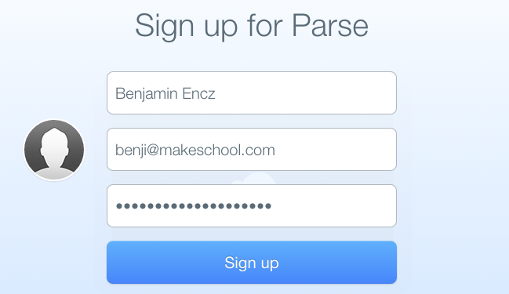
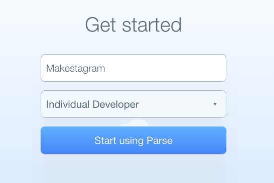
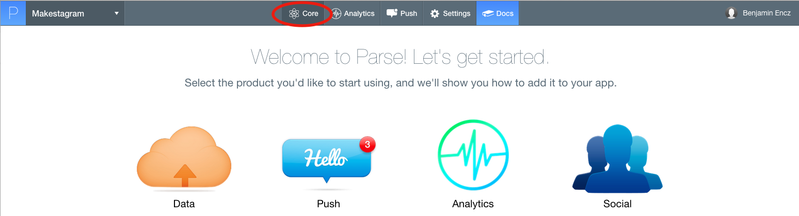

---
title: "Setting up Parse"
slug: setting-up-parse
---     

To build a photo sharing app we will need to exchange information between multiple users on multiple devices.

In the *Make School Notes* tutorial we built an app that only stores information locally, on the user's phone. There is no way of sharing information with other users or accessing notes from other devices. This is fine for some apps. However, most applications need to provide a way for multiple users to to interact with each other. In such cases we need to store the information used in the app on a server that is accessible by all users.

#What does Parse do for us?

Until recently it was necessary to write an entire server application to handle this - now we can use the Parse platform instead. Parse allows us to define the different type of objects we want to store for our application, as well as relationships between them. Additionally Parse provides an iOS library that makes it easy to store and read objects on and from our Parse backend.

We will start off by creating a Parse account and adding a new app to it.

#Setting up a Parse account

First, sign up for an account.

Go to [Parse.com](http://parse.com). Enter name, email address and choose a password:

On the next screen you will be able to create an app. Choose *Makestagram* as the app title and select *Individual Developer* as the company size:

Now you have created your first Parse app!

On the next screen you will see a bunch of services that Parse provides. We will only be using the *Core* product which allows us to create a data model for our application. 

Select *Core* in the top bar to open the Parse Data Browser:

This is the place where we can see and edit the data model for our application. Before we dive into the details of how to create new classes we should discuss what the data model for *Makestagram* should look like.

