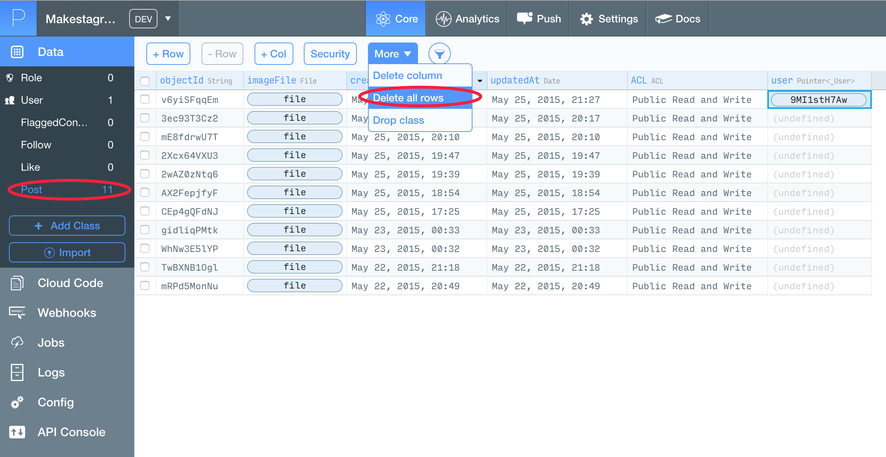

Security is a very important topic - so we should discuss it as early as possible. Luckily, when using Parse we don't need to spend too much time thinking about security features. Storing of passwords, the login mechanism, etc. are all taken care of.

There is one aspect that we need to take care off - _Access Control Lists_.

#An introduction to Access Control Lists

_Access Control Lists_ (ACL) allow you to define lists of users that have certain rights to read, modify or delete certain objects. The default ACL is _Public Read and Write_. This means any user can read this object, modify it and even delete it.

You can see the current ACL of each object in the Parse data browser, in the ACL column:

For most objects you store in Parse **you don't want this default ACL.** If any of your users gets access to your _ClientKey_ (which is possible in multiple different ways) they will be able to modify all objects that have public write access!

If you store all of your objects with the default ACL, that would allow an attacker to delete your entire app data!

How can we avoid that? By changing the default ACL!

#Changing the default ACL

Parse provides an API call that allows us to change the default ACL for all objects created in the app. We will use that to change the default to a security setting that:

1. Allows public _read_ access - any user can see all objects created with this default ACL
2. Only provides _write_ access to the user that created the object

We will set up this default ACL directly after app launch, within our `AppDelegate`.

Extend the `application(_:, didFinishLaunchingWithOptions:)` method by adding the three lines of code that change the default ACL:

    func application(application: UIApplication, didFinishLaunchingWithOptions launchOptions: [NSObject: AnyObject]?) -> Bool {

      //...

      let acl = PFACL()
      acl.setPublicReadAccess(true)
      PFACL.setDefaultACL(acl, withAccessForCurrentUser: true)

      return true
    }

Now every new Parse object will be equipped with public read access and write access that is limited to the object's creator.

If you upload a new photo to Parse, you should now see a different entry in the ACL column:

With this new default setting our app content is already much safer!

#Cleaning up the old data

Throughout the last steps we have created multiple posts, using code that is now outdated. Some posts don't have users assigned to them; others have the wrong ACL. Let's delete all of the existing posts - that way we will avoid debugging issues related to outdated objects.

We can use the Parse data browser to delete all rows of the `Post` class:

#Conclusion

This chapter gave you a basic overview of ACLs - an important security feature in Parse.

You also learned how to change the default ACL. Changing the default ACL should be one of the first steps when creating your own apps using Parse.

If you are interested in some more details on ACLs, you can read the official documentation [here](https://parse.com/docs/ios/guide#security-object-level-access-control).

For now, this step concludes our solution for creating new posts. In the next step we will start implementing one of the core features of Makestagram: the timeline!
