We have spent the last few steps discussing how to store data in Parse. In this step we will look at how to fetch it!
Throughout this step we will discuss the basics of querying data, while starting to work on the important _Timeline_ feature of Makestagram.

As a first step if implementing the _Timeline_ feature, we will set up the basic UI for the `TimelineViewController`.

#Adding a Table View to the TimelineViewController

Let's add a Table View to the `TimelineViewController` - we will use that Table View to display the posts in a user's timeline.

The Table View should be a full-screen view. However, we need to leave space for the status bar on the top and the Tab Bar on the bottom.

Open _Main.storyboard_ and add a Table View to the _TimelineViewController_. The resulting scene hierarchy should look like this:

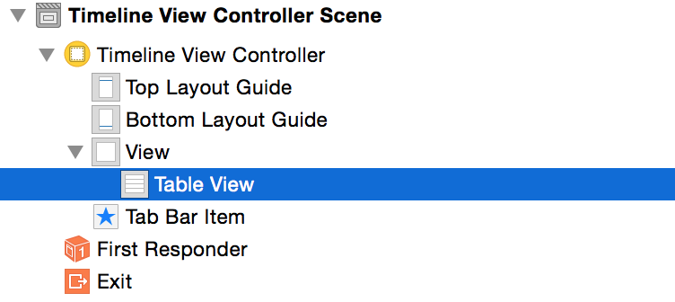

##Setting up Constraints

Next, set up the horizontal constraints. Make sure that the Table View is selected. Then open the constraints menu. Uncheck _Constrain to margins_. Then set the constraints for _left_ and _right_ to _0_. Finally, hit _Add Constraints_:

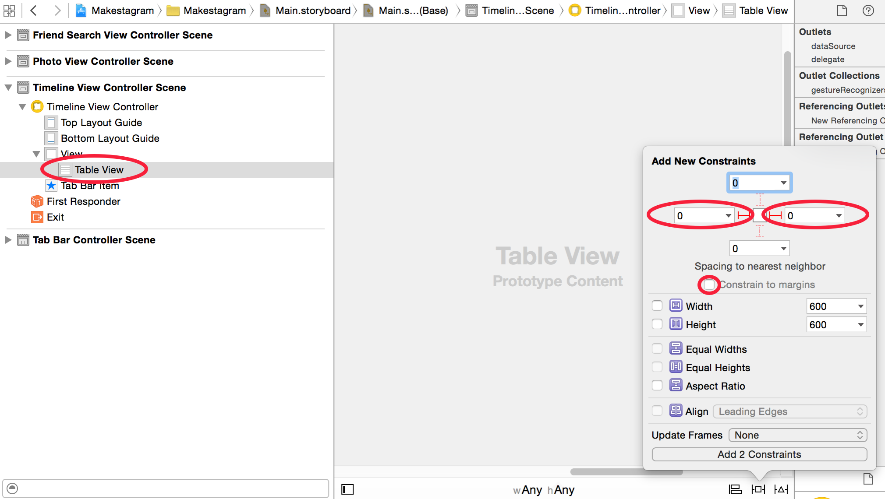

Now, set up the top constraint. Hold the _Control_ key and, in the _Document Outline_, drag a line from the Table View to the _Top Layout Guide_:
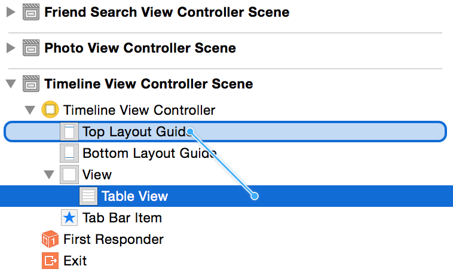
Select _Vertical Spacing_ in the popup that shows up after you created the connection:
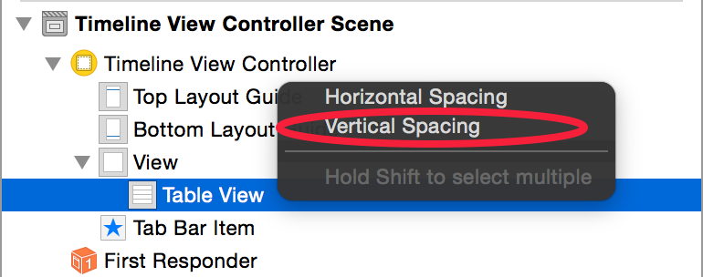

Then, set up the bottom constraint.
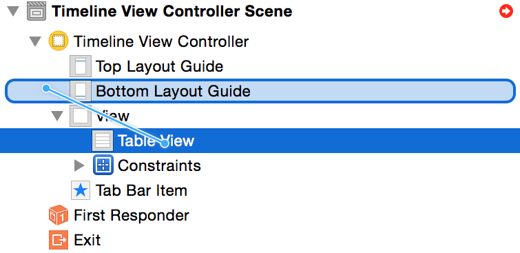
Select _Vertical Spacing_ in the popup that shows up after you created the connection:

As a last step, we need to set the top and bottom constraints to _0_.

1. Select the Table View.
2. Open the size inspector.
3. Hit the _Edit_ button for each of the constraints and set their value to _0_
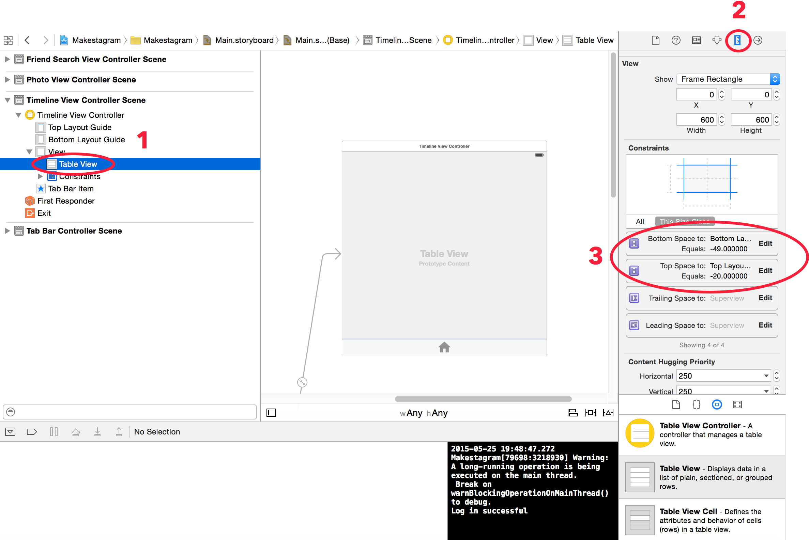
The result should look like this:
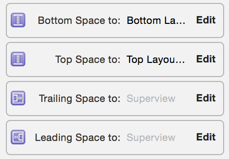

If you don't want your views to overlap with the Status Bar or the Tab Bar, you need to set up constraints with the Top and Bottom Layout Guide, instead of setting them up with the Superview.

##Defining a Table View Data Source

In order to fill this Table View with data, we need to define a Data Source (just as we did in the _Make School Notes_ app).

Set the _Timeline View Controller_ to be the data source of the Table View, as shown in the image below:

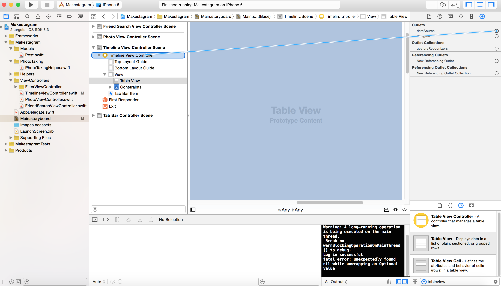

##Defining a Referencing Outlet

We will also need to access this Table View in code; therefore we need to set up a referencing outlet.

Set up a referencing outlet, as shown below, and name the property `tableView`:
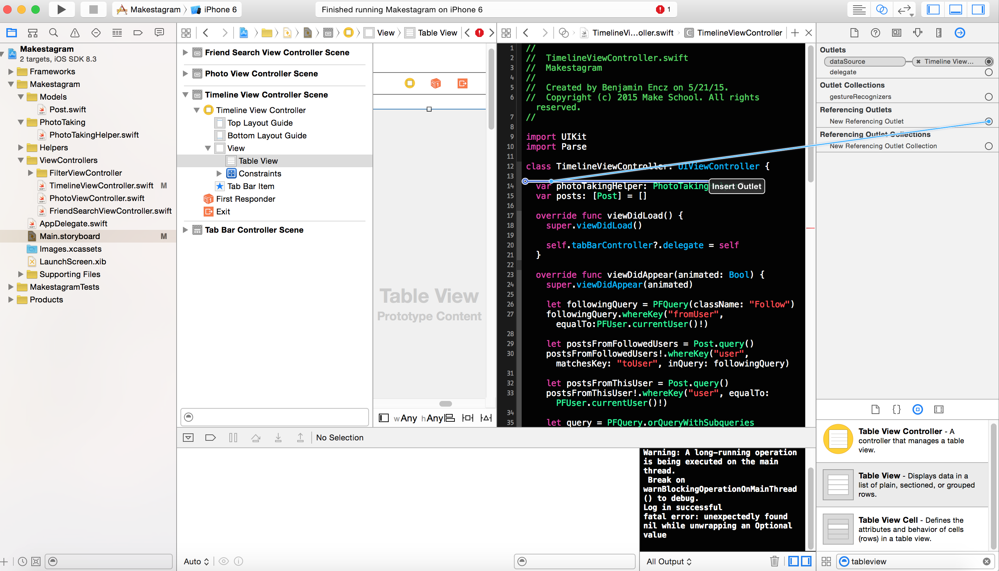

##Create a Prototype Cell

We'll need a cell to display the posts that we download. Let's add it to the Table View.

Add a new Table View Cell to the Table View:
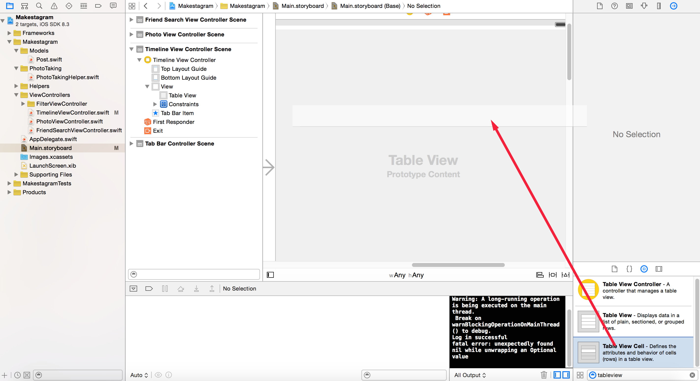
Next, set up an identifier for this cell, so that we can reference it from code:
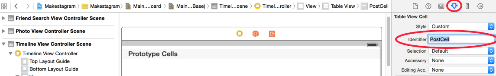

Well done!

We have done our due diligence - the Table View is set up! Now we can take a look at how we can fetch data from Parse and display it in this Table View.

#Basics of Quering in Parse

To retrieve data from Parse we use the `PFQuery` class. A _query_ is a set of requirements that we can define - Parse will then provide all objects that fulfill these requirements.

We start defining a query by choosing what the class of the query result should be.

If we want to create a query that returns `Posts`, we initialize the `PFQuery` like this:

    let postsQuery = PFQuery(className: "Post")

Or, since we have set up a custom class for `Post`, like this:

    let postsQuery = Post.query()

Now the query knows which type of class to return!

The second step is defining the criteria that all `Post` objects need to match in order to be included in the query result.

If we, for example, want to retrieve all of the posts created by the current user, we can add the requirement as follows:

    postsQuery.whereKey("user", equalTo: PFUser.currentUser()!)

Parse provides many variations of the `whereKey...` method that allow you to compare values in many different ways.
In the example above we are checking whether the user stored in the _"user"_ column matches the user that is currently logged in.

Once you have set up a query with all the constraints you need, you can start fetching the data:

    query.findObjectsInBackgroundWithBlock {(result: [AnyObject]?, error: NSError?) -> Void in
      // ...
    }

These are the absolute basics of querying data in Parse. We will see some more advanced options when implementing the query for out timeline.

#Building the Timeline Query

With this basic knowledge at hand, how can we implement the timeline query? Here's a short reminder of what the data model for _Makestagram_ looks like:

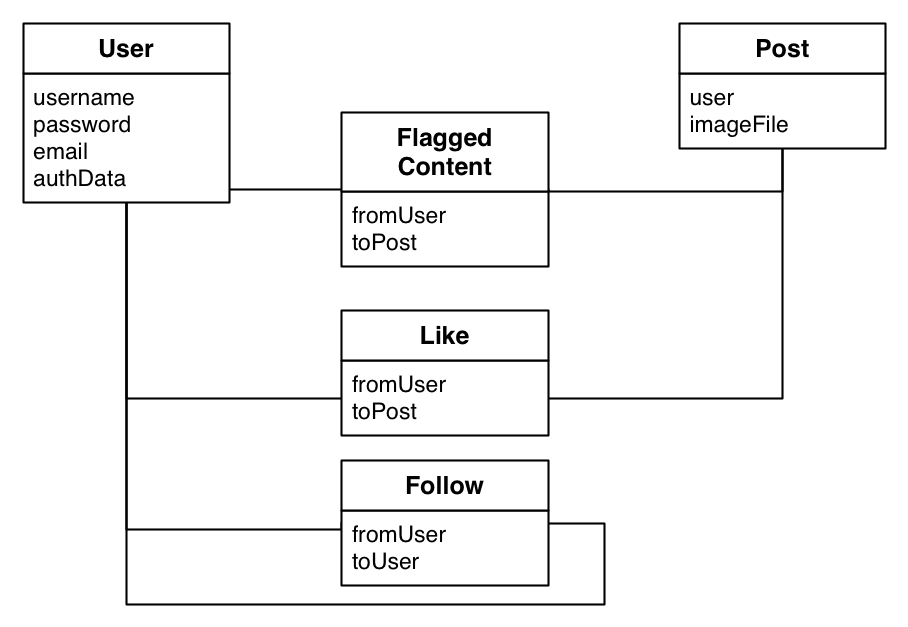

We want to show posts in a user's timeline if they fulfill one of the following two requirements:

1. the post is created by a user which we are following
2. the post is created by the user that is currently logged in

We have already seen the solution for _2._:

    postsQuery.whereKey("user", equalTo: PFUser.currentUser()!)

The solution for _1._ however, consists of two different steps:

1. Fetch the users we are currently following
2. Fetch the posts of the users that we are currently following

We can build such a query like this:

    let followingQuery = PFQuery(className: "Follow")
    followingQuery.whereKey("fromUser", equalTo:PFUser.currentUser()!)

    let postsFromFollowedUsers = Post.query()
    postsFromFollowedUsers!.whereKey("user", matchesKey: "toUser", inQuery: followingQuery)

First, we get the instances of `Follow`, where the current user is stored in the `fromUser` column. This means we retrieve all `Follow` relationships that the current user has established.

Then, we use this information to get all posts of these users. We create a query that returns all `Post` objects that have been created by users that have been returned by the `followingQuery`.

This concept we have used here is called a _subquery_. We use the result of one query to create another one.

##Putting the parts together

This should give you enough theoretical knowledge to understand the timeline query.
Let's add it to the `TimelineViewController` and discuss some of its details:

Add the following implementation of `viewDidAppear` to the `TimelineViewController`:

    override func viewDidAppear(animated: Bool) {
        super.viewDidAppear(animated)

        // 1
        let followingQuery = PFQuery(className: "Follow")
        followingQuery.whereKey("fromUser", equalTo:PFUser.currentUser()!)

        // 2
        let postsFromFollowedUsers = Post.query()
        postsFromFollowedUsers!.whereKey("user", matchesKey: "toUser", inQuery: followingQuery)

        // 3
        let postsFromThisUser = Post.query()
        postsFromThisUser!.whereKey("user", equalTo: PFUser.currentUser()!)

        // 4
        let query = PFQuery.orQueryWithSubqueries([postsFromFollowedUsers!, postsFromThisUser!])
        // 5
        query.includeKey("user")
        // 6
        query.orderByDescending("createdAt")

        // 7
        query.findObjectsInBackgroundWithBlock {(result: [AnyObject]?, error: NSError?) -> Void in
          // 8
          self.posts = result as? [Post] ?? []
          // 9
          self.tableView.reloadData()
        }
    }

1. First, we are creating the query that fetches the `Follow` relationships for the current user.
2. We use that query to fetch any posts that are created by users that the current user is following.
3. We create another query to retrieve all posts that the current user has posted herself.
4. We create a combined query of the _2._ and _3._ queries, using the `orQueryWithSubqueries` method. The query generated this way will return any `Post` that meets either of the constraints of the queries in _2._ or _3._
5. We define that the combined query should also fetch the `PFUser` associated with a post. As you might remember, we are storing a _pointer_ to a user object in the _user_ column of each post. By using the `includeKey` method we tell Parse to resolve that pointer and download all the information about the user along with the post. We will need the username later when we display posts in our timeline.
6. We define that the results should be ordered by the _createdAt_ field. This will make posts on the timeline appear in chronological order.
7. We kick off the network request.
8. In the completion block we receive all posts that meet our requirements. The Parse framework hands us an array of type `[AnyObject]?`. However, we would like to store the posts in an array of type `[Post]`. In this step we check if it is possible to cast the result into a `[Post]`; if that's not possible (e.g., because the result is nil) we store an empty array (`[]`) in `self.posts`. The `??` operator is called the _nil coalescing operator_ in Swift. If the statement before this operator returns `nil`, the return value will be replaced with the value after the operator.
9. Once we have stored the new posts, we refresh the `tableView`.

#Displaying the Query Results

There are two more required steps before we can test this code:

1. We need to add the `posts` property that we're referencing
2. We need to implement the `UITableViewDataSource` protocol

Add the `posts` property to `TimelineViewController`:

    var posts: [Post] = []

Now, let's add a simple implementation of the `UITableViewDataSource` protocol. That will allow us to see if our request is working as expected:

Add the following extension to `TimelineViewController`:

    extension TimelineViewController: UITableViewDataSource {

      func tableView(tableView: UITableView, numberOfRowsInSection section: Int) -> Int {
        // 1
        return posts.count
      }

      func tableView(tableView: UITableView, cellForRowAtIndexPath indexPath: NSIndexPath) -> UITableViewCell {
        // 2
        let cell = tableView.dequeueReusableCellWithIdentifier("PostCell") as! UITableViewCell

        cell.textLabel!.text = "Post"

        return cell
      }

    }

1. Our Table View needs to have as many rows as we have posts stored in the `posts` property
2. For now, we return a simple placeholder cell with the title _"Post"_

Great! Now you should be able to run the app and test the query!

After a short moment the Table View should show as many posts as you can see in the Parse data browser:

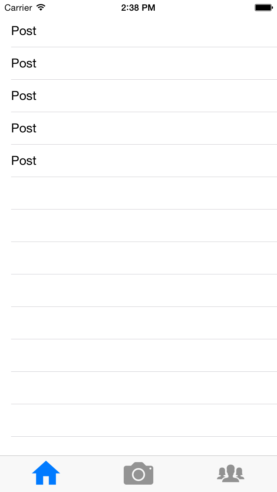

If you don't see any posts, make sure that you have uploaded to some! Use the Parse data browser to see how many post entries you  have stored.

#Conclusion

Admittedly the app is still looking pretty boring - but with the timeline query you have implemented a very important feature!
To make our progress a little bit more visual, we will focus on displaying posts with images in the next step!
