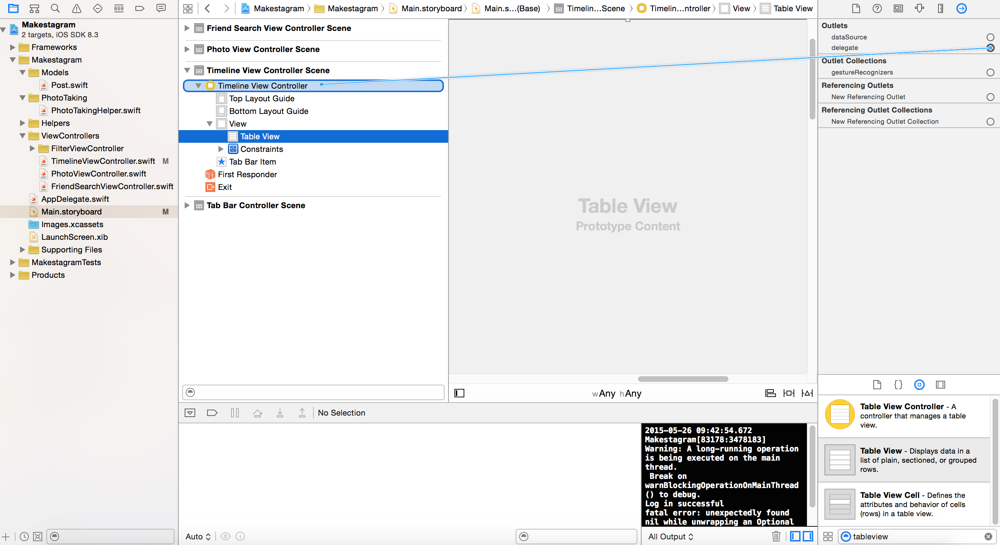

We have spent the last few steps discussing how to store data in Parse. In this step we will look at how to fetch it!
Throughout this step we will discuss the basics of querying data, while starting to work on the important _Timeline_ feature of Makestagram.

As a first step if implementing the _Timeline_ feature, we will set up the basic UI for the `TimelineViewController`.

#Adding a Table View to the TimelineViewController

Let's add a Table View to the `TimelineViewController` - we will use that Table View to display the posts in a user's timeline.

The Table View should be a full-screen view. However, we need to leave space for the status bar on the top and the Tab Bar on the bottom.

Open _Main.storyboard_ and add a Table View to the _TimelineViewController_. The resulting scene hierarchy should look like this:

##Setting up Constraints

Next, set up the horizontal constraints. Make sure that the Table View is selected. Then open the constraints menu. Uncheck _Constrain to margins_. Then set the constraints for _left_ and _right_ to _0_. Finally, hit _Add Constraints_:

Now, set up the top constraint. Hold the _Control_ key and, in the _Document Outline_, drag a line from the Table View to the _Top Layout Guide_:

Select _Vertical Spacing_ in the popup that shows up after you created the connection:

Then, set up the bottom constraint.

Select _Vertical Spacing_ in the popup that shows up after you created the connection:

As a last step, we need to set the top and bottom constraints to _0_.

1. Select the Table View.
2. Open the size inspector.
3. Hit the _Edit_ button for each of the constraints and set their value to _0_

The result should look like this:

If you don't want your views to overlap with the Status Bar or the Tab Bar, you need to set up constraints with the Top and Bottom Layout Guide, instead of setting them up with the Superview.

##Defining a Table View Data Source

In order to fill this Table View with data, we need to define a Data Source (just as we did in the _Make School Notes_ app).

Set the _Timeline View Controller_ to be the delegate of the Table View, as shown in the image below:

We have done our due diligence - the Table View is set  up! Now we can take a look at how we can fetch data from Parse and display it in this Table View.

#Basics of Quering in Parse

#Building the Timeline Query

#Displaying the Query Results
