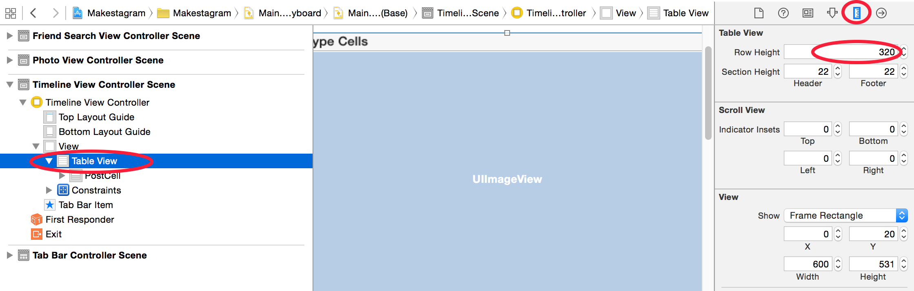
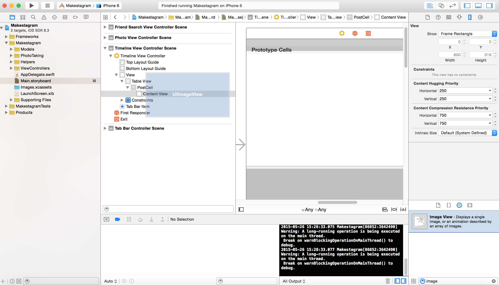
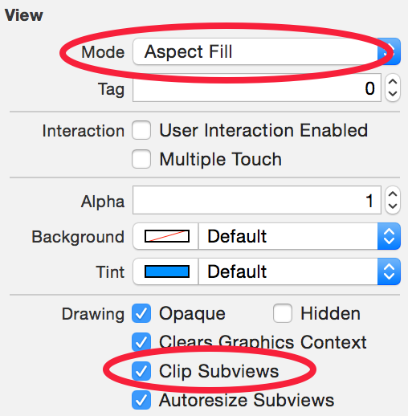
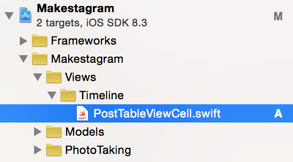
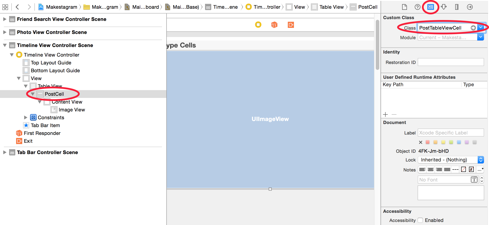
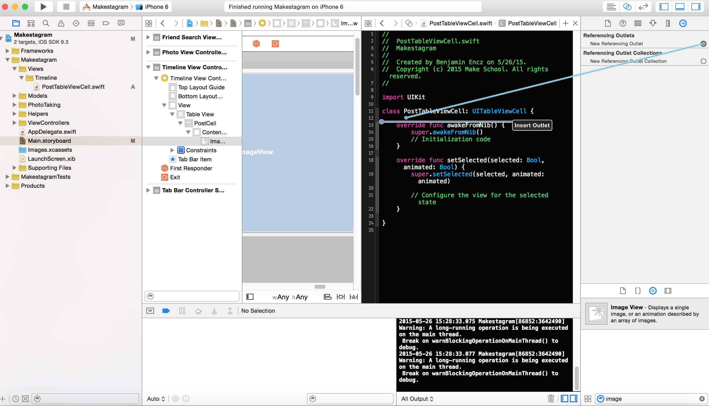
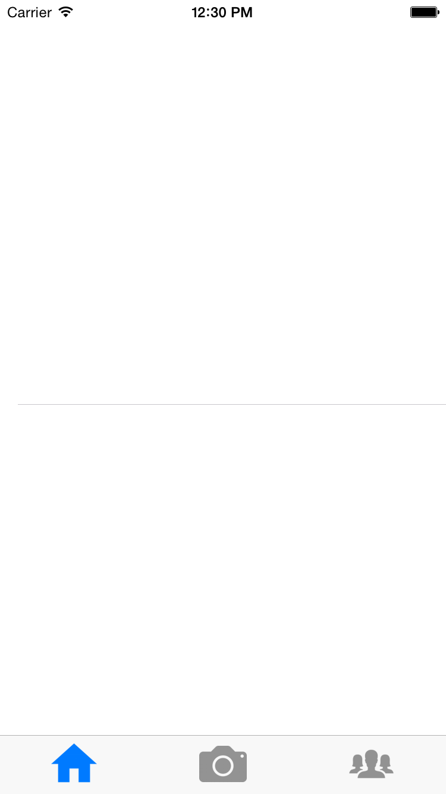
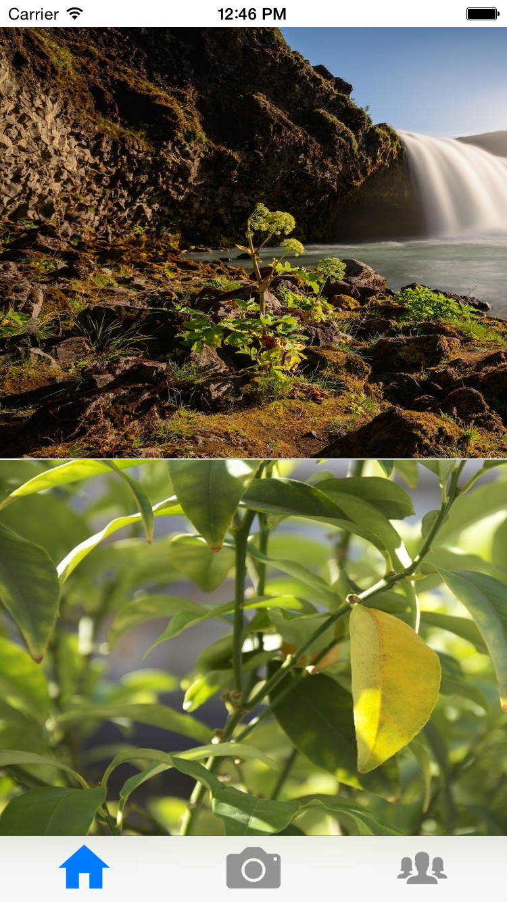

As I promised, this step will focus on displaying the photos associated with each post.
To display the posts we will need to switch from the default Table View Cell that we are
using right now to a custom one. Whenever you want to create a Table View Cell that doesn't use one of the few default layouts that iOS has to offer, you will end up creating a custom one.

#Setting up a Custom Table View Cell

First, we will change the height of the cells.

##Changing the Row Height
Just as in the Instagram app we want the images
to be displaced as squares. Since the screen has a width of 320 points we should set the height of each
cell to 320 as well. Later you will learn that it isn't a good idea to rely on specific constant numbers in
your code or Storyboard files - for now the solution is just fine.

> [action]
Change the row height to _320_ as shown below:

You will also need to change the row height of the Table View.

> [action]
Change the Table View row height to _320_ as well:

##Adding an Image View
Next, we'll add an Image View that will display the uploaded photo.

> [action]
Add an Image View to the Table View Cell, as shown below:

By dragging the corners of the Image View, change its size to be the full size of the cell. We won't be using constraints until later on.

Additionally we need to change the _Content Mode_ of the Image View. Currently it is set to the default value which is _Scale To Fill_. That will distort the image to fit into the size of the Image View. Distorted images look ugly! It's much better to crop them. To do that, we change the _Content Mode_ to _Aspect Fill_.

> [action]
> Change the _Content Mode_ of the Image View in the _Attributes inspector_, as shown in the image below. Also select
> _Clip Subviews_ in the right panel:
> 

The _Clip Subviews_ option ensures that the image is not drawn outside the border of the Image View. Without this option, the image leaks over the edges of the Image View.

##Creating a Custom Class for the Table View Cell
Since we will want to create an IBOutlet connection from this Image View to our Table View Cell, we will need to
create a custom `UITableViewCell` subclass. That IBOutlet connection will allow the `TimelineViewController` to set the image as soon as a post is downloaded.

> [action]
Create a class called `PostTableViewCell` in the Xcode group shown below (don't forget to first create a folder on the filesystem and then import into your Xcode project). The new class should be a subclass of `UITableViewCell`:

Confirm that your newly created class is a subclass of `UITableViewCell`:
>
    import UIKit
>
    class PostTableViewCell: UITableViewCell {
>
        // ...
>
    }

##Connecting the Custom Class to the Table View Cell

Now that we have created the `UITableViewCell` subclass, we need to configure it to be used in our Table View Cell in Storyboard.

> [action]
Set the _Custom Class_ of the Table View Cell to our newly created `PostTableViewCell`:

##Creating a Referencing Outlet for the Image View

To complete our last step in Storyboard, we need to create a referencing outlet from the Image View to the Table View Cell.
This will allow us set the image displayed inside of each cell.

> [action]
Create a referencing outlet from the Image View to the `PostTableViewCell` class; name the property `postImageView`:

#Adding Code to Display Images

Now we have a Table View Cell that will allow us to display photos that users have taken. We'll need to update our code to show these photos instead of the placeholder text that we're currently displaying. That means we need to update the code that creates our cells.

> [action]
> Update the `tableView(_:, cellForRowAtIndexPath:)` method as follownig:
>
    func tableView(tableView: UITableView, cellForRowAtIndexPath indexPath: NSIndexPath) -> UITableViewCell {
      // 1
      let cell = tableView.dequeueReusableCellWithIdentifier("PostCell") as! PostTableViewCell
>
      // 2
      cell.postImageView.image = posts[indexPath.row].image
>
      return cell
    }

1. In this line we have added a cast to `PostTableViewCell`. In Storyboard we've configured a custom class for our Table View Cell. In order to access its specific properties we need to perform a cast to the type of our custom class. Without this cast the `cell` variable would have a type of a plain old `UITableViewCell` instead of our `PostTableViewCell`
2. Using the `postImageView` property of our custom cell we can now decide which image should be displayed in the cell. We grab the `image` property of the post.

Now you can run the app and you will see...

... empty Table View Cells! **Why is this happening?**

##Downloading PFFiles

Just like _PFPointers_, _PFFiles_ are not automatically downloaded together with their parent objects. Each of our posts references a _PFFile_, that reference is stored within the post. However, we are responsible for performing the download of the actual image.

This system makes a lot of sense - in many cases we want some information about a post (like the author or when it was created) but we don't need access to the uploaded photo. It would be a waste of resources to download the photo in such a case.

This means we need to write some extra code to download the image.

As I promised, this chapter will focus on making some visual progress, so for now we will use a temporary solution to download the images.

> [action]
Extend the callback block of `findObjectsInBackgroundWithBlock` within the `viewDidAppear` method of `TimelineViewController` as shown below:
>
    query.findObjectsInBackgroundWithBlock {(result: [AnyObject]?, error: NSError?) -> Void in
      self.posts = result as? [Post] ?? []
>
      // 1
      for post in self.posts {
        // 2
        let data = post.imageFile?.getData()
        // 3
        post.image = UIImage(data: data!, scale:1.0)
      }
>
      self.tableView.reloadData()
    }

1. We loop over all posts returned from the timeline query
2. First, we are calling `getData()` to download the actual image file. We are currently not doing this in the background, but on the main thread, that is bad! We'll fix that issue in the next step.
3. Once we have retrieved and stored the data, we turn it into a `UIImage` instance and store that in the `image` property of the `post`

Now you can run the app again. And for the first time you should see our photos on the screen!

That's awesome! This app is very slowly starting to look like a real photo sharing app!

#Conclusion

In this chapter you have learned how to set up a custom Table View Cell. Almost all iOS apps use Table Views in combination with custom cells, so this knowledge will be very useful for your own app! You have also learned that `PFFile`s are stored as references in other `PFObject`s and are not automatically downloaded. For now we have implemented a primitive approach of downloading the photos for each post - after all, the focus of this chapter was to make some visual progress!

In the next step we will focus on improving the code that queries Parse data. The goal will be to set up a nice app structure that will allow us to add many different queries as we progress through this tutorial, without turning our project into a mess. We will also make some improvements to our photo download code.

Let's turn this working solution into a good one!
