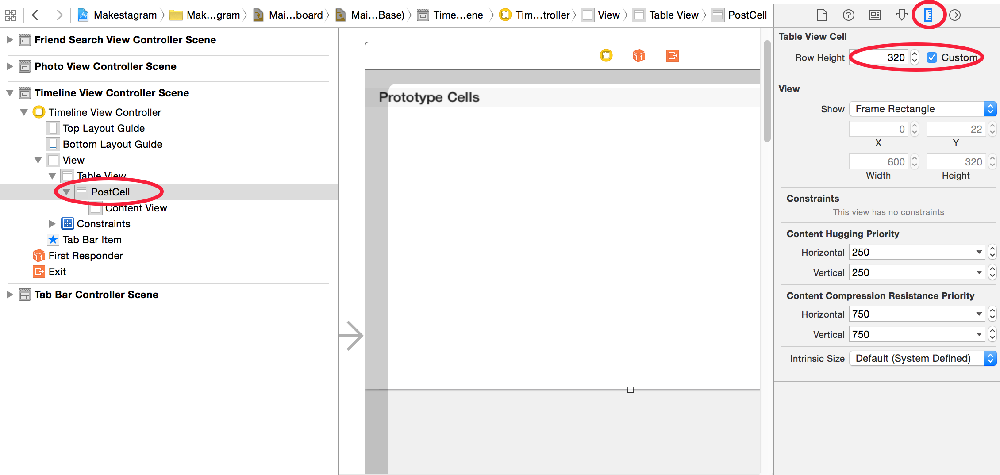

As I promised, this step will focus on displaying the photos associated with each post.
To display the posts we will need to switch from the default Table View Cell that we are
using right now to a custom one.

#Setting up a custom Table View Cell

First, we will change the height of the cells.

##Changing the Row Height
Just as in the Instagram app we want the images
to be displaced as squares. Since the screen has a width of 320 points we should set the height of each
cell to 320 as well. Later you will learn that it isn't a good idea to rely on specific constant numbers in
your code or Storyboard files - for now the solution is just fine.

Change the row height to _320_ as shown below:

##Adding an Image View
Next, we'll add an Image View that will display the uploaded photo.

Add an Image View to the Table View Cell, as shown below:

##Creating a Custom Class for the Table View Cell
Since we will want to create an IBOutlet connection from this Image View to our Table View Cell, we will need to
create a custom `UITableViewCell` subclass. That IBOutlet connection will allow the `TimelineViewController` to set the image as soon as a post is downloaded.

Create a class called `PostTableViewCell` in the Xcode group shown below (don't forget to first create a folder on the filesystem and then import into your Xcode project). The new class should be a subclass of `UITableViewCell`:

Confirm that your newly created class is a subclass of `UITableViewCell`:

    import UIKit

    class PostTableViewCell: UITableViewCell {

        // ...

    }

##Connecting the Custom Class to the Table View Cell

Now that we have created the `UITableViewCell` subclass, we need to configure it to be used in our Table View Cell
in Storyboard:

Set the _Custom Class_ of the Table View Cell to our newly created `PostTableViewCell`:

##Creating a Referencing Outlet for the Image View

To complete our last step in Storyboard, we need to create a referencing outlet from the Image View to the Table View Cell.
This will allow us set the image displayed inside of each cell.

Create a referencing outlet from the Image View to the `PostTableViewCell` class; name the property `postImageView`:

#Adding Code to Display Images

...
