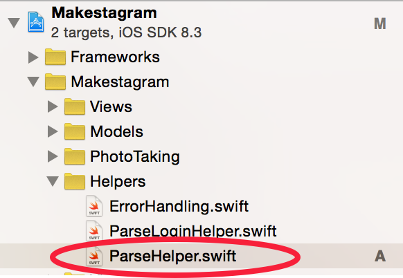

We've made some great progress throughout the last steps! We have a query that builds a users timeline (even though that's a lonely place right now with only one user that uses the app...). We are downloading photos from posts on that timeline and displaying them nicely.

Now that all of this is working - let's work on cleaning up the code a little bit. We'll start with the timeline query in this step and then improve the the image download code in the next one.

#Adding a Parse Helper Class

Oftentimes, the most difficult part about tidying up is finding a _good_ place for every object at hand. It's been mentioned a few times throughout the tutorial already, but as a reminder: *We want to avoid putting all of our code into view controllers.*

Currently, the entire timeline request is written within the `TimelineViewController`. Later on we're going to add a bunch more such requests, which could quickly result in a `TimelineViewController` with well over 1000 lines.

**So where is the right place to put our query code?**

If in doubt, create a new file (don't take this too literally...).

We're going to introduce a _ParseHelper.swift_ file that will contain most of our code that's responsible for talking to our Parse server. That way we can avoid bloated view controllers.

> [action]
Start by adding the new _ParseHelper.swift_ file to the _Helpers_ group in your Xcode project:

Now we're going to tidy up the `TimelineViewController` by moving the timeline query into our new _ParseHelper.swift_ file.

> [action]
Fill the _ParseHelper.swift_ file with the following content:
>
    import Foundation
    import Parse
>
    // 1
    class ParseHelper {
>
      // 2
      static func timelineRequestForCurrentUser(completionBlock: PFArrayResultBlock) {
        let followingQuery = PFQuery(className: "Follow")
        followingQuery.whereKey("fromUser", equalTo:PFUser.currentUser()!)
>
        let postsFromFollowedUsers = Post.query()
        postsFromFollowedUsers!.whereKey("user", matchesKey: "toUser", inQuery: followingQuery)
>
        let postsFromThisUser = Post.query()
        postsFromThisUser!.whereKey("user", equalTo: PFUser.currentUser()!)
>
        let query = PFQuery.orQueryWithSubqueries([postsFromFollowedUsers!, postsFromThisUser!])
        query.includeKey("user")
        query.orderByDescending("createdAt")
>
        // 3
        query.findObjectsInBackgroundWithBlock(completionBlock)
      }
>
    }

1. We are going to wrap all of our helper methods into a class called `ParseHelper`. We only do this so that all of the functions are bundled under the `ParseHelper` _namespace_. That makes the code easier to read in some cases. To call the timeline request function you call `ParseHelper.timelineRequestforUser...` instead of simply `timelineRequestforUser`. That way you always know exactly in which file you can find the methods that are being called.
2. We mark this method as `static`. This means we can call it without having to create an instance of `ParseHelper` - you should do that for all helper methods. This method has only one parameter, `completionBlock`: the callback block that should be called once the query has completed. The type of this parameter is `PFArrayResultBlock`. That's the default type for all of the callbacks in the Parse framework. By taking this callback as a parameter, we can call any Parse method and return the result of the method to that `completionBlock` - you'll see how we use that in _3._
3. The entire body of this method is unchanged, it's the exact timeline query that we've built within the `TimelineViewController`. The only difference is the last line of the method. Instead of providing a closure and handling the results of the query within this method, we hand off the results to the closure that has been handed to use through the `completionBlock` parameter. This means, whoever calls the `timelineRequestForCurrentUser` method will be able to handle the result returned from the query!

Now we can tidy up the `TimelineViewController` and replace the query in there with a call to our newly crafted helper method.

> [action]
Update the `viewDidAppear` method in `TimelineViewController` to look as following:
>
    override func viewDidAppear(animated: Bool) {
      super.viewDidAppear(animated)
>
      ParseHelper.timelineRequestForCurrentUser {
        (result: [AnyObject]?, error: NSError?) -> Void in
          self.posts = result as? [Post] ?? []
>
          for post in self.posts {
            let data = post.imageFile?.getData()
            post.image = UIImage(data: data!, scale:1.0)
          }
>
          self.tableView.reloadData()
      }
    }

Suddenly the `viewDidAppear` method is much, much shorter. All we need to do is call `ParseHelper.timelineRequestforCurrentUser` and hand the method a completion block (which we are doing using the trailing closure syntax).

The content of the completion block remains exactly the same; we store the posts, download all of the images, and finally update the table view.

You can test this version of the app and it should behave exactly as before. However, our code is now better organized.

#Conclusion

In this section we've set up a corner stone for the sound structure of our app. The next section will be really exciting - we will use _lazy loading_ to download our images and you will learn about _bindings_!
