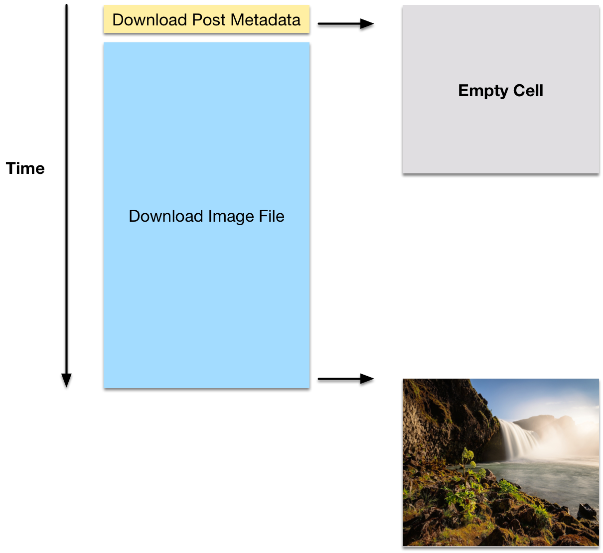

In this step you will learn about an awesome new concept called _bindings_ - it's an important one that we'll be using often throughout the rest of the tutorial.

We will use bindings to improve our photo downloading code. Currently it has three issues:

1. We are downloading all of the photos on the main thread - that blocks the UI of our app!
2. The image download is happening inside of the `TimelineViewController`, that's not necessarily where it belongs.
3. We are downloading the photos for all posts upfront - if we had 50 posts in the timeline we would download 50 photos right away; many which our users would likely not see (did you know that the average app usage time is just a little bit above one minute?)

We're going to fix all of these three issues throughout this step:

1. We will perform the download of photos in the background
2. We will move the photo download code into the `Post` class
3. We will only download photos of posts that are currently displayed

#The Concepts of Asynchrony and Bindings

Before we dive into coding I want to discuss some of the concepts that we will use throughout this step. While implementing the changes outlined above, we will run into an interesting situation.

The way our timeline currently works, we wait until all data is available, then we create a Table View Cell that displays that data.

In future we want to download the photos lazily and on a background thread. That will lead to a situation as shown below:

First, we perform the timeline query. That query downloads all posts for a user's timeline. These posts contain metadata (e.g. which user created the post, when it was created, etc.). As soon as this metadata is available, we create the refresh our Table and create all of the Table View Cells. At that point however, none of the images are loaded yet.

As soon as a cell appears on screen, we start the download of the image. That's the lazy part in _lazy loading_ - we don't load the information until we need it. That download will take a little time. Once the download completes, we want to update the Table View Cell so that the downloaded photo gets displayed.

This is what we call an _asynchronous_ operation. Instead of having all the information we need available right now, we are getting some time in the future. As soon as that information is available, we want to perform a certain operation - in this case updating the image of the Table View Cell as soon as the photo is downloaded.

There are many different ways how we can deal with data that is available asynchronously. In this tutorial we will be using _bindings_. Using a Swift library called [Bond](https://github.com/SwiftBond/Bond) we can handle asynchronous data as following:

    // bind the image of the post to the 'postImage' view
    post.image ->> postImageView

The `->>` operator might look a little bit obscure, but what it does is pretty straightforward. Whenever the value on the left-hand side changes, the value on the right-hand side is updated. In this specific line we define that the `postImageView` shall be updated whenever the `image` property of a `post` changes.

Using this technique we will be able to improve our photo download code!

#Putting it into Practice

Equipped with the theory we need, let's turn this idea into code.

##Storing a Post in the PostTableViewCell

The first change that we'll make is that we'll add a `post` property to the `PostTableViewCell`. Right now we are configuring the cell from the `cellForRowAtIndexPath` in the `TimelineViewController`:

    cell.postImageView.image = posts[indexPath.row].image

We're setting the image by directly accessing the `postImageView` property of the cell. This is another thing that our `TimelineViewController` does not need to be responsible for. Ideally custom Table View Cells should receive one object that describes their content. Then the Table View Cell itself should change its properties based on that object.

We're going to store the `Post` in the `PostTableViewCell` and let the cell itself be responsible for changing its appearance.

> [action]
First, add an `import` statement for the Swift Bond library that we'll be using to _PostTableViewCell.swift_:
>
    import Bond

Then we can add the property to store the `Post`.

> [action]
Add the following property and property observer to the `PostTableViewCell` class:
>
    var post:Post? {
      didSet {
        // 1
        if let post = post {
          //2
          // bind the image of the post to the 'postImage' view
          post.image ->> postImageView
        }
      }
    }

1. Whenever a new value is assigned to the `post` property, we use _optional binding_ to check whether the new value is `nil`.
2. If the value isn't `nil`, we create a binding between the `image` property of the post and the `postImageView` using the `->>` operator. The _Bond_ library has special support for many UI components, including the `UIImageView`. This support allows us to bind an `UIImage` (`post.image`) directly to a `UIImageView` (`postImageView`) - whenever `post.image` updates, the displayed image of `postImageView` will update _magically_.

Now our `PostTableViewCell` is able to receive and store a `Post` object and react to an asynchronously available image of that post!

Awesome!

##Making the Image Property of a Post Dynamic

If you've tried, you will realize that the current version of our code does not compile. To be able to use _bindings_ (`->>`) our properties need to have a special type. They need to be `Dynamic`.

Let's change the `image` property of `Post` to be `Dynamic` - then we'll discuss in detail what `Dynamic` means.

> [action]
Change the property definition of `image` in the `Post` class to look as following:
>
    var image: Dynamic<UIImage?> = Dynamic(nil)

Ok, so what is this whole `Dynamic` thing? Basically it is just a wrapper around the actual value that we want to store. That wrapper allows us to listen for changes to the wrapped value. The `Dynamic` wrapper enables us to use the property together with bindings. You can see the type of the wrapped value in the angled brackets (`<UIImage?>`). These angled brackets mark the use of _generics_; a concept that we don't need to discuss now.

As soon as we are making a property `Dynamic`, we need to refer to the wrapped value like this:

    // we need to append .value to access the value wrapped by the Dynamic
    post.image.value

This means we'll need to update the code that is currently referencing the `image` property. Before we can move on to that you need to import the _Bond_ framework into the _Post.swift_ file.

> [action]
Add the following import statement to _Post.swift_:
>
    import Bond

##Updating the Upload Post Method

Now we can start updating our code to work with the new `Dynamic` `image` property. Let's first update the `uploadPost` method.

> [action]
Update the first line of `uploadPost` to access `image.value` instead of `image`:
>
    func uploadPost() {
      let imageData = UIImageJPEGRepresentation(image.value, 0.8)
      // ...
    }

##Adding a Download Image Method

We also wanted to move the image download form the `TimelineViewController` into the `Post` class. We're going to wrap the functionality into a new `downloadImage` method.

> [action]
Add the `downloadImage` method to the `Post` class:
>
    func downloadImage() {
      // if image is not downloaded yet, get it
      // 1
      if (image.value == nil) {
        // 2
        imageFile?.getDataInBackgroundWithBlock { (data: NSData?, error: NSError?) -> Void in
          if let data = data {
            let image = UIImage(data: data, scale:1.0)!
            // 3
            self.image.value = image
          }
        }
      }
    }

1. First, we are checking if `image.value` already has a stored value. We do this to avoid that images are downloaded multiple times. Only if `image.value` is `nil`, we actually want to start the download.
2. Here we start the download. Instead of using `getData` we are using `getDataInBackgroundWithBlock` - that way we are no longer blocking the main thread!
3. Once the download completes, we update the `post.image`. Note that we are now accessing the `.value` property, because `image` is a `Dynamic`.

With this step we have solved two issues! The download code has been moved into the `Post` class and our download is no longer blocking the main thread!

##Updating the TimelineViewController

Lastly, we need to update the `TimelineViewController`. Let's start with a very small update to the `takePhoto` method.

> [action]
Update the `takePhoto` method in `TimelineViewController` to access `image.value` instead of `image`
>
    func takePhoto() {
      // instantiate photo taking class, provide callback for when photo is selected
      photoTakingHelper =
        PhotoTakingHelper(viewController: self.tabBarController!) { (image: UIImage?) in
          let post = Post()
          // 1
          post.image.value = image!
          post.uploadPost()
      }
    }

1. Because `image` is now a `Dynamic` property, we need to store the image in the `post.image.value` property

No time for a break - we have some more significant changes to make to the `TimelineViewController`!

We no longer want to download all images immediately after the timeline query completes, instead we want to load them lazily as soon as a post is displayed.

> [action]
Update the `viewDidAppear` method in `TimelineViewController` by removing the image download code. The result should look like this:
>
    override func viewDidAppear(animated: Bool) {
      super.viewDidAppear(animated)
>
      ParseHelper.timelineRequestforCurrentUser {
        (result: [AnyObject]?, error: NSError?) -> Void in
          self.posts = result as? [Post] ?? []
>
          self.tableView.reloadData()
      }
    }

Now we are only downloading the metadata of all posts upfront and deferring the image download until a post is displayed.

##Loading Images Lazily
The last step - before we have a _Makestagram_ app that works correctly again - is to trigger the image download for our visible posts.

**What do you think? Where should we call the `downloadImage` method of our posts?**
> [action]
Correct, inside of the `cellForRowAtIndexPath` method. The `cellForRowAtIndexPath` method is called when the Table View is about to present a cell - immediately before the cell becomes visible. That's a great place to call the `downloadImage()` method. ([This method in the `UITableViewDelegate` protocol](https://developer.apple.com/library/ios/documentation/UIKit/Reference/UITableViewDelegate_Protocol/#//apple_ref/occ/intfm/UITableViewDelegate/tableView:willDisplayCell:forRowAtIndexPath:) is another correct answer, but we won't go with that approach here)

Let's extend the `cellForRowAtIndexPath` method to include the call to `downloadImage`. We also want to assign a `post` to each cell instead of setting the displayed image on the cell directly.

> [action]
Change the `cellForRowAtIndexPath` method to look as following:
>
    func tableView(tableView: UITableView, cellForRowAtIndexPath indexPath: NSIndexPath) -> UITableViewCell {
      let cell = tableView.dequeueReusableCellWithIdentifier("PostCell") as! PostTableViewCell
>
      let post = posts[indexPath.row]
      // 1
      post.downloadImage()
      // 2
      cell.post = post
>
      return cell
    }

1. Directly before a post will be displayed, we trigger the image download.
2. Instead of changing the image that is displayed in the cell from within the `TimelineViewController`, we assign the post that shall be displayed to the `post` property. After the changes we made a few steps back, the cell now takes care of displaying the image that belongs to a `Post` object itself.

After disassembling almost our entire app we are now finally back in a state that compiles, runs and behaves correctly! If you run the app now, you will realize that the UI no longer freezes when downloading images. When testing on the Simulator the differences will be minimal (because you have a super fast processor and a great Wifi connection). If you compare the two versions running on a real device, you will see a huge improvement in the solution we have implemented now.

#Conclusion

Wow, this step consisted of a huge set of changes! While restructuring our code you have learned how to deal with data that is available asynchronously. When working with network requests you will frequently come back to use this knowledge.
You have also learned how to load information lazily. Especially on mobile devices we should defer any network requests and computationally expensive tasks until they are absolutely necessary!

In the next step we will focus on some visual progress again. We will bring the `PostTableViewCell` into its final design, which will include a lovely shaped heear button!
