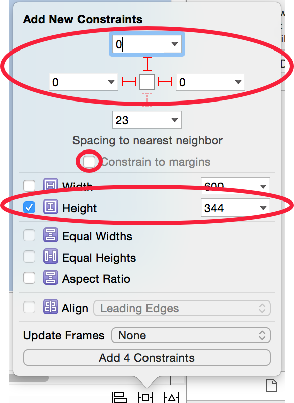

Now we'll spend some time in Interface Builder and with Auto Layout to polish up our extremely simple UI. We'll also add some more assets to our app. That will allow us to improve the look & feel throughout the next chapters.

#Adding Additional Resources

This step is pretty simple; we're going to add some more resources to our Asset Catalog. You've already downloaded the Art Pack for this tutorial earlier on, in case you no longer know where you've stored it, you can get it again [here](https://s3.amazonaws.com/mgwu-misc/SA2015/Makestagram_Art.zip) (I don't blame you; my file system is pretty messy!).

> [action]
Add new image sets for each of these resources (if you no longer know how this works, go back to the step where we set up the Tab Bar). The result should look like this (note that you don't need to set up _camera_ and _AppIcon_):
>

Make sure you have added all of the resources with the correct names! Now we have some hearts and buttons that can we use to turn our Table View Cell into a nice looking interface.

When we are entirely done, we want the Table View Cell to look like this:

We won't finish the entire set up in this step - but we'll get pretty far!

#Changing the PostTableViewCell Height

First, we'll make the cell a little bit larger to make space for our additional UI elements.

> [action]
Change the _Row Height_ of the Table View Cell **and** the Table View, in the _Size Insepctor_, to _470_. If you forgot how this works, look back to the step where we set up the Table View Cell's Image View.

Now we're good to got!

#Setting up Constraints for the Image View

Throughout this step we will add many UI elements and place them using constraints. Currently the Image View is our only UI component and it doesn't have any constraints set up. Once you start adding constraints to a View, you will have to add constraints to **all** child views - otherwise you will run into some serious Interface Builder problems.

So before we get started on adding new UI elements, let's define some constraints for the Image View, so that it stays nicely in place.

> [action]
Define the constraints for the Image View as following:
>

Great! Now we can safely move on!

#Adding the Like Button

Now, let's start designing one of the core experiences of our app - the _like_ button!

##Creating an Image Button

> [action]
Drag a Button from the object library and add it to the Table View Cell (technically the _Content View_ of the Table View Cell.) Move it to the bottom-right corner of the cell.

Now we're going to configure the like button to show the heart image.

> [action]
>
1. Select the Button that you just created.
2. Open the _Attributes Inspector_.
3. Set the Button Type to _Custom_. Whenever you want to create a button that just shows an image, you should choose the _Custom_ type. The _System_ type that is selected by default, tints all images in a bright blue.
4. Remove the _Title_ from the button
5. Set the image to the _Heart_ button

Ok, our basic button is set up. Now we need to take care of some Auto Layout!

While working on the Auto Layout constraints for the next few steps, you'll might run into a bug in Interface Builder. Sometimes your constraints won't correctly influence the size of the UI elements. In such cases you can update the value of the constraint to some other value - then immediately set it back to the old value. Here's a short video that illustrates the issue:

<video width="100%" controls>
  <source src="https://s3.amazonaws.com/mgwu-misc/SA2015/IB_Constraints_Bug_small.mov" type="video/mp4"></video>

Even though the _Traliling Space to Superview_ was set to _50_ at the beginning and at the end of the video, the size of the label appears differently. Give this a shot in case you run into similar issues throughout the next steps!

##Defining Size and Layout

Before designing your Apps, you should at least glance over [Apple's Human Interface Guidelines for iOS](https://developer.apple.com/library/ios/documentation/UserExperience/Conceptual/MobileHIG/).

They contain many do's and don'ts for mobile developers and designers.  
One part of the documentation discusses sizes of buttons:

> Make it easy for people to interact with content and controls by giving each interactive element ample spacing. Give tappable controls a hit target of about 44 x 44 points.

Source: [Apple's Human Interface Guidelines - Layout and Appearance.](https://developer.apple.com/library/ios/documentation/UserExperience/Conceptual/MobileHIG/LayoutandAppearance.html)

We should keep that in mind when creating our like button!

> [action]
Set up the constraints as shown below; we are setting the button size to the minimum recommended size of _44x44_:
>

Don't forget that you need to manually update the frame after you have added your constraints!

> [action]

You can either use the top menu or the _⌥⌘=_ shortkey, just make sure the heart button is selected.

Now your cell with the like button should look more or less like this:

I'm not a designer by trade, but to me the like button looks a little bit too big. Apple's guide stated that 44x44 should be the minimum size of our buttons - **what can we do?**

Luckily, the touch area of our button can be larger than the visual one! We can leave the button at 44x44 but make the heart image a little bit smaller. We can do that by defining _Insets_ for the image.

> [action]
>
> 1. Select the like button.
> 2. Open the _Attribute Inspector_ Tab in the right panel
> 3. Set the all of the four inset values to _4_:
>

The touch area remains suitable for a small mobile screen - but the button looks better with the smaller heart image! You can use this _"trick"_ for many buttons in your own app as well!

##Changing the Selected Image

Just like the _Instagram_ app, _Makestagram's_ like button will have two different states. If you haven't liked a post yet, you'll see the gray like button. Once you've liked a post, you'll see the a red heart instead.

`UIButtons` have a total of four different states:

1. Default
2. Highlighted
3. Selected
4. Disabled

Most of them are self-explanatory. The `Highlighted` state is activated as soon as you tap onto a button. The `Selected` state needs to be triggered manually by the developer. As soon as a user likes a post, we'll set the like button to have the `Selected` state.

Let's set up the image for the selected state real quick.

> [action]
Set up the _Heart-selected_ image for the like button:

Now our like button is complete! But there's a lot more UI to be built. Feel free to grab your favorite hot beverage, but promise to come back!

#Adding the Action Button

Next, we'll take care of what I call the _Action_ button. It's the button in the bottom left corner:

That button will allow users to delete their own posts - and to flag posts of other users that have offending content.
We'll try to add this button with a little less hand-holding. Slowly but surely you should be becoming more comfortable with Interface Builder and Storyboards.

> [action]
>
1. Add the action to the bottom left corner of the Table View Cell.
2. Make the Button a _Custom_ on and set the image to _More_.
3. Set it up with a size of _44x44_. Set the _Leading space to Superview_ to _0_ and the _Bottom space to Superview_ to _10_ (both constrained to margins).

The result should look pretty similar to this:

Alright! We are making some good progress here! Next, we're going to add the label that displays the names of all the users that liked a post.

#Adding the Likes Label and the Likes Icon

Now we're going to add the _Likes Label_ and the little icon that goes along with it:

Let's start with the heart icon!

> [action]
>
1. Add a small Image View below the large Image View (that displays the post image) and above the Action Button
2. Set the size of this Image View to _20x20_. Define a _Bottom Space_ to the Action Button of _20_. Define a _Leading Space_ (constrained to margin) of _12_.
3. Set the displayed image to be the _Heart_ image and set the _Alpha_ value to _0.5_.

Now, your Table View Cell should look more or less like this:

We're almost there! Next, we need a label that will display the usernames of our "likers"!

> [action]
>
1. Add a Label to the right hand side of the Like icon
2. Set up its basic constraints as following:

3. Then add an additional constraint between the Label and the Action Button. We will discuss the purpose of this constraint later on in detail! Hold the _control_ key and drag a line from the Label to the Action Button:

4. In the Popup that appears after you stop dragging, select _Vertical spacing_. This will create a vertical constraint with the current distance between the Label and Action Button.
5. Set the value of that newly created constraint to _20_:

Finally, change the appearance of the Label so that it fits in with the rest of the design.

> [action]
Change the appearance of the Label to look as following (checkout the video below to see how you can pick the right color):

You can grab the exact color for the Label from the Action button using the color picker as shown in the video below:
<video width="100%" controls>
  <source src="https://s3.amazonaws.com/mgwu-misc/SA2015/Color_picker_small.mov" type="video/mp4"></video>

#One More Thing...

The Table View Cell is looking great - but there's one last option we should tweak.
We should turn off the _Selection_ for the Table View Cell. Often Table Views are used to display an overview of information and they allow the user to select a cell to receive more detailed information (such as the _Mail_ and the _Messages_ app on iOS). In _Makestagram_ however, we are displaying the entire information about a post directly within the cell. We provide some buttons for interaction, but nothing happens if a user selects an individual cell. Except that the cell color changes to a light gray which shall indicate that the cell has been selected - in our app that is very confusing.

> [action]
Turn off the _Selection_ for the Table View Cell, so that cells no longer get highlighted:

#Testing it all Together

If you run your app, with all of these changes in place, you should see a timeline that looks similar to this one:

Now, this is starting to look like a real app!

#Connecting the Pieces

As a last step of customizing our cell - for now - we'll add some code connections. Throughout the next steps we will be implementing the like feature and other features that require all of the UI components on this cell to be accessible from code.

You've set up a bunch of code connections before, so try to create them without detailed instructions this time!

> [action]
Create _Referencing Outlets_ for all of your UI elements on the Table View Cell. The result in your source code should look like this:
>
    @IBOutlet weak var postImageView: UIImageView!
    @IBOutlet weak var likesIconImageView: UIImageView!
    @IBOutlet weak var likesLabel: UILabel!
    @IBOutlet weak var likeButton: UIButton!
    @IBOutlet weak var moreButton: UIButton!

> [action]
Create _@IBActions_ for the two buttons (remember that you want to connect these to the _Touch Up Inside_ event of the button):
>
    @IBAction func moreButtonTapped(sender: AnyObject) {
>
    }
>
    @IBAction func likeButtonTapped(sender: AnyObject) {
>
    }

Make sure that you can see a filled dot next to each of these connections - that indicates that they are successfully tied to an element in Interface Builder:

#Conclusion

We didn't cover too many new topics in this step; however, you should be a little more comfortable with Interface Builder and Auto Layout after decorating the custom Table View Cell with different UI elements. We've also made some good visual progress in this step and we have laid the groundwork for implementing some of the core features of _Makestagram_.

Coming up next: how to like things in a digital world!
