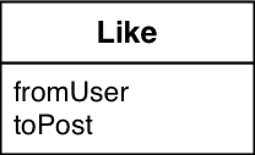
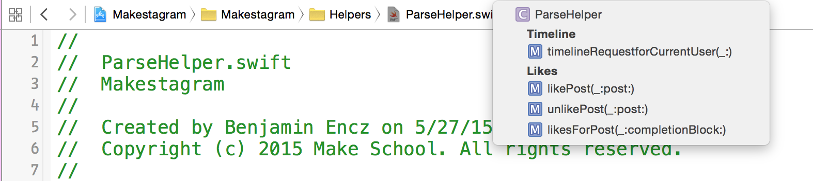
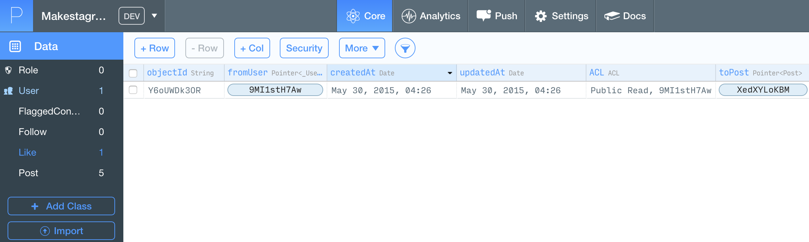
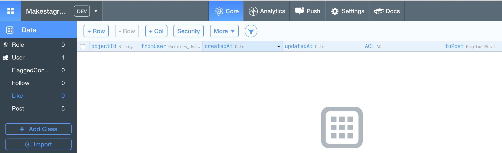

In this step we will tackle _the_ core feature of _Makestagram_. Liking posts!
We will need to tackle that feature from three different angles:

1. We need new Parse queries to fetch/add/remove likes of posts
2. We need to extend the `Post` model to store the likes that belong to it
3. We need to connect the UI to our new code. That means, for example, displaying the red heart if a user
has liked a certain post

We will start with adding new Parse queries! However, I first want to suggest some further cleanup of our existing Parse query!

#Cleaning up the Timeline Query - Once Again

Take a look at the query we have right now:

    static func timelineRequestforCurrentUser(completionBlock: PFArrayResultBlock) {
      let followingQuery = PFQuery(className: "Follow")
      followingQuery.whereKey("fromUser", equalTo:PFUser.currentUser()!)

      let postsFromFollowedUsers = Post.query()
      postsFromFollowedUsers!.whereKey("user", matchesKey: "toUser", inQuery: followingQuery)

      let postsFromThisUser = Post.query()
      postsFromThisUser!.whereKey("user", equalTo: PFUser.currentUser()!)

      let query = PFQuery.orQueryWithSubqueries([postsFromFollowedUsers!, postsFromThisUser!])
      query.includeKey("user")
      query.orderByDescending("createdAt")

      query.findObjectsInBackgroundWithBlock(completionBlock)
    }

**What could be improved?**

Well, we have a ton of _Strings_ inside of this method. Using strings in such a manner can cause multiple problems.

Firstly, typos can cause bugs that are difficult to debug. The compiler won't verify any of these strings and won't be able to identify if you are querying for _"Uzer"_ instead of _"User"_.

Secondly, if we use those strings in multiple places, we need to remember to update every occurrence of them if something in our Parse backend changes.

Instead of using plain strings it would be much better to use constants!
Let's add constants for all the different Parse classes and fields we are going to access! Since this isn't too exciting of an exercise, I'll provide you with the full list of constants that we need.

> [action]
Add the following constants to the `ParseHelper` class:
>
    class ParseHelper {
>
      // Following Relation
      static let ParseFollowClass       = "Follow"
      static let ParseFollowFromUser    = "fromUser"
      static let ParseFollowToUser      = "toUser"
>
      // Like Relation
      static let ParseLikeClass         = "Like"
      static let ParseLikeToPost        = "toPost"
      static let ParseLikeFromUser      = "fromUser"
>
      // Post Relation
      static let ParsePostUser          = "user"
      static let ParsePostCreatedAt     = "createdAt"
>
      // Flagged Content Relation
      static let ParseFlaggedContentClass    = "FlaggedContent"
      static let ParseFlaggedContentFromUser = "fromUser"
      static let ParseFlaggedContentToPost   = "toPost"
>
      // User Relation
      static let ParseUserUsername      = "username"
>
      // ...

This approach has a third advantage that we did not discuss yet: all of the fields are now unambiguous. Before this change we could have used _"toPost"_ to refer to either the _toPost_ column in the _FlaggedContent_ class, or to the _toPost_ column in the _Like_ class. Through giving all of these constants a name, we have removed this ambiguity.

Note that the constant names follow this pattern: _Parse[ClassName][FieldName]_. Consistent naming is important to make your life as a developer easier!

With these constants in place, we can now update our timeline query to use them.

> [action]
Change the timeline query to use constants instead of string literals:
>
    static func timelineRequestforCurrentUser(completionBlock: PFArrayResultBlock) {
      let followingQuery = PFQuery(className: ParseFollowClass)
      followingQuery.whereKey(ParseLikeFromUser, equalTo:PFUser.currentUser()!)
>
      let postsFromFollowedUsers = Post.query()
      postsFromFollowedUsers!.whereKey(ParsePostUser, matchesKey: ParseFollowToUser, inQuery: followingQuery)
>
      let postsFromThisUser = Post.query()
      postsFromThisUser!.whereKey(ParsePostUser, equalTo: PFUser.currentUser()!)
>
      let query = PFQuery.orQueryWithSubqueries([postsFromFollowedUsers!, postsFromThisUser!])
      query.includeKey(ParsePostUser)
      query.orderByDescending(ParsePostCreatedAt)
>
      query.findObjectsInBackgroundWithBlock(completionBlock)
    }

Same, same but nicer! Now we have a solid foundation to add more queries!

#Adding Parse Queries for Likes

There are three types of things our app needs to with likes:

1. Create a like, when a user likes a post
2. Delete a like, when a user unlikes a post
3. Fetch all likes for a given post

These three requirements translate directly into three different queries that we're going to
add to our `ParseHelper`.

Just as a refresher, here's how we are modeling likes in `Makestagram`:

It's a pretty simple model, that only stores a reference to the user that performed the like and the post that has been liked (ignoring all of the fields that Parse provides automatically).

##Creating Likes

So, how can we create a method that adds likes to a certain post? **I want to give you a try here!** Based on your experience with Parse so far, try and see if you can build a query for this on your own! We will play this game for all queries in this step.

If you come up with your own solution that seems to work but looks different from ours - please replace your solution with the provided one. That way we can avoid that you run into issues later on.

> [solution]
Here's our solution:
>
    static func likePost(user: PFUser, post: Post) {
      let likeObject = PFObject(className: ParseLikeClass)
      likeObject.setObject(user, forKey: ParseLikeFromUser)
      likeObject.setObject(post, forKey: ParseLikeToPost)
>
      likeObject.saveInBackgroundWithBlock(nil)
    }

It is pretty straight forward! the method takes a `PFUser` and a `Post` reference. Then it generates a `likeObject` based on these two input parameters and saves it.

##Deleting Likes

Deleting a like is a tiny bit trickier. We need to first build a query to find the like object before we can delete it. Can you still come up with the `unlikePost` method on your own?

> [solution]
Here's our solution:
>
    static func unlikePost(user: PFUser, post: Post) {
      // 1
      let query = PFQuery(className: ParseLikeClass)
      query.whereKey(ParseLikeFromUser, equalTo: user)
      query.whereKey(ParseLikeToPost, equalTo: post)
>
      query.findObjectsInBackgroundWithBlock {
        (results: [AnyObject]?, error: NSError?) -> Void in
         // 2
           if let results = results as? [PFObject] {
             for likes in results {
               likes.deleteInBackgroundWithBlock(nil)
             }
           }
      }
    }

1. We build a query to find the like of a given user that belongs to a given post
2. We iterate over all like objects that met our requirements and delete them.

Technically, there never should be more then one like for a given user on a given post. Our like code will ensure that. However, there are little guarantees in software development and especially when working with networking code, there are a ton of possible sources for issues. We could do some more error handling here, and log an error message if we find more then one like that - but that's well beyond the scope of this tutorial!

##Fetching all likes for a given post

It's once again on you! Try to come up with an implementation for the `likesForPost` method.
Hint: it should take a completion block and call it when the query completes! We already have implemented one Parse request that does this...

> [solution]
And here's our solution:
>
    // 1
    static func likesForPost(post: Post, completionBlock: PFArrayResultBlock) {
      let query = PFQuery(className: ParseLikeClass)
      query.whereKey(ParseLikeToPost, equalTo: post)
      // 2
      query.includeKey(ParseLikeFromUser)
>
      query.findObjectsInBackgroundWithBlock(completionBlock)
    }

There are two interesting aspects that should be highlighted:

1. Our method is taking a `PFArrayResultBlock` as an argument. We've used the same approach in our `timelineRequestforCurrentUser` method. The `PFArrayResultBlock` has the following signature:

    ([AnyObject]?, NSError?) -> Void

That's the default signature for the callback of most Parse queries. It returns an _optional_ result and and _optional_ error.
By taking this default block as argument, we can hand it directly to the `findObjectsInBackgroundWithBlock` method! This way, whoever has called the `likesForPost` method will get the results in the callback block that they provide.

2. We are using the `includeKey` method to tell Parse to fetch the `PFUser` object for each of the likes (we've discussed `includeKey` in detail when building the timeline request). We want to fetch the `PFUser` along with the likes, because we later on want to display the usernames of all users that have liked a post. Remember, without the `includeKey` line we would just have a reference to a `PFUser` and would have to start a separate request to fetch the information about the user.

##Summing It up

Awesome! We now have request to add / delete and fetch likes. Hopefully this section has helped to get a little bit more comfortable in writing and understanding Parse queries.

Just to make sure we're on the same page, here's what all the queries that we just added to the `ParseHelper` should look like:

    // MARK: Likes

    static func likePost(user: PFUser, post: Post) {
      let likeObject = PFObject(className: ParseLikeClass)
      likeObject.setObject(user, forKey: ParseLikeFromUser)
      likeObject.setObject(post, forKey: ParseLikeToPost)

      likeObject.saveInBackgroundWithBlock(nil)
    }

    static func unlikePost(user: PFUser, post: Post) {
      let query = PFQuery(className: ParseLikeClass)
      query.whereKey(ParseLikeFromUser, equalTo: user)
      query.whereKey(ParseLikeToPost, equalTo: post)

      query.findObjectsInBackgroundWithBlock {
        (results: [AnyObject]?, error: NSError?) -> Void in
          if let error = error {
            ErrorHandling.defaultErrorHandler(error)
          }

          if let results = results as? [PFObject] {
            for likes in results {
              likes.deleteInBackgroundWithBlock(nil)
            }
          }
      }
    }

    static func likesForPost(post: Post, completionBlock: PFArrayResultBlock) {
      let query = PFQuery(className: ParseLikeClass)
      query.whereKey(ParseLikeToPost, equalTo: post)
      query.includeKey(ParseLikeFromUser)

      query.findObjectsInBackgroundWithBlock(completionBlock)
    }

A short side note: We haven't discussed the `// MARK:` feature of Xcode yet. It allows you to group your methods into different sections which can be extremely useful! A click into the _Jumpbar_ in the top right corner of Xcode will show you an outline of methods you've add to your class:

If you include `// MARK:' sections in your source code, they will show up as headers in this view - great for navigating through more complex classes!

With all of the queries in place, we should think about how we want tie them into the rest of our code, next!
Where should we place the code that adds and removes likes from `Post` objects?

We're going to add it directly to the `Post` class and you'll shortly see why!

#Extending the Post Class

In most object oriented programs we wan't to couple the information that an object stores along with its behavior. If I have access to a `Post` object I would like to be able to like it or unlike it with a simple method call. I would also like to be able to access of all of the likes of a `Post` directly through a simple method call.

Now we're going to add this functionality to the `Post` class. It consists of two different parts:

1. Storing likes
2. Adding / removing likes

Let's start with storage. **Why do we want to store likes in the first place?**

##Storing Likes

We want to avoid to perform network requests, every single time we want to access the likes that belong to a post. Instead, similar to the post's image, we want to cache the information we have fetched.

Towards the end of this tutorial we will add a pull-to-refresh mechanism that allows users to refresh the timeline. We want to cache all information until such a refresh happens.

In which format should we store likes? For our purposes the best format is an array of users that have liked a certain post.

Just as with the image of a `Post`, we won't load all of the likes directly with the timeline query. Instead, we will load them lazily as soon as a post is displayed. This means, we once again need to deal with data is available _asynchronously_. Our favorite tool for such cases is the `Dynamic` wrapper - as we discussed in detail when we implemented the image download.

With all this in mind, let's add the `likes` property to the `Post` class.

> [action]
Add the following property to the `Post` class:
>
    var likes =  Dynamic<[PFUser]?>(nil)

We create the `likes` property as a _dynamic_, _optional_ array of `PFUser` - now that's a mouthful! However, we've used all of these concepts before. We make the property `Dynamic` so that we can listen to changes and update our UI after we've downloaded the likes for a post. We make it _optional_, because before we've downloaded the likes this property will be `nil`.

Now that we can store likes, we can add methods to the `Post` class that make it easy to retrieve, add and remove likes.

##Fetching Likes

We'll handle fetching likes very similar to fetching images. They are fetched lazily and that lazy fetching can be triggered by a method call.

Let's add this functionality in the form of a `fetchLikes` method. There are a bunch of a new concepts in that method, so I'll provide it for you and we'll discuss it in detail afterwards.

> [action]
Add the following method to the `Post` class:
>
    func fetchLikes() {
      // 1
      if (likes.value != nil) {
        return
      }
>
      // 2
      ParseHelper.likesForPost(self, completionBlock: { (var likes: [AnyObject]?, error: NSError?) -> Void in
        // 3
        likes = likes?.filter { like in like[ParseHelper.ParseLikeFromUser] != nil }
>
        // 4
        self.likes.value = likes?.map { like in
          let like = like as! PFObject
          let fromUser = like[ParseHelper.ParseLikeFromUser] as! PFUser
>
          return fromUser
        }
      })
    }

1. First we are checking whether `likes.value` already has stored a value or is nil. If we've already stored a value, we will skip the entire method. As discussed, we will cache all likes until the entire timeline is refreshed (which we haven't implemented yet). So as soon as `likes.value` has a cached value, we don't need to perform the body this method.
2. We fetch the likes for the current `Post` using the method of `ParseHelper` that we created earlier
3. There is a new concept on this line: the `filter` method that we call on our `Array`. The `filter` method takes a closure and returns an array that only contains the objects from the original array that meet the requirement stated in that closure. The closure passed to the `filter` method gets called for each element in the array, each time passing the current element as the `like` argument to the closure. Note that you can pick any arbitrary name for the argument that we called `like`. **So why are we filtering the array in the first place?** We are removing all likes that belong to users that no longer exist in our _Makestagram_ app (because their account has been deleted). Without this filtering the next statement could crash.
4. Here we are again using a new method: `map`. The `map` method behaves similar to the `filter` method in that it takes a closure that is called for each element in the array and in that it also returns a new array as a result. The difference is, that unlike `filter`, `map` does not remove objects but _replaces_ them. In this particular case, we are replacing the likes in the array with the users that are associated with the like. We start with an array of likes and retrieve an array of users. Then we assign the result to our `likes.value` property.

Now we're able to lazily fetch the likes for a post!

##Checking If a Post is Liked by a given User

Next, we'll add a method that will allow us to find out whether a post is liked by a user or not.
We'll use that method to decide if the like button for a post should be displayed in gray or in red.
This method will be quite a lot simpler than `fetchLikes`. All we need to do is check if a given user is contained in the array stored in the `likes` property.

> [action]
Add the `doesUserLikePost` method to the `Post` class:
>
    func doesUserLikePost(user: PFUser) -> Bool {
      if let likes = likes.value {
        return contains(likes, user)
      } else {
        return false
      }
    }

As promised, this method is pretty straightforward. The only part that might be new to you is the `contains` function. The `contains` function takes an array and an object and returns whether or not the object is stored inside of the array.

##Liking and Unliking a Post

The the last piece of functionality that we need to squeeze into the `Post` class for now is the like / unlike functionality. And we can actually wrap it into a single method that toggles whether or not a post is liked by a user - after all, the app only provides a single button to like / unlike. Furthermore it doesn't make sense to create a second `Like` object if the user a already likes a given post.

> [action]
Add the following method to the `Post` class:
>
    func toggleLikePost(user: PFUser) {
      if (doesUserLikePost(user)) {
        // if image is liked, unlike it now
        // 1
        likes.value = likes.value?.filter { $0 != user }
        ParseHelper.unlikePost(user, post: self)
      } else {
        // if this image is not liked yet, like it now
        // 2
        likes.value?.append(user)
        ParseHelper.likePost(user, post: self)
      }
    }

1. If the `toggleLikePost` method is called and a  user likes a post, we unlike the post. First by removing the the user from the local cache stored in the `likes` property, then by syncing the change with Parse. We remove the user from the local cache by using the `filter` method on the array stored in `likes.value`.
2. If the user doesn't like the post yet, we add them to the local cache and then synch the change with Parse.

Great! Our changes to the `Post` class are complete. Next, we can make use of our new methods!

#Loading Likes Lazily

Wow, did you notice the three _l_'s in the header? Joking aside, let's take care of loading the likes for each post, as soon as it gets displayed. Now that our `Post` class provides a method for exactly that, it's pretty easy to implement the feature.

**Do you remember where we should place the lazy loading code?**

> [solution]
Exactly: inside the `cellForRowAtIndexPath` method of the `TimelineViewController`. Why? Because that method gets called immediately before a cell gets displayed. Extend the method to look like this:
>
    func tableView(tableView: UITableView, cellForRowAtIndexPath indexPath: NSIndexPath) -> UITableViewCell {
      let cell = tableView.dequeueReusableCellWithIdentifier("PostCell") as! PostTableViewCell
>
      let post = posts[indexPath.row]
      post.downloadImage()
      post.fetchLikes()
      cell.post = post
>
      return cell
    }

#Toggling Likes from the UI

Now it's time to add some interactivity to our app. Let's hook the like functionality up to our like button in the `PostTableViewCell`.

> [action]
Change the implementation of `likeButtonTapped` in the `PostTableViewCell` to call the `toggleLikePost` method:
>
    @IBAction func likeButtonTapped(sender: AnyObject) {
      post?.toggleLikePost(PFUser.currentUser()!)
    }

Awesome! Since we are using the Parse framework to access the current user, you will also need to import the Parse framework into the `PostTableViewCell`.

> [action]
Import the Parse framework inside of the `PostTableViewCell` by adding the following import statement
>
    import Parse

Now we have created the first interactive connection between our code and the UI!

#Testing the Like Functionality

Now it's time to test! Run the app and hit the like button on the first post. Then open the Parse data browser.
You should see one like instance:

Hit the like button on the same post again and the like should be removed:

Awesome! Our very first interactive feature!

#Conclusion

This was a pretty intense step! You first learned that string constants are better than string literals. Then you implemented a few more Parse queries which hopefully made you more comfortable with the `PFQuery` class. You've also added a new `Dynamic` property that allows us to load likes of posts lazily.

From a Swift language perspective you learned about `filter` and `map`! Both functions allow you to manipulate collections by performing a closure that you provide to each element in the collection. The `filter` function helps you to remove elements from a collection. The `map` function helps you to replace elements in a collection by mapping them from one representation to another. We used that functionality to turn like objects into user objects.

We've made great progress on the core functionality of _Makestagram_, in the next chapter we will visualize likes to make our progress more apparent!
