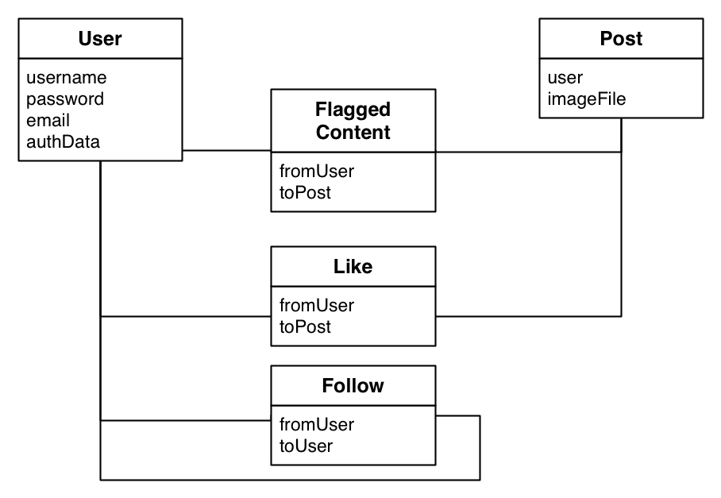

To design a data model we need to know which features our app will have. The goal of this tutorial is to build a photo sharing app. Users shall be able to share photos, follow users and interact with other users through likes.

This is the detailed list of features our app will have:

- Sign up with an email address or a Facebook account
- Find other users by searching for their username
- Follow other users
- View photos posted by other users
- Like photos
- Post photos
- Add filters to photos
- Delete photos you posted
- Flag photos other users have posted

You know most of the features from popular social network apps. You might wonder why include *flagging* content in this simple photo sharing app. We include it, because it's an important feature to get your app into Apple's App Store. Apple requires apps with user created content to have a *flag* feature - this way users can report inappropriate content. Since you will likely need this feature in your original app, we have included it as part of the tutorial.

#Finding the Classes in Our App

Now that we know which features our app will have, how can we build a data model?

Typically the first step in defining a data model is finding different classes that are involved in our features.

**Looking at the feature list above, which classes can you identify?**

> [solution]
Looking at the features above we can identify at least the three following classes:
>
>- **User**
>- **Post**
>- **Photo**

These three classes will definitely be part of our data model!

#Modelling Object Relationships

In addition to finding classes we also need to think about the possible interactions with them. Some of the interactions need to be considered when defining our data model.

Deleting a post is easy, we can simply delete the associated post object, so we don't need to integrate this into our model.

Some interactions are more complex, such as liking a post or following a user.

**How could we store which user has liked which image? How can we store which users another user is following?**

Your first reaction is very likely similar to this: we can store the likes as part of the post object and the followers as part of the user object!

However, there is a non-obvious issue with this approach.

Imagine the following scenario: we are building the timeline feature for our app. We want to find all the users that the current user is following, in order to show their latest post. How can we find these users? If we store the information about *followers* as part of the user object, we need to search through **all** users of the app and see if we are part of the follower list for each of them.

If your app has a lot of users, such a request will take a very long time!

For this reason most apps, including ours, use separate classes to model the relationship between objects. This means we will have the following three additional classes:

- **Follow** - stores all *follow* relationships between users. Whenever a user follows another user, a *Follow* object is created
- **Like** - stores all the *like* relationships. When a user likes a post, a *Like* object is created
- **FlaggedContent** - stores which content was flagged by which user. When a user flags a post, a *FlaggedContent* object is created

#Putting our model together

Now that we have identified all the classes we need, we can sketch out what our data model should look like:

We now have a total of five classes. You might have realized that we don't have a *Photo* class - this is because Parse already provides an easy way to store files. We can store each photo with the post it belongs to.

The diagram above illustrates the different classes, their most important properties and the relationships between them.

Let's discuss them briefly:

- **User**
A new *User* class is created whenever a user signs up. The *username* will store the user's display name: this name is used to log in and is displayed in the app when the user creates posts or likes other posts.

- **Post**
A *Post* class is created whenever a user posts a new photo. The most important properties of a post are the *user* it belongs to and the *imageFile* stored along with the post.

- **FlaggedContent**
Marks which posts have been flagged. It stores a reference to the *post* that is flagged and the *user* that has flagged it.

- **Like**
Works just as *FlaggedContent*; stores a reference to the *post* that is liked and the *user* that has liked it.

- **Follow**
Stores a following relationship between two users. The *toUser* field stores the user being followed, the *fromUser* user field stores the following user.

Now you should have a good understanding of all the classes we need. You will be able to use our approach to identify the classes for your original app as well. First, take a look at the different subjects that you can identify from your features, e.g. *Users*, *Posts*, etc. Then take a look at the relationships between them.

With this understanding we can now move on to some action - setting up all of the classes in Parse.
