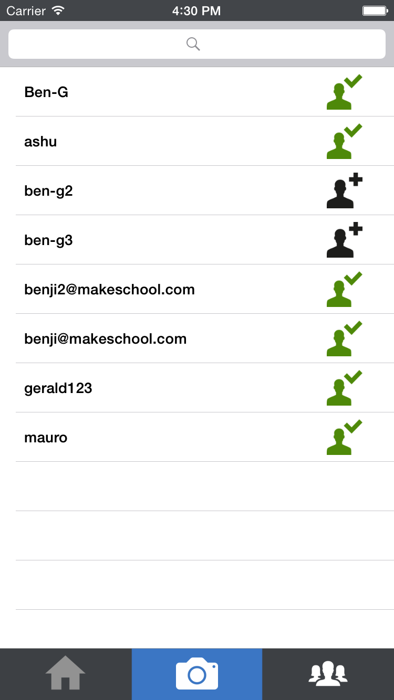
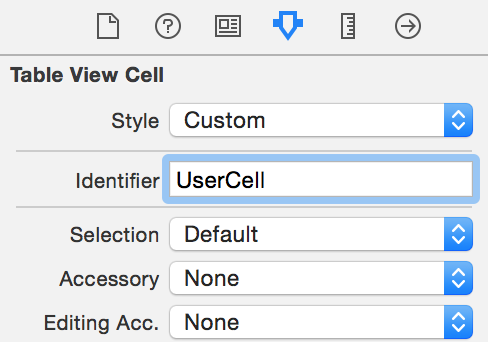
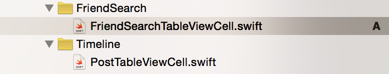
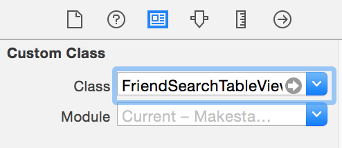
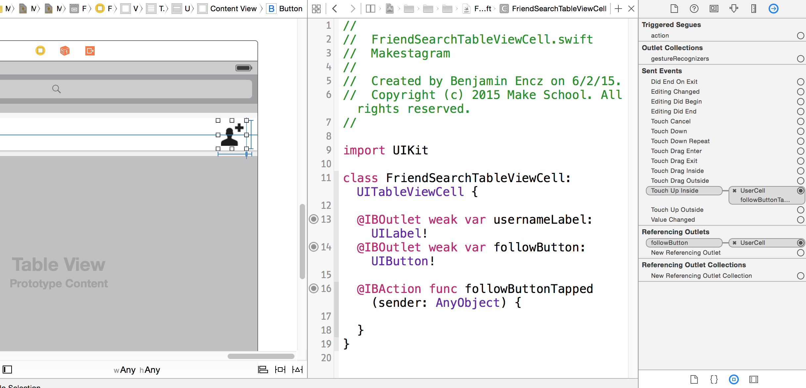
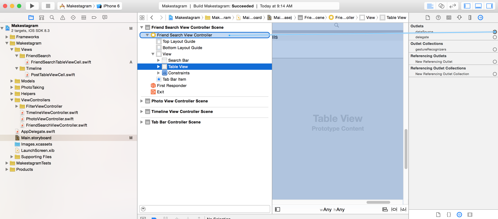
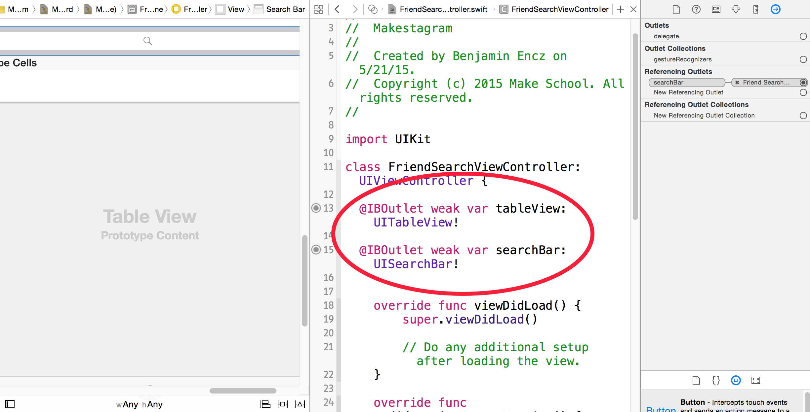
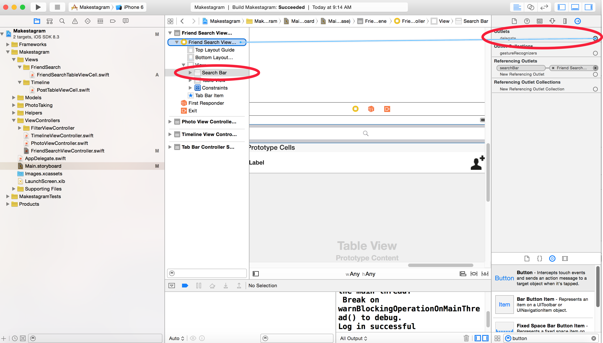

In this chapter we will add a feature that will allow users to find & follow friends. We will start by setting up the UI in Storyboard, then we'll fill in the implementation in code.

**The explanations and instructions in this step will not be as detailed as in the previous ones - the View Controller we are about to build behaves very similar to the main View Controller in the notes app. Therefore it won't be necessary to discuss all of the involved concepts.**

If you are incorporating any kind of search into your app, the code in this step should serve as a very good template!

#Setting up the Friend Search UI

This is what the final UI will look like, once the entire app is complete:

At the root level we only have two components: a Search Bar and a Table View.

##Adding a Search Bar

> [action]
> Add a Search Bar to the `FriendSearchViewController` as show in the video below:
> <video width="100%" height="400pt" controls>
  <source src="https://s3.amazonaws.com/mgwu-misc/SA2015/SearchBarConstraints_small.mov" type="video/mp4">
>
> Remember that the last step is to use the shortkey _⌘⌥=_ to update the frame according to its new constraints.

##Adding a Table View

> [action]
> Add a Table View to the `FriendSearchViewController` as shown in the video below:
> <video width="100%" height="400pt" controls>
  <source src="https://s3.amazonaws.com/mgwu-misc/SA2015/FriendSearchTableViewConstraints_small.mov" type="video/mp4">

##Adding a Custom Table View Cell

> [action]
> Add a Table View Cell to the `FriendSearchViewController` as shown in the video below:
> <video width="100%" height="400pt" controls>
  <source src="https://s3.amazonaws.com/mgwu-misc/SA2015/CustomCellFriendSearch_small.mov" type="video/mp4">

#Creating Code Connections

We'll need multiple Code Connections to generate the cells from code and to implement the _follow_ button. We'll also need code connections for the Search Bar.

##Cell identifier

Let's start by setting up an identifier for our new Table View Cell.

> [action]
> Set the identifier for the `FriendSearchViewController`'s Table View Cell to _UserCell_:
> 

##Custom Cell Class

Next, create a new class for this Cell.

> [action]
> Create a new `UITableViewCell` subclass called `FriendSearchTableViewCell` and add it to the _View_ group as shown below. Remember to first add a folder on the filesystem, then add that folder to Xcode. That way groups and folders stay in sync:
> 

##Referencing Outlets and Button Callback

Then connect the new class to the Table View Cell.

> [action]
> Set the custom class of the TableViewCell to `FriendSearchTableViewCell`:
> 

Next, set up referencing outlets for the label and the button on the Table View Cell. Also add a callback for button taps:
> [action]
> Create the three code connections outlined below with the `FriendSearchTableViewCell`:
> 

##Table View Data Source

Now, set the Table View's Data Source to be the `FriendSearchViewController`.

> [action]
> Set the Table View Data Source as as shown below:
> 

##Referencing Outlets for FriendSearchViewController

Next, set up referencing outlets to the `FriendSearchViewController` from the Table View and the Search Bar.

> [action]
> Set up the following referencing outlets:
> 

##Search Bar Delegate

Finally, set up the Search Bar Delegate to be the `FriendSearchViewController`.

> [action]
> Set up the Search Bar Delegate as shown below:
> 

#Adding the Friend Search Code

As discussed at the beginning of this step, we won't discuss the code in detail. The source code has comments in all the relevant places. We will provide you with the full source code that you need to each class - you should take time to read through it and make sure that you understand it. We'll then discuss a few interesting, high-level details about the solution.

##Addding Parse Requests

First we are going to add 5 different Parse request.

> [action]
> Add the following methods to the `ParseHelper` class:
>
     // MARK: Following
>
    /**
      Fetches all users that the provided user is following.
>
      :param: user The user who's followees you want to retrive
      :param: completionBlock The completion block that is called when the query completes
    */
    static func getFollowingUsersForUser(user: PFUser, completionBlock: PFArrayResultBlock) {
      let query = PFQuery(className: ParseFollowClass)
>
      query.whereKey(ParseFollowFromUser, equalTo:user)
      query.findObjectsInBackgroundWithBlock(completionBlock)
    }
>
    /**
      Establishes a follow relationship between two users.
>
      :param: user    The user that is following
      :param: toUser  The user that is being followed
    */
    static func addFollowRelationshipFromUser(user: PFUser, toUser: PFUser) {
      let followObject = PFObject(className: ParseFollowClass)
      followObject.setObject(user, forKey: ParseFollowFromUser)
      followObject.setObject(toUser, forKey: ParseFollowToUser)
>
      followObject.saveInBackgroundWithBlock(nil)
    }
>
    /**
      Deletes a follow relationship between two users.
>
      :param: user    The user that is following
      :param: toUser  The user that is being followed
    */
    static func removeFollowRelationshipFromUser(user: PFUser, toUser: PFUser) {
      let query = PFQuery(className: ParseFollowClass)
      query.whereKey(ParseFollowFromUser, equalTo:user)
      query.whereKey(ParseFollowToUser, equalTo: toUser)
>
      query.findObjectsInBackgroundWithBlock {
        (results: [AnyObject]?, error: NSError?) -> Void in
>
          let results = results as? [PFObject] ?? []
>
          for likes in results {
            likes.deleteInBackgroundWithBlock(nil)
          }
      }
    }
>
    // MARK: Users
>
    /**
      Fetch all users, except the one that's currently signed in.
      Limits the amount of users returned to 20.
>
      :param: completionBlock The completion block that is called when the query completes
>
      :returns: The generated PFQuery
    */
    static func allUsers(completionBlock:PFArrayResultBlock) -> PFQuery {
      let query = PFUser.query()!
      // exclude the current user
      query.whereKey(ParseHelper.ParseUserUsername,
        notEqualTo: PFUser.currentUser()!.username!)
      query.orderByAscending(ParseHelper.ParseUserUsername)
      query.limit = 20
>
      query.findObjectsInBackgroundWithBlock(completionBlock)
>
      return query
    }
>
    /**
    Fetch users who's username matches the provided search term.
>
    :param: searchText The text that should be used to search for users
    :param: completionBlock The completion block that is called when the query completes
>
    :returns: The generated PFQuery
    */
    static func searchUsers(searchText: String, completionBlock: PFArrayResultBlock)
      -> PFQuery {
      /*
        NOTE: We are using a Regex to allow for a case insensetive compare of usernames.
        Regex can be slow on large datasets. For large amount of data it's better to store
        lowercased username in a separate column and perform a regular string compare.
      */
      let query = PFUser.query()!.whereKey(ParseHelper.ParseUserUsername,
        matchesRegex: searchText, modifiers: "i")
>
      query.whereKey(ParseHelper.ParseUserUsername,
        notEqualTo: PFUser.currentUser()!.username!)
>
      query.orderByAscending(ParseHelper.ParseUserUsername)
      query.limit = 20
>
      query.findObjectsInBackgroundWithBlock(completionBlock)
>
      return query
    }

We've added a total of 5 different queries. All of these queries will be used by the `FriendSearchViewController`.

Two are used to search for users. One returns all users (except the signed in one) - that query is used when the Search Bar in the `FriendSearchViewController` is empty.

The other user search query takes the current search string and returns the users that match it.

It's noteworthy that both of these methods return a `PFQuery` object. This allows the `FriendSearchViewController` to keep a reference to the request that is currently going on. When a user types into the search field, we will kick of a new search request every time the text changes; you'll see that later in the code for the `FriendSearchViewController`. Using the reference to the current query, the `FriendSearchViewController` will cancel the current request before starting a new one. That way we avoid that a fast-typing user causes many requests to start in parallel. Whenever we start a new search query, the old query is outdated. So if it is still ongoing, we can cancel it since we are no longer interested in these outdated results.

The other three methods are used to add, remove and retrieve followees of the current user. These are pretty standard Parse queries without any noteworthy implementation details.

Using these 5 queries the `FriendSearchViewController` will be able to display users that we are searching for _and_ to mark whether or not we are following them.

##Implementing the FriendSearchTableViewCell

Next, let's discuss the implementation of the `FriendSearchTableViewCell`. The main features of that cell are displaying a username and a _follow_ button. That follow button can indicate whether or not we are already following a user.

When the button is tapped, we want _Makestagram_ to follow / unfollow the person. However, we won't implement that directly in the `FriendSearchTableViewCell`. Typically we want to keep more complex functionality outside of our views. Our solution is to define a `delegate` that will be responsible for performing the follow / unfollow.

The `delegate` of each cell will be the `FriendSearchViewController`. When the follow button is tapped, the `FriendTableViewCell` will inform it's delegate.

> [action]
> Replace the content of _FriendSearchTableViewCell.swift_ with the following one:
>
    import UIKit
    import Parse
>
    protocol FriendSearchTableViewCellDelegate: class {
      func cell(cell: FriendSearchTableViewCell, didSelectFollowUser user: PFUser)
      func cell(cell: FriendSearchTableViewCell, didSelectUnfollowUser user: PFUser)
    }
>
    class FriendSearchTableViewCell: UITableViewCell {
>
      @IBOutlet weak var usernameLabel: UILabel!
      @IBOutlet weak var followButton: UIButton!
      weak var delegate: FriendSearchTableViewCellDelegate?
>
      var user: PFUser? {
        didSet {
          usernameLabel.text = user?.username
        }
      }
>
      var canFollow: Bool? = true {
        didSet {
          /*
            Change the state of the follow button based on whether or not
            it is possible to follow a user.
          */
          if let canFollow = canFollow {
            followButton.selected = !canFollow
          }
        }
      }
>
      @IBAction func followButtonTapped(sender: AnyObject) {
        if let canFollow = canFollow where canFollow == true {
          delegate?.cell(self, didSelectFollowUser: user!)
          self.canFollow = false
        } else {
          delegate?.cell(self, didSelectUnfollowUser: user!)
          self.canFollow = true
        }
      }
    }

Once again, there aren't too many new concepts in this code. After you took a detailed look at the code, we can move on to the core component: the `FriendSearchViewController`.

##Implementing the FriendSearchViewController

The `FriendSearchViewController` is very similar to the main View Controller in _Make School Notes_. It has two different states: searching or not searching. Based on that state it calls one of the two different Parse queries that we defined earlier.

The biggest novelty in the `FriendSearchViewController` is the concept of a local cache. We create a special property called `followingUsers` that stores which users the current user is following. When one of the `FriendSearchTableViewCell`s triggers a unfollow / follow, we send a request to Parse, **but** we also update the `followingUsers` property immediately. As you will see in the code, this allows to update the UI immediately, without waiting for the server to respond.

> [action]
> Replace the content of _FriendSearchViewController.swift_ with the following code:
>
    import UIKit
    import ConvenienceKit
    import Parse
>
    class FriendSearchViewController: UIViewController {
>
      @IBOutlet weak var searchBar: UISearchBar!
      @IBOutlet weak var tableView: UITableView!
>
      // stores all the users that match the current search query
      var users: [PFUser]?
>
      /*
        This is a local cache. It stores all the users this user is following.
        It is used to update the UI immediately upon user interaction, instead of waiting
        for a server response.
      */
      var followingUsers: [PFUser]?
>
      // the current parse query
      var query: PFQuery? {
        didSet {
          // whenever we assign a new query, cancel any previous requests
          oldValue?.cancel()
        }
      }
>
      // this view can be in two different states
      enum State {
        case DefaultMode
        case SearchMode
      }
>
      // whenever the state changes, perform one of the two queries and update the list
      var state: State = .DefaultMode {
        didSet {
          switch (state) {
          case .DefaultMode:
            query = ParseHelper.allUsers(updateList)
>
          case .SearchMode:
            let searchText = searchBar?.text ?? ""
             query = ParseHelper.searchUsers(searchText, completionBlock:updateList)
          }
        }
      }
>
      // MARK: Update userlist
>
      /**
        Is called as the completion block of all queries.
        As soon as a query completes, this method updates the Table View.
      */
      func updateList(results: [AnyObject]?, error: NSError?) {
        self.users = results as? [PFUser] ?? []
        self.tableView.reloadData()
>
        if let error = error {
          ErrorHandling.defaultErrorHandler(error)
        }
      }
>
      // MARK: View Lifecycle
>
      override func viewWillAppear(animated: Bool) {
        super.viewWillAppear(animated)
>
        state = .DefaultMode
>
        // fill the cache of a user's followees
        ParseHelper.getFollowingUsersForUser(PFUser.currentUser()!) {
          (results: [AnyObject]?, error: NSError?) -> Void in
            let relations = results as? [PFObject] ?? []
            // use map to extract the User from a Follow object
            self.followingUsers = relations.map {
              $0.objectForKey(ParseHelper.ParseFollowToUser) as! PFUser
            }
>
            if let error = error {
              // Call the default error handler in case of an Error
              ErrorHandling.defaultErrorHandler(error)
            }
        }
      }
>
    }
>
    // MARK: TableView Data Source
>
    extension FriendSearchViewController: UITableViewDataSource {
>
      func tableView(tableView: UITableView, numberOfRowsInSection section: Int) -> Int {
        return self.users?.count ?? 0
      }
>
      func tableView(tableView: UITableView, cellForRowAtIndexPath indexPath: NSIndexPath) -> UITableViewCell {
        let cell = tableView.dequeueReusableCellWithIdentifier("UserCell") as! FriendSearchTableViewCell
>
        let user = users![indexPath.row]
        cell.user = user
>
        if let followingUsers = followingUsers {
          // check if current user is already following displayed user
          // change button appereance based on result
          cell.canFollow = !contains(followingUsers, user)
        }
>
        cell.delegate = self
>
        return cell
      }
    }
>
    // MARK: Searchbar Delegate
>
    extension FriendSearchViewController: UISearchBarDelegate {
>
      func searchBarTextDidBeginEditing(searchBar: UISearchBar) {
        searchBar.setShowsCancelButton(true, animated: true)
        state = .SearchMode
      }
>
      func searchBarCancelButtonClicked(searchBar: UISearchBar) {
        searchBar.resignFirstResponder()
        searchBar.text = ""
        searchBar.setShowsCancelButton(false, animated: true)
        state = .DefaultMode
      }
>
      func searchBar(searchBar: UISearchBar, textDidChange searchText: String) {
        ParseHelper.searchUsers(searchText, completionBlock:updateList)
      }
>
    }
>
    // MARK: FriendSearchTableViewCell Delegate
>
    extension FriendSearchViewController: FriendSearchTableViewCellDelegate {
>
      func cell(cell: FriendSearchTableViewCell, didSelectFollowUser user: PFUser) {
        ParseHelper.addFollowRelationshipFromUser(PFUser.currentUser()!, toUser: user)
        // update local cache
        followingUsers?.append(user)
      }
>
      func cell(cell: FriendSearchTableViewCell, didSelectUnfollowUser user: PFUser) {
        if var followingUsers = followingUsers {
          ParseHelper.removeFollowRelationshipFromUser(PFUser.currentUser()!, toUser: user)
          // update local cache
          removeObject(user, fromArray: &followingUsers)
        }
      }
>
    }

Take your time to read through this implementation and the comments in the source code! The implementation of the `FriendSearchViewController` completes the Friend Search feature.

Once you are done you can move on to the next step: importing test data.

#Getting Additional Users into Makestagram

To test all of this new functionality we need multiple users with multiple posts stored on our server. There are two ways how you can accomplish this:

1. Create new users in the Parse Data Browser, then log in with these users and create posts.
2. [Download the data that we have prepared for you.](https://s3.amazonaws.com/mgwu-misc/SA2015/Parse_Exports.zip)

The downloaded data contains multiple users and a few posts. You can import them into your server through the Parse data browser.

> [action]
> 1. Unzip the Parse data that you downloaded
> 2. Use the _import_ functionality in the Parse Data Browser to select the two Parse _.json_ files and upload them:
> <video width="100%" height="400pt" controls>
  <source src="https://s3.amazonaws.com/mgwu-misc/SA2015/ParseImport_small.mov" type="video/mp4">
> 3. Make sure to import the *_User* file and the _Post_ file  

Now you should be able to try out the new feature. Follow another user, then refresh the timelime:

> <video width="100%" height="400pt" controls>
  <source src="https://s3.amazonaws.com/mgwu-misc/SA2015/FollowNewUser_small.mov" type="video/mp4">

You should see our posts show up on the timeline! This is very exciting. Now you can use the app with multiple user!

#Conclusion

This step serves as a nice template for implementing a search screen in Parse. It was mostly a re-iteration of things you have learned earlier on. Hopefully this re-iteration made you more comfortable in working with Storyboard and building View Controllers from scratch!

In the next step we will discuss how to add a signup and login screen to _Makestagram_!
