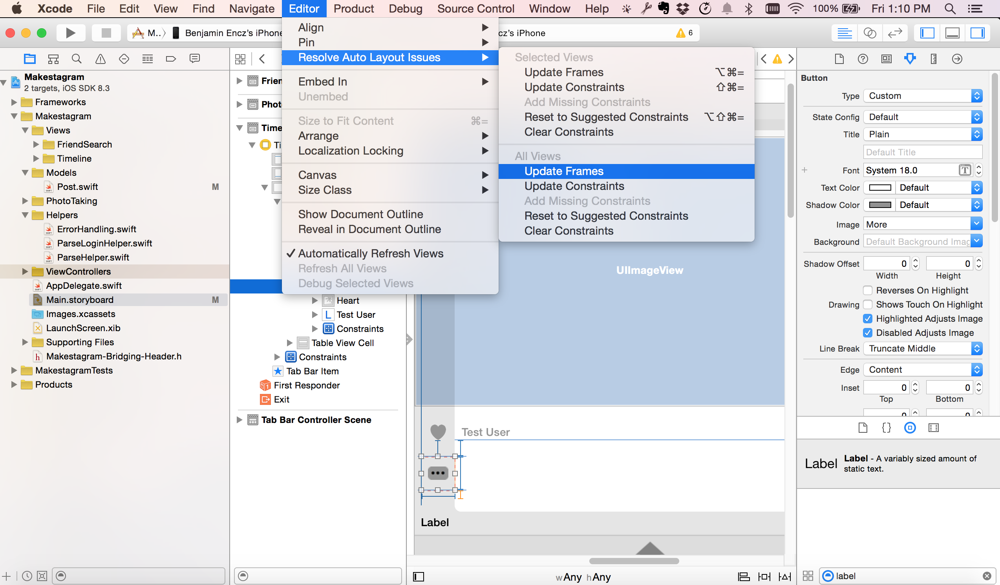
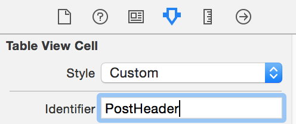
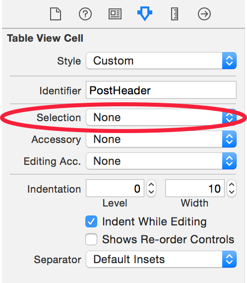
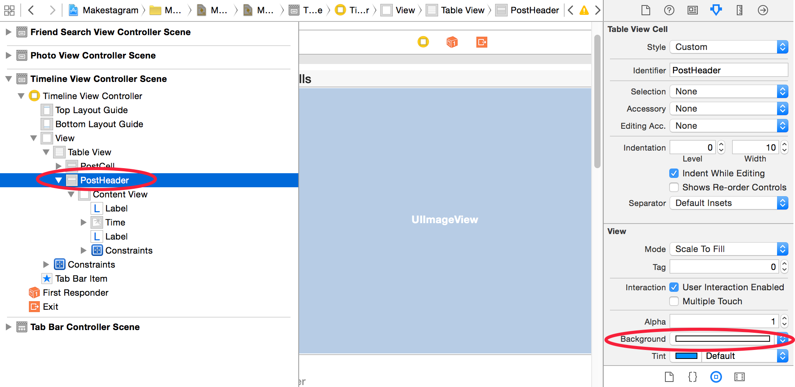
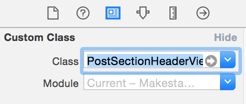
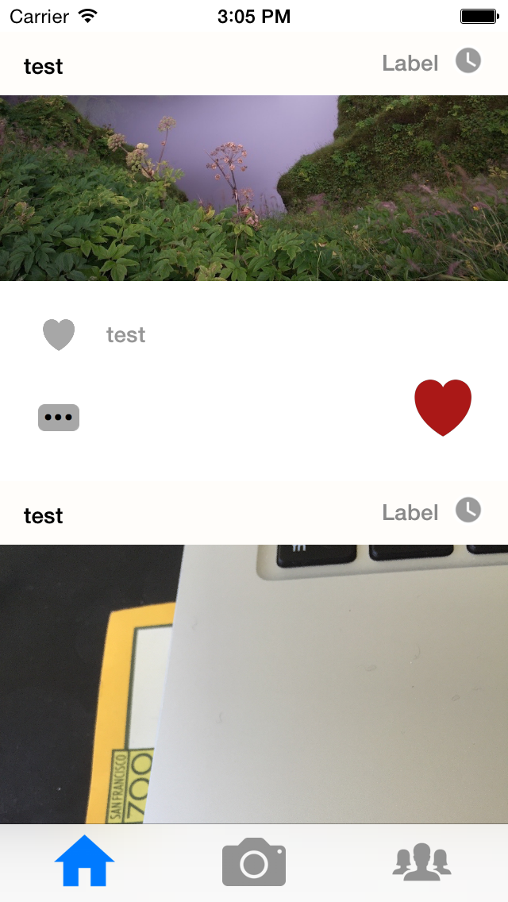

This and the following steps will focus primarily on improving the design of _Makestagram_. One of the missing visual features are headers above every post that show the username and when the post was created. Here's what the final timeline of _Makestagram_ will look like, when it includes that feature:

![image(stacked_headers.png)

In this step we will add these headers to every post. The header will be a second type of `UITableViewCell` that we will configure in Interface Builder.

#Creating the Header Cell

Let's start by setting that cell up.

> [action]
> Create a new `UITableViewCell` for the Post's header, as shown in the video below:
> <video width="100%" controls>
  <source src="https://s3.amazonaws.com/mgwu-misc/SA2015/SetupPostHeader_small.mov" type="video/mp4">
>
Throughout the instructions I have been updating the frames of our views by using the _⌘⌥=_ shortkey. To make sure that your frames are up to date, select any View in the Storyboard, then select _Update Frames_ as shown below:

Next, we need to define an _identifier_ for that new Table View Cell so that we can reference it in code.

> [action]
> Set the identifier of the cell to _PostHeader_:
> 

Just as with the post cell we don't want this cell to be selectable; we are not using the header cell for user interaction, instead we only want to display information.

> [action]
> Disable selection for the header cell:
> 

And finally, the header should have a solid white background.

> [action]
> Set the background color of the header cell to white:
> 

We will also need a new Swift class for this cell. That will allow us to create references to the two labels on the header. We can then use these references to display the username of the creator of a post along with the creation date.

#Setting up Code Connections

> [action]
> Create a new class `PostSectionHeaderView` and make it a subclass of `UITableView`.

Now we'll connect our class and the cell in Interface Builder and create referencing outlets for both labels.

> [action]
> Set the _Custom Class_ of the new Table View Cell:

Now we can create the referencing outlets.

> [action]
> Add referencing outlets for both labels:

Now our Interface Builder setup is complete and we can start writing some code.

#Implementing the Post Cell Header

The code for the header cell will be very simple. We want it to accept a `Post` object and then display the information contained in it. For now, we will skip the time information and only display the username. In the next step we'll use a third-party library which will help us displaying how long ago a post has been created.

> [action]
> Change the content of the _PostSectionHeaderView.swift_ file to look as following:
>
    import UIKit
>
    class PostSectionHeaderView: UITableViewCell {
>
      @IBOutlet weak var postTimeLabel: UILabel!
      @IBOutlet weak var usernameLabel: UILabel!
>
      var post: Post? {
        didSet {
          if let post = post {
            usernameLabel.text = post.user?.username
          }
        }
      }
    }

As you can see: compared to the code we've written so far, this is not too exciting! The more interesting part is presenting this new header cell above every single post in our Table View.

#Displaying the Post Cell Header

Luckily, displaying our header cells is not too complicated. Apple has built this functionality into `UITableView`.

The `UITableView` divides its content into sections and rows. Currently our Table View has exactly one section, with all posts displayed as individual rows within that section.

Each section in a `UITableView` can have a header view. This means we could easily display _one_ header view for our _one_ section.

But how can we display a header for each post?

The trick is to change the structure of our data in the Table View. Instead of displaying each post as a row, we will display each post as a _section_. This way we will be able to provide an individual section header for each post.

Essentially we are swapping the meaning of rows and sections - this requires some changes to our `TimelineViewController`.

Let's first update the two methods that define the amount of rows and sections!

> [action]
> Change the implementation of `numberOfSectionsInTableView(_:)` and `tableView(_: UITableView, numberOfRowsInSection)` to look as following:
>
    func numberOfSectionsInTableView(tableView: UITableView) -> Int {
      return self.timelineComponent.content.count
    }
>
    func tableView(tableView: UITableView, numberOfRowsInSection section: Int) -> Int {
      return 1
    }

All we are doing is swapping the implementation of both of these methods. We now have a section for each post, that contains exactly one row. Before the change we had exactly one section that contained one row for each post.

Now that _sections_, and no longer _rows_, are mapped to posts, we also need to change our implementation of `tableView(_:, cellForRowAtIndexPath)`.

> [action]
> Change the `tableView(_:, cellForRowAtIndexPath)` method to look as following:
>
    func tableView(tableView: UITableView, cellForRowAtIndexPath indexPath: NSIndexPath) -> UITableViewCell {
      let cell = tableView.dequeueReusableCellWithIdentifier("PostCell") as! PostTableViewCell
>
      let post = timelineComponent.content[indexPath.section]
      post.downloadImage()
      post.fetchLikes()
      cell.post = post
>
      return cell
    }

We now select which post should be displayed based on `indexPath.section` instead of `indexPath.row`.

We need to apply the same change to the `tableView(_:, willDisplayCell:, forRowAtIndexPath)` method!

> [action]
> Change the implementation of `tableView(_:, willDisplayCell:, forRowAtIndexPath)` to look as following:
>
    func tableView(tableView: UITableView, willDisplayCell cell: UITableViewCell, forRowAtIndexPath indexPath: NSIndexPath) {
>
      timelineComponent.targetWillDisplayEntry(indexPath.section)
    }

Now we are informing the `timelineComponent` about which post is currently being displayed by sending it the `indexPath.section` instead of the `indexPath.row`.

At this point we have successfully swapped the meaning of rows and sections throughout the entire `TimelineViewController`. Now we can add the code that will display our section headers.

We need to implement two methods of the `UITableViewDelegate` protocol. One defines the height of our header, the other is responsible for providing the view that should be displayed.

> [action]
> Add the following two methods to the `UITableViewDelegate` extension of the `TimelineViewController`:
>
    func tableView(tableView: UITableView, viewForHeaderInSection section: Int) -> UIView? {
      let headerCell = tableView.dequeueReusableCellWithIdentifier("PostHeader") as! PostSectionHeaderView
>
      let post = self.timelineComponent.content[section]
      headerCell.post = post
>
      return headerCell
    }
>
    func tableView(tableView: UITableView, heightForHeaderInSection section: Int) -> CGFloat {
      return 40
    }

The implementation for providing header cells is almost identical to the code that provides the post cells - there aren't any new concepts in these few lines. We dequeue a _PostHeader_ cell, fetch the corresponding post and assign it to the cell. The cell then displays the username based on the user associated with the provided post.

Time to run the app and try this feature out. Ideally it should look similar to this:

Awesome! Now this app looks very similar to a famous photo sharing app!

#Conclusion

In this step you have learned more about how rows and sections compose the content of a Table View. You have also learned how to display section headers.

In the next step we will improve these headers, by displaying the amount of time that has passed since a post has been created. You will also learn how to install a third-party library to help us with that feature.
