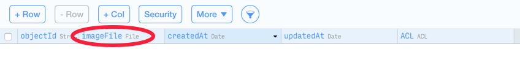

---
title: "Creating the Data Model in Parse"
slug: create-data-model-parse
---     

Now, you should pull up your browser again. Make sure that you are on the *Core* page of Parse, where you can see your current (almost empty) data model:

The *User* class is set up by default. It's our job to add the other entities we need for our app.

#Creating the Post class

Now, select the *Add Class* button on the left hand side to create your first class:

 

Next, you will see a popup that allows you to choose the type and name of the class.

Choose the name to be *Post* and leave the class type as is (*Custom*). Then hit the *create Class* button:

Now you've created a new class that will be used to store our posts. It comes with 4 default columns (columns are basically the same as properties on classes): *objectID*, *createdAt*, *updatedAt*, *ACL*. These default columns exist on every Parse object and their content is maintained by the Parse framework, we don't need to discuss them in detail now.

#Adding columns to a class

In addition to the default columns we need to create columns for all of the custom properties of our classes. The *Post* class has two custom properties:

- **imageFile** this property stores the uploaded photo
- **user** this property is a reference to the user that created the post

##Adding the photo column

Let's go ahead and add them. You add a column by hitting the *+Col* button in the top bar of the data browser:

 

Then you'll see a popup that will ask you to specify details about this new column. We need to choose the type and the name of the column. To store binary data, such as photos, zip-files, etc. we use the *File* type. 

Set the type of the column to *File* and name it *imageFile*. Then hit the *Create Column* button:

Now you should see the new *imageFile* column in the data browser:

##Adding the user column

Now it's time to add the *user* column. Unlike the *imageFile* column the *user* column is not intended to store actual data - instead it stores a reference (or relationship) to an existing *user* object.

For such use cases Parse provides the *Pointer* column type. A pointer column allows us to store a reference to another Parse object.

Hit the *+Col* button to create a new column, just as in the step before. Then choose this column to be a *Pointer*. Additionally Parse will ask you *which* class this pointer is pointing to. Choose the *_User* class (the underscore in the class name indicates that this class was generated by Parse). Finally, name the column *user* and hit the *Create Column* button:

Now you should have a basic understanding of how to create new classes and columns in Parse. That's an important thing to know to get up to speed on your original app down the road!

#Adding the remaining classes

Let's create the remaining classes so that we can start coding!

We will skip the step-by-step instructions on how to create the classes and columns - if you happen to get stuck, skim back through the previous instructions!

1. Add a new custom class called *Like*. 
	1. Add a *Pointer* column that points to the class *_User* and name it *fromUser*
	2. Add a *Pointer* column that points to the class *Post* and name it 
2. Add a new custom class called *Follow*
	1. Add a *Pointer* column that points to the class *_User* and name it *fromUser*
	2. Add a *Pointer* column that points to the class *_User* and name it *toUser*
3. Add a new custom class called *FlaggedContent*
	1. Add a *Pointer* column that points to the class *_User* and name it *fromUser*
	2. Add a *Pointer* column that points to the class *Post* and name it *toPost*
	
Well done! The entire data model is set up! Now we can dive into Xcode and get started building our phot sharing app! 	 	

