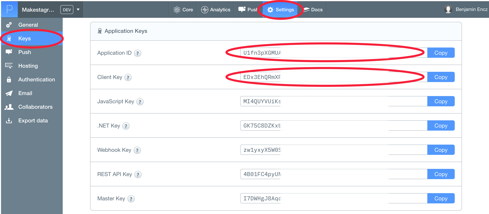

---
title: "Connecting to our Parse Backend"
slug: connect-parse-backend
---     

Since all the features of *Makestagram* rely on the Parse framework, we will set it up as a very first step. 

The Parse framework requires us to provide the *ID* of our Parse App as soon as our iPhone app starts. That way our iPhone app and our backend can establish a connection.

**What is the right place to perform code upon app launch?**

Every iOS project gets created with class called `AppDelegate`. This class has multiple methods that get called when our App starts, is put in the background or is closed. Whenever we want to respond to such *lifecycle* events, the `AppDelegate` is the right place to add our code. If you open the *AppDelegate.swift* file, that is part of the *Makestagram* project, you will see the different methods that are part of the `AppDelegate`. Apple also provides some helpful comments about the responisibilites of each method. For now, we are mainly interested in the following method:

    func application(application: UIApplication, didFinishLaunchingWithOptions launchOptions: [NSObject: AnyObject]?) -> Bool {
      // Override point for customization after application launch.
      
      return true
    }
    
This is the method that is called as soon as our App starts. Here we need to add the code to configure the Parse SDK. The SDK can be configured with one simple method call.

Add an import statement (`import Parse`) to import the Parse SDK into the `AppDelegate`. Then add a method call to `Parse.setApplicationID` into the `application(application:didFinishLaunchingWithOptions:launchOptions:)` method. The result should look like this:

    import UIKit
    import Parse

    @UIApplicationMain
    class AppDelegate: UIResponder, UIApplicationDelegate {

      var window: UIWindow?

      func application(application: UIApplication, didFinishLaunchingWithOptions launchOptions: [NSObject: AnyObject]?) -> Bool {

        // Set up the Parse SDK
        Parse.setApplicationId("AppID", clientKey: "ClientKey")
        
        return true
      }
      
      ...
      
Next, we need to replace the current placeholders for the *AppID* and the *ClientKey* with the correct values for our Parse application. We can grab these keys from our dashboard on parse.com.

Open the browser and pull up your Parse app (if you've closed the tab you can find your Parse App [here](https://www.parse.com/apps/). Then select the *Settings* tab on the top and the *Keys* tab on the left. You should see the following list of keys:

Copy the *Application ID* and the *Client Key* from this list. Then update the Parse setup method to include them:

    func application(application: UIApplication, didFinishLaunchingWithOptions launchOptions: [NSObject: AnyObject]?) -> Bool {

      // Set up the Parse SDK
      Parse.setApplicationId("sFhhR274jAgF2189FaFg222j5", clientKey: "rFG1ORTb234GyRsVFH")
      
      return true
    }
    
**Make sure to include your keys from the dashboard instead of the example ones above 😉**

Now we should be ready to work with Parse SDK! In a moment we will see if you've set everything up correctly.

#Adding a fake login

Before we can start building our actual app, we should provide a fake login mechanism. All features in *Makestagram* will require a logged in user. Later in this tutorial we will spend some time building a full login mechanism - for now we can simply log in as a test user whenever our app starts.

<video width="100%" controls>
  <source src="testuser.mp4" type="video/mp4">
   Your browser does not support the video tag.
</video>