Once you have decided on your app's features, your next step should be to outline your apps structure. The outline should contain all the screens in your app, and should include how they will be connected. For **Makestagram**, the outline would look like this:

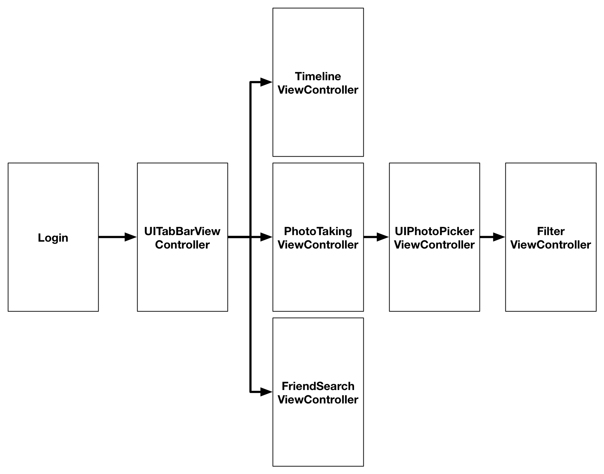

You should come up with a similar diagram before writing code for your original app - it will give you a better idea of how much effort it will take to build your app.

#Another Container View Controller: The UITabBarController

In this section, we're going to set up the basic structure of our app, starting with a *container view controller*, a view controller that can present other view controllers.

In **Make School Notes** we  used a `UINavigationController` as our container view controller, which allowed us to drill down on content by *pushing* and *popping* view controllers.

In **Makestagram**, we will be using another popular container view controller called the `UITabBarController`. The `UITabBarController` contains a *tab bar* and *tab bar items*. Each tab bar item is connected to a specifc view controller, tapping a tab bar item displays the appropriate view controller.  Below is a screenshot from the finished **Makestagram** app that contains a tab bar (the tab bar is enclosed by a red rectangle) and three tab bar items (home, camera, friends):

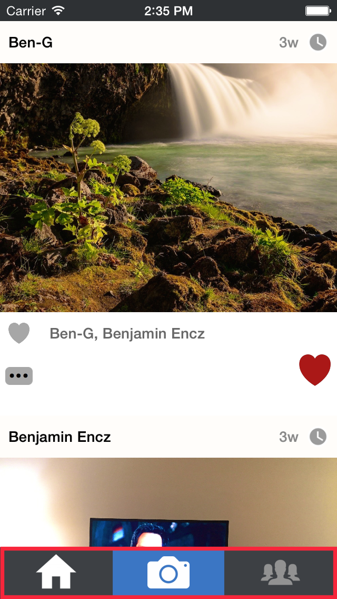

By selecting the appropriate tab bar item, a user can switch between the Timeline Screen, Photo Capture Screen, and Friends Search Screen.

It is common to see multiple types of container view controllers in a single app - we will explore this idea when adding the image filter feature to **Makestagram** later on.

#Setting Up the UITabBarController

Since we won't be adding the login screen until later, the first screen we need to setup is our Tab Bar Screen.

The **Makestagram** project template that you downloaded earlier currently has one screen, a simple `UIViewController`. We don't need that screen, so let's go ahead and delete it.

> [action]
Open *Main.storyboard*. Select the existing view controller; after you have selected it you should see a blue border surrounding it:
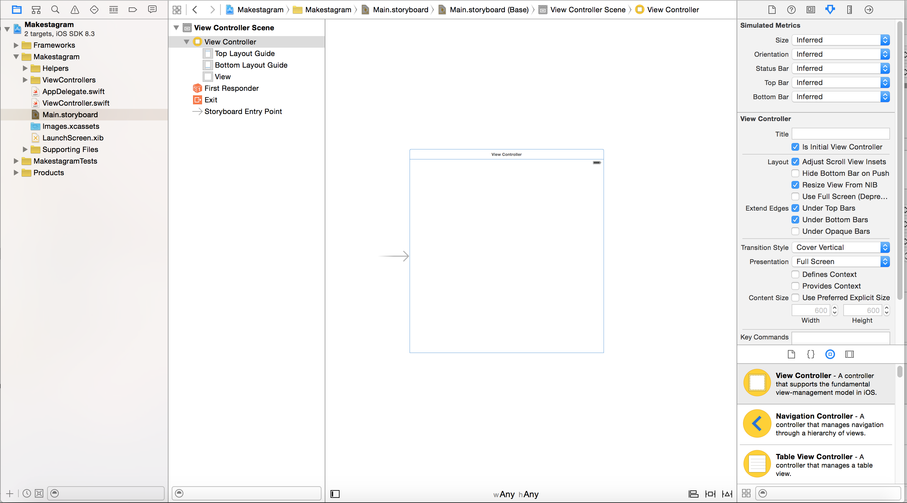
>
Hit the *delete* key to remove this view controller. Now you should see a blank storyboard:
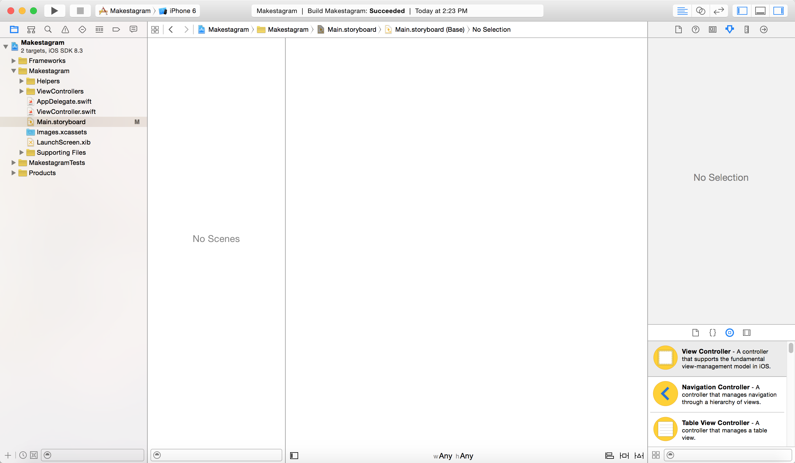

Let's also delete the screen's accompanying source file called *ViewController.swift*.

> [action]
Delete the *ViewController.swift* file:
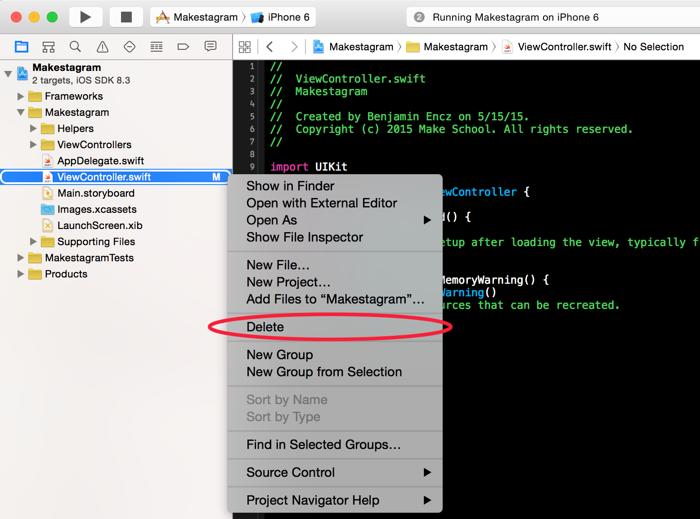
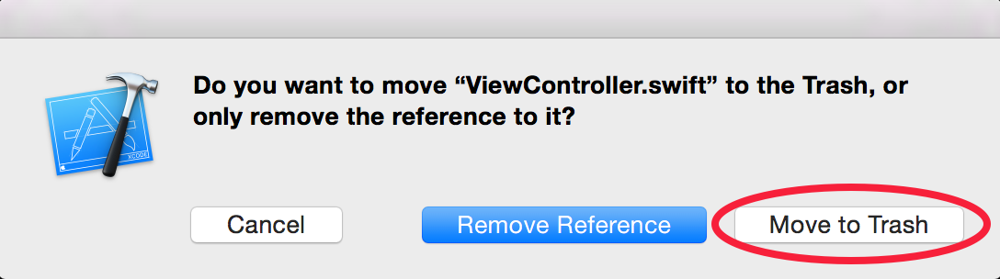

Now we can add the `UITabBarController`.

> [action]
Drag the `UITabBarController` from the component library into the storyboard:
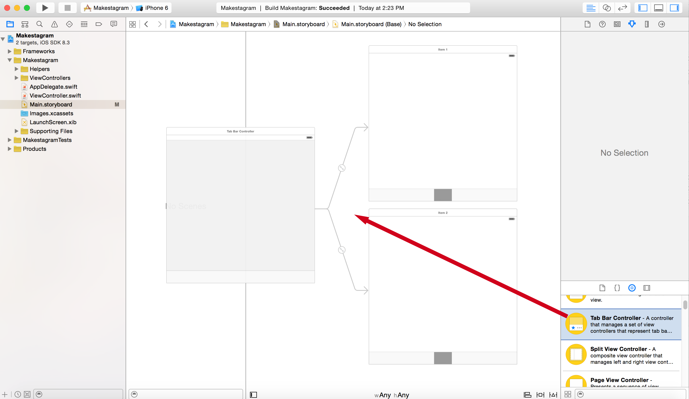

We have now set up the container view controller for our app - time to run it?

If you run the app now, after the splash image disappears, you will see a blank black screen. You will also see the following error in the console:

> Makestagram[76593:9371786] Failed to instantiate the default view controller for UIMainStoryboardFile 'Main' - perhaps the designated entry point is not set?

**Why Are We Seeing This Error?**

When working with storyboards, we have to designate an entry point, or more simply, we have to tell UIKit (the Apple framwork which handles manipulating the user interface) what view controller should appear first (we call this view controller the *Initial View Controller*). When the compiler doesn't know which view controller to show first (a.k.a. when the entry point is not set), it defaults to showing an empty black screen.

We are seeing this error because the `UIViewController` that we initially deleted from the project was set as the Initial View Controller, and after deleting it, we never set another view controller to be the new Initial View Controller. Let's fix this error by assigning our tab bar controller as the Initial View Controller.

> [action]
Configure the tab bar controller to be our app's Initial View Controller. First select the *Attributes Inspector* in the right bar (1). Then check the *is Initial View Controller* checkbox (2). As a confirmation you should see an arrow pointing to the Tab Bar View Controller (3):
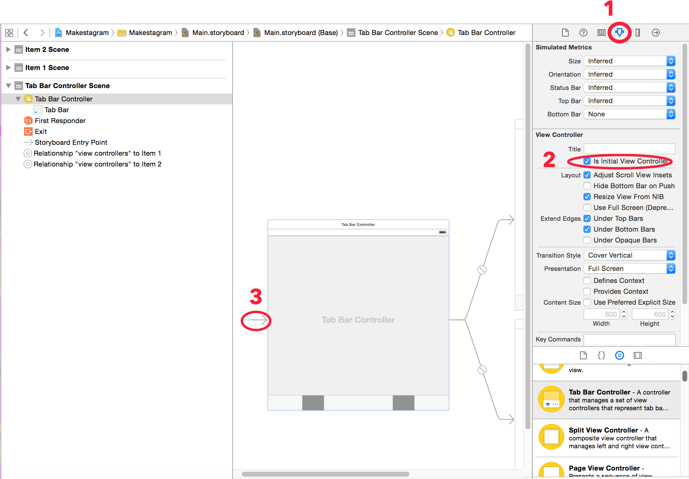

Great! When you run the app now, you should see a tab bar with two items:
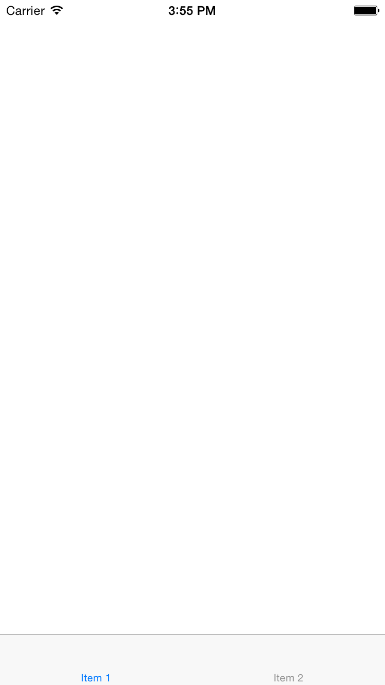

#Adding a Third View Controller to the Tab Bar

The default tab bar comes with two view controllers; however, we need three view controllers for **Makestagram**. Lets add the third view controller now.

> [action]
Add a third view controller, as shown in the video below. Note that the key you need to hold down is the *control* key which has the following symbol: ⌃
<video width="100%" controls>
  <source src="https://s3.amazonaws.com/mgwu-misc/SA2015/AddViewController_TabBar_Small.mov" type="video/mp4">
</video>

We now have all of the required view controllers set up!

#Decorating the Tab Bar Items

Currently the tab bar has three entries and looks like this:

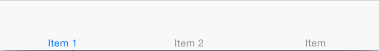

<!-- Every View Controller that has a relationship to a Tab Bar View Controller owns one such a *Tab Bar Item*. The Tab Bar Items are named rather generically right now (*Item 1*, *Item 2*, etc.). Instead of names, we will use icons to decorate our *Tab Bar Items*. -->

The empty tab bar looks pretty bad, so let's add an image to each tab bar item to make things look nicer. (Images will also have the benefit of making it easier to identify the different tabs.)

> [action]
[Download the art pack for this tutorial!](https://s3.amazonaws.com/mgwu-misc/SA2015/Makestagram_Art.zip)

##Adding Assets to an App

Now it's time to add some of these assets you just downloaded to our app. All assets used within an iOS app are stored in *Asset catalogs*. Every iOS projects that you create with Xcode comes with one default asset catalog called *Images.xcassets*:

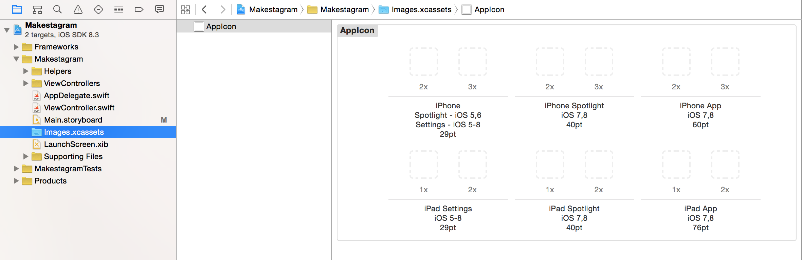

That asset catalog contains one resource for the App's icon. You add new resources to your app by creating new entries (called *Image Sets*) in this asset catalog. You can also create multiple asset catalogs which is useful for apps with huge amounts of images.

Let's add our first images to our app!
> [action]
Unzip the downloaded art pack, then add the camera assets as shown in the video below:
<video width="100%" controls>
  <source src="https://s3.amazonaws.com/mgwu-misc/SA2015/AddImageAssetCatalog_small.mov" type="video/mp4">
</video>
>
Repeat these steps for the *Home* and *People* assets, so that all Tab Bar Item images are added to the asset catalog:
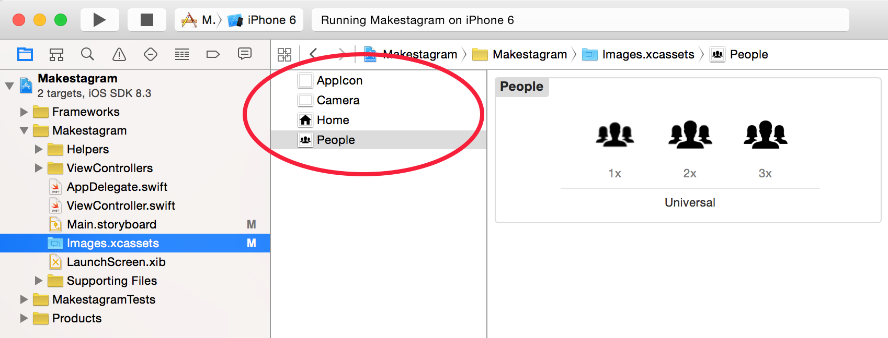

Let's briefly discuss some important concepts about asset handling on iOS. You probably have realized that we're providing three different image files for each asset we wanted to use in our App (*@1x*, *@2x* and *@3x*). These different images have different resolutions, each suited to a specific type of iOS devices with a different screen resolution. The *@1x* assets are used for the oldest iOS devices, e.g. iPhone 3Gs, which don't have retina displays. The *@2x* images are used for the 3.5 and 4 inch retina screens of the iPhone 4(S) and iPhone 5(S). Finally, the *@3x* images are used by the iPhone 6 and iPhone 6 Plus. In most cases you won't have to spend too much time thinking about this, as long as you provide assets in all relevant resolutions.

You should also note that we don't reference images in asset catalogs by their file name, but instead by the name of their Image Set. In our example, our image sets are called *camera*, *people* and *home*.

##Assigning Images to Tab Bar Items

Now that we have added images to our app, we can assign them to our tab bar items.

When we're done, the Tab Bar should look like this:

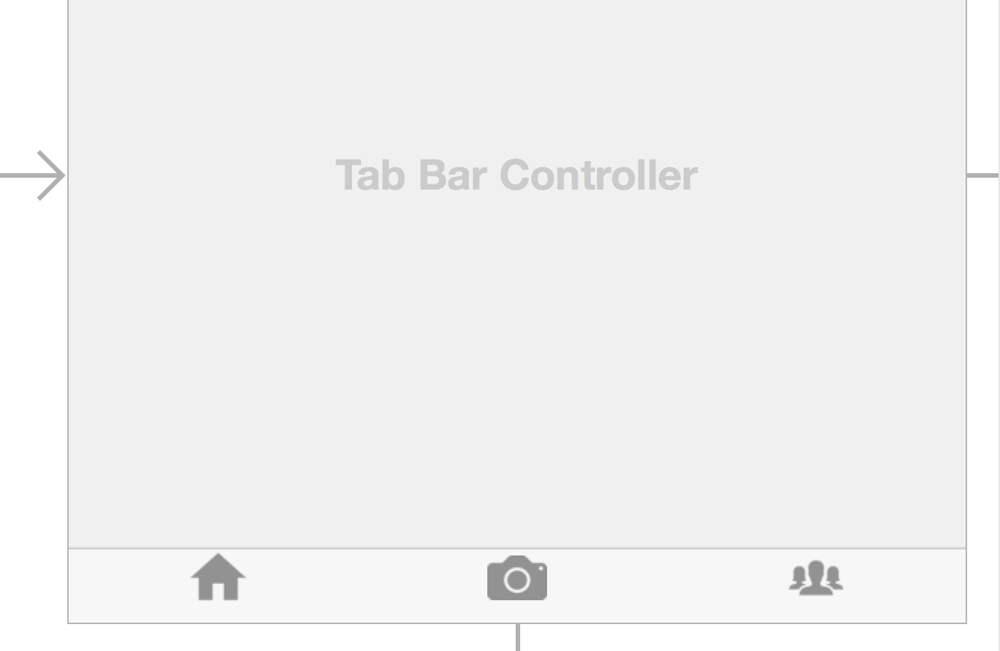

Let's set the images up!

> [action]
**Repeat the following steps for all three View Controllers**:
>
1. Select a View Controller in the left panel of the Storyboard
2. Select the View Controller's Tab Bar Item
3. Open the *Attributes Inspector* in the right panel
4. Erase the Item *Title*
5. Set the Item *Image* to *home*, *camera* or *people*, depending on which View Controller you are currently setting up
>
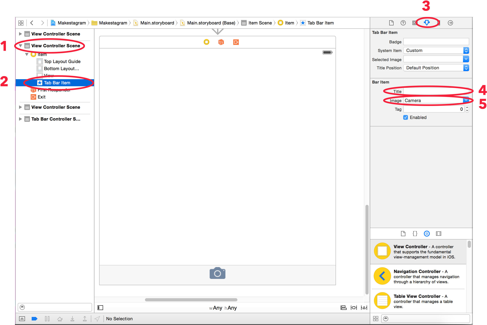

Now we have images on each Tab Bar item - but something doesn't look quite right. The images aren't vertically centered. That's because iOS reserves some space below the image for the *Title* of the Tab Bar Item. For **Makestagram** we don't need titles, instead we want the images to be centered. We can accomplish that by adjusting the *Image Inset* for each Tab Bar Item.

> [action]
**Repeat the following steps for all three view controllers**:
>
1. With the tab bar item selected, open the *Size Inspector* on the right panel
2. Set the *Image Insets* as following:
      - *Top*: 5
      - *Bottom*: -5
>
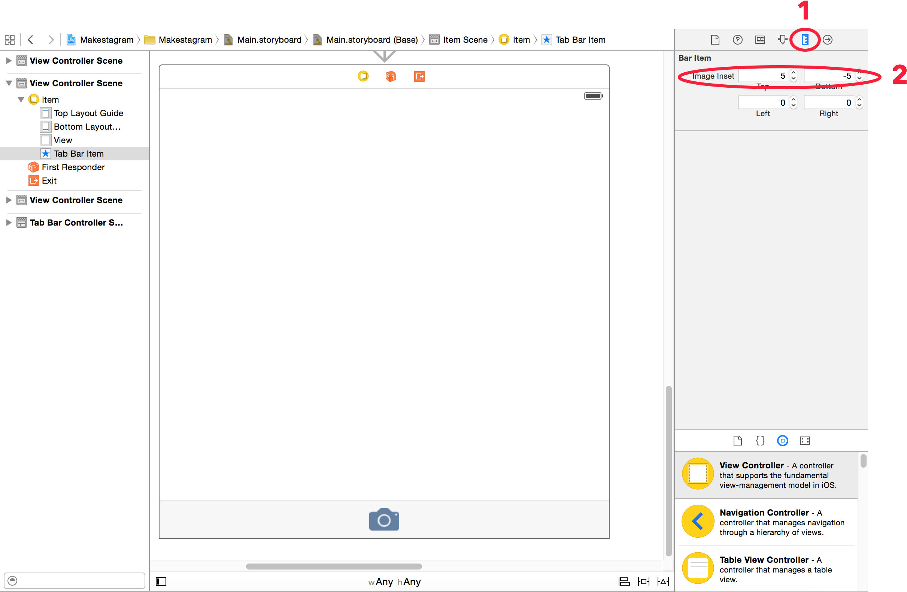

Now all of your tab bar items should have images that are nicely centered.

##Reordering Tab Bar Items

Just in case you didn't set up the view controllers in the correct order, I want to show you how you can reorder them. Select the tab bar view controller in your storyboard, then simply drag the tab bar items to rearrange them:

<video width="100%" controls>
  <source src="https://s3.amazonaws.com/mgwu-misc/SA2015/ReorderTabBarItems_small.mov" type="video/mp4">
</video>

Now we have a nice looking Tab Bar that connects to the three View Controllers of our App.

#Creating Classes for our View Controllers

To finish this section, let's create the Source Code Files for all three View Controllers that we will be working on throughout this tutorial. We'll add them to the  *ViewControllers* group to keep this project nicely structured.

> [action]
Create the `TimelineViewController` class as a subclass of `UIViewController` as shown in the video below:
<video width="100%" controls>
  <source src="https://s3.amazonaws.com/mgwu-misc/SA2015/Timeline_NewViewController_small.mov" type="video/mp4">
</video>
**Repeat these steps** to create a `PhotoViewController` and a `FriendSearchViewController`, which also should be subclasses of `UIViewController`.

When you're done you should have three View Controllers:
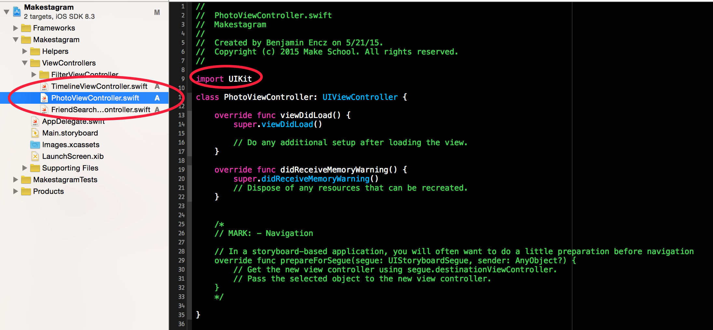

Make sure that each View Controller starts with the line `import UIKit`. That indicates that your file has been created from the correct iOS template.
If you see the line `import Cocoa` instead, you mistakenly created an OS X file, and the project won't compile. You can simply replace `import Cocoa` with `import UIKit` to fix that issue.

##Configuring Custom Classes in Storyboard

The last setup step that remains, is connecting the classes that we just created to our View Controllers in Storyboard.

> [action]
**Repeat the following steps for all three View Controllers**:
>
1. Select the View Controller in Storyboard
2. Open the *Identity Inspector* in the right panel
3. Set the custom class to match the current View Controller
>
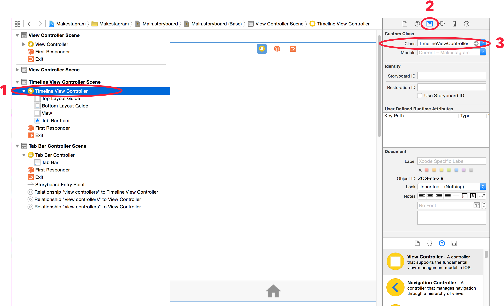

#Wrapping up

Congratulations! We have now set up the basic structure of **Makestagram**! You should have three tab bar items with icons, connected to three view controllers in your storyboard, each backed by a corresponding Swift file.

We're ready to implement our first Feature: **Uploading photos!**
