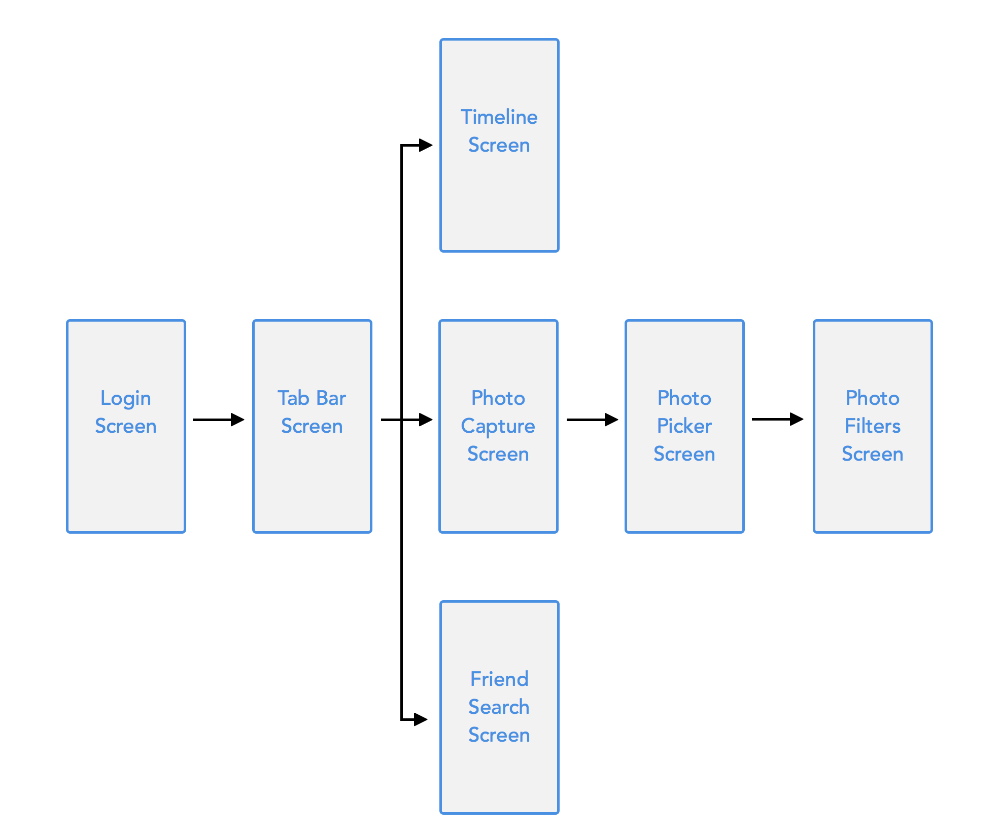

---
title: "Setting up the App Structure with a UITabBarController"
slug: setup-app-structure-uitabbarcontroller
---     

In this section we're going to set up the basic structure of our app. While building the *Make School Notes* app, you have learnt about *Container View Controllers*.

Just as a short reminder: Container View Controllers are View Controllers that can present other View Controllers. Most apps have at least one such a Container View Controller. In *Make School Notes* we used a `UINavigationController` as container. It allowed us to *push* and *pop* View Controllers.

iOS provides another very popular Container View Controller: the `UITabBarController`. Using a `UINavigationController` the user typically navigates between different View Controllers by selecting items from `UITableView`s, such as Apple's *Mail* app, or as in *Make School Notes*.

Using a `UITabBarController`, the user switches between different View Controllers by selecting one of the Tab Bar Items in a Tab Bar. Below is a screenshot from the finished *Makestagram* app that contains a Tab Bar:

The user can switch between the timeline, taking a photo, or finding friends, by selecting the respective button from the Tab Bar. 

Many apps use multiple types of Container View Controllers in one App. We will see how that approach works when we add the image filter feature to the *Makestagram* app later on.

#The App Structure

One of the first steps, once you have collected all the features you want to be part of your app, should be drawing an outline of the different screens that your app will contain. This outline should include connections between the different screens.

For *Makestagram* I've created this overview, that breaks down the entire app into View Controllers:

I highly recommend you come up with a similar diagram before writing code for your original app - it will give you a very good idea of how much effort it will take to build your app. With this overview at hand, let's dive into the action of creating a bunch of these View Controllers.

#Setting the UITabBarController up

As mentioned earlier, we will skip the login screen for now. That means that the `UITabBarController` is the first View Controller we need to add to our app. We also want the Tab Bar Controller to be the initial View Controller of our app.

The Xcode project template has a simple `UIViewController` as its initial View Controller.
Let's first go ahead and delete it.

Open *Main.storyboard*. Select the existing View Controller; after you have selected it you should see a blue border surrounding it: 

Hit the *delete* key to remove this View Controller. Now you should see a blank Storyboard:

Now we can add the `UITabBarController`.

Drag the `UITabBarController` from the component library into the Storyboard:

Now we have set up the Container View Controller for our app - time to run it?

If you run the app now, you will see a blank, black screen, after the splash image disappears. You will also see the following error in the console:

> Makestagram[76593:9371786] Failed to instantiate the default view controller for UIMainStoryboardFile 'Main' - perhaps the designated entry point is not set?

**Why are you seeing this error?**

Every app needs to define an *initial View Controller*. Our app doesn't have one right now - we have deleted the default View Controller, and haven't set the Tab Bar Controller as the initial one. Let's fix that.

Configure the Tab Bar Controller to be our app's initial View Controller. First select the *Attributes Inspector* in the right bar (1). Then check the *is Initial View Controller* checkbox (2). As a confirmation you should see an arrow pointing to the Tab Bar View Controller (3): 

Great! When you run the app now, you should see a tab bar with two items:

#Adding a third View Controller to the tab bar

The default Tab Bar comes with two View Controllers. Our outline shows that we need three View Controllers in the Tab Bar for *Makestagram*. Let's add that third View Controller.

Add a third View Controller, as shown in the video below. Note that the key you need to hold down is the *control* key which has the following symbol: ⌃
<video width="100%" controls>
  <source src="https://s3.amazonaws.com/mgwu-misc/SA2015/AddViewController_TabBar_Small.mov" type="video/mp4">
</video>

Now we have the third View Controller set up. This also completes the set up of our very basic app structure.

#Decorating the Tab Bar Items

The empty tab bar looks pretty sad - let's add an image to each tab bar item. That will also make it easier to identify the different tabs. 

Currently the tab bar has three entries and looks like this:

 

Each of these three entries is called a *Tab Bar Item*. Every View Controller that has a relationship to a Tab Bar View Controller owns one such a *Tab Bar Item*. The Tab Bar Items are named rather generically right now (*Item 1*, *Item 2*, etc.). Instead of names, we will use icons to decorate our *Tab Bar Items*.

[Download the art pack for this tutorial!](https://www.dropbox.com/s/kt9w4m94z4y3m4f/Art.zip?dl=0)

##Adding assets to an App

Now it's time to add some of these assets you just downloaded to our app. All assets used within an iOS app are stored in *Asset catalogs*. Every iOS projects that you create with Xcode comes with one default asset catalog called *Images.xcassets*:

That asset catalog contains one resource for the App's icon. You add new resources to your app by creating new entries in this asset catalog. You can also create multiple asset catalogs which is useful for apps with huge amounts of images.

Let's add our first images to our app!

Unzip the downloaded art pack, then add the camera assets as shown in the video below:

<video width="100%" controls>
  <source src="https://s3.amazonaws.com/mgwu-misc/SA2015/AddImageAssetCatalog_small.mov" type="video/mp4">
</video>

Repeat these steps for the *Home* and *Person* assets, so that all tab bar item images are added to the asset catalog:

Let's briefly discuss some important concepts about asset handling on iOS. You probably have realized that we're providing three different image files for each asset we wanted to use in our App (*@1x*, *@2x* and *@3x*). These different images have different resolutions, each suited to a specific type of iOS devices with a different screen resolution. The *@1x* assets are used for the oldest iOS devices, e.g. iPhone 3Gs, which don't have retina displays. The *@2x* images are used for the 3.5 and 4 inch retina screens of the iPhone 4(S) and iPhone 5(S). Finally, the *@3x* images are used by the iPhone 6 and iPhone 6 Plus. In most cases you won't have to spend too much time thinking about this, as long as you provide assets in all relevant resolutions.

You should also note that we don't reference images in asset catalogs by their file name, but instead by the name of the *Image Set* they belong to. In our example our assets are called *Camera*, *People* and *Home*.

##Assigning images to Tab Bar Items

We've added assets to our app; now we can assign them to our Tab Bar Items.

...

Later on we will replace these labels with images; for now let's at least rename the entry in the middle to *Photo*.

Select the View Controller that is connected to the **middle** item of the Tab Bar View Controller (1). Then select that View Controller's Tab Bar Item in the left panel(2):
 

In the next section we will implement our first feature: **Uploading photos!**
