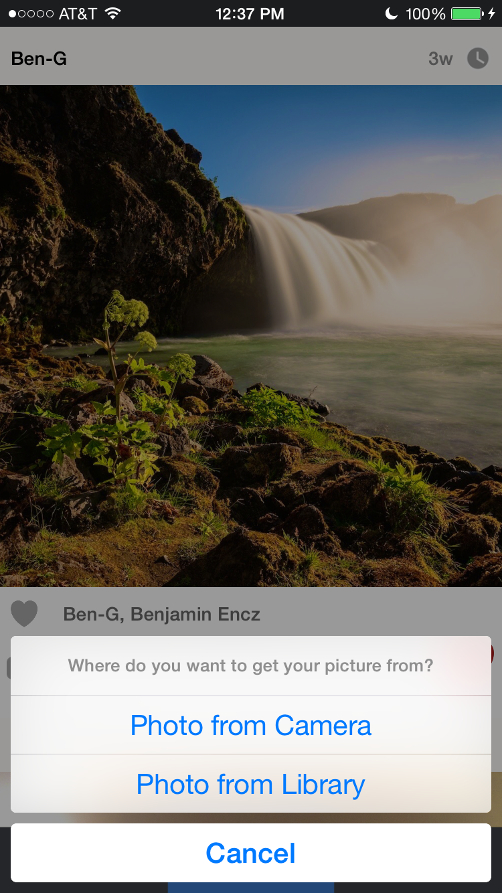
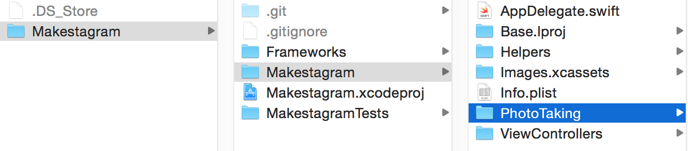
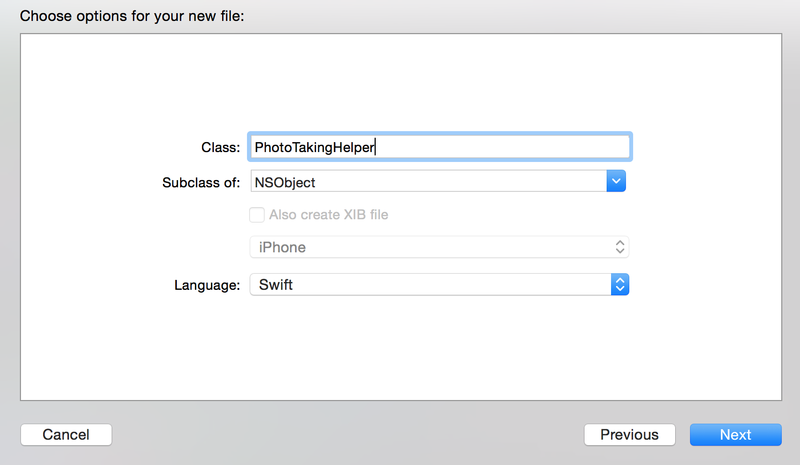
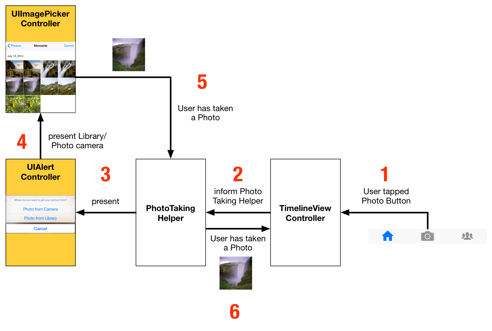
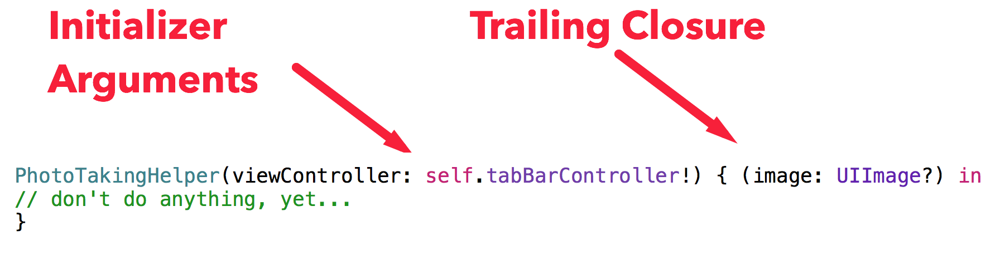
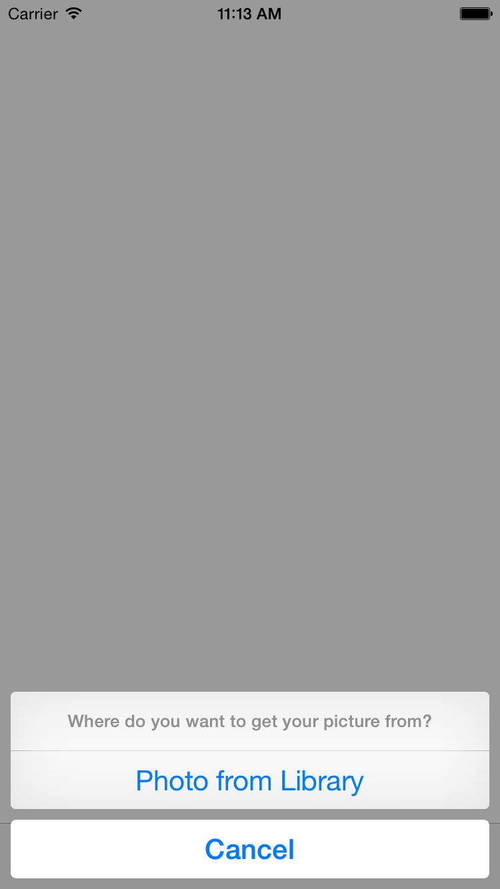
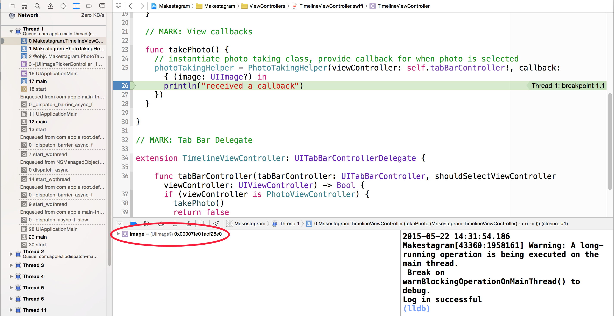

It's time to implement our very first feature: uploading Photos to Parse! In our App we want to allow the users to upload or take a photo as soon as they tap the camera button in the middle of the Tab Bar.

Typically at Tab Bar View Controller only allows a user to switch between different View Controllers. We don't want to switch to a View Controller when the button is tapped, instead we want to show an Action Dialog that lets the user take or select a picture:

Unfortunately, using a Tab Bar View Controller, we cannot **easily** perform an arbitrary method when one of the Tab Bar Items is selected.

However,there's a **workaround**.

#Using a Tab Bar Item Like a Button
Essentially we want to use the Photo Tab Bar Item like a button. When it is tapped we want to call a method to present dialog shown above.

One of the ways to accomplish this is to make use of the `UITabBarControllerDelegate` protocol.

That protocol contains a method that is interesting for us:

    optional func tabBarController(_ tabBarController: UITabBarController, shouldSelectViewController viewController: UIViewController) -> Bool

You can read the full documentation of the method [here](https://developer.apple.com/library/ios/documentation/UIKit/Reference/UITabBarControllerDelegate_Protocol/#//apple_ref/occ/intfm/UITabBarControllerDelegate/tabBarController:shouldSelectViewController:).

Using this method, the Tab Bar View Controller asks its delegate whether or not it should present the View Controller that belongs to the Tab Bar Item that a user just tapped.

**Can you imagine how we could use this method to accomplish our goal?**

> [solution]
One of our classes can become the `delegate` of the `UITabBarViewController` and implement the method above. We can implement the method such that whenever the `PhotoViewController` should be presented, we show the photo capture dialog instead!

Let's implement this solution!

The `TimelineViewController` will be the main View Controller of our app. When a user opens the App, the timeline will be displayed first.

That means we can use the `TimelineViewController` as the delegate for the `UITabBarViewController`.

Implementing our solution involves two steps:

1. Set the `TimelineViewController` as the delegate of `UITabBarViewController`
2. Implement the `tabBarController(_ , shouldSelectViewController:)` delegate method

> [action]
Replace the entire source code in `TimelineViewController.swift` with the following one:
>
    import UIKit
>
    class TimelineViewController: UIViewController {
>
      override func viewDidLoad() {
        super.viewDidLoad()
>
        self.tabBarController?.delegate = self
      }
>
    }
>
    // MARK: Tab Bar Delegate
>
    extension TimelineViewController: UITabBarControllerDelegate {
>
      func tabBarController(tabBarController: UITabBarController, shouldSelectViewController viewController: UIViewController) -> Bool {
        if (viewController is PhotoViewController) {
          println("Take Photo")
          return false
        } else {
          return true
        }
      }
>
    }

What are we doing here? In `viewDidLoad` we are setting the `TimelineViewController` to be the `tabBarController`s delegate. Every `UIViewController` in iOS has the `tabBarController?` property; if the View Controller is presented from a `UITabBarViewController` (as it's the case in our app), this property will store a reference to it.

In the second part of this solution, after:

    // MARK: Tab Bar Delegate

we implement the relevant protocol method. The protocol method requires us to return a boolean value. If we return `true` the Tab Bar View Controller will behave as usual and present the View Controller that the user has selected. If we return `false` the View Controller will not be displayed and the Tab Bar Item will not be selected - exactly the behavior that we want for the Photo Tab Bar Item.

Within the method we check which View Controller is about to be selected.  If the View Controller is a `PhotoViewController` we return `false` and print "Take Photo" to the console. Later we'll replace this line with the actual photo taking code.

If the View Controller **isn't** a `PhotoViewController`, we return `true` and let the Tab Bar Controller behave as usual.

With this code in place, it's time to run the app. You should see the same behavior as in this video:

<video width="100%" controls>
  <source src="https://s3.amazonaws.com/mgwu-misc/SA2015/PhotoButton_small.mov" type="video/mp4">

When you tap the left or the right Tab Bar Item, they are selected. When you tap the middle button, you see our console output instead!

Now we can replace this console output with our actual photo taking code!

#Structuring the Photo Taking Code

Taking photos is one of the core features of our app! We allow users to take photos with the camera and to pick existing photos from their library. Additionally we will allow users to add filters to their photos.

As you'll see, implementing this takes quite a bit of code. Instead of putting all of that code into the `TimelineViewController` we should create a separate class that only takes care of photo related features.

Keep this in mind when working on your own app: *implementing all of your features directly in a View Controller is the first step towards an extremely messy project!*

Before we create that new photo taking class, let's create a new folder for it to keep our project structure tidy.

> [action]
Open the folder that contains your Xcode project in Finder and create a new folder called *PhotoTaking*. It should be on the same level as the *ViewController* folder:

Then add this new folder to your Xcode project:
<video width="100%" controls>
  <source src="https://s3.amazonaws.com/mgwu-misc/SA2015/AddPhotoFolder_small.mov" type="video/mp4">

You should always add new folders with this two-step process. If you create a new group directly in Xcode, that will not automatically create a new folder on your file system. That results in Xcode projects that have a structure that is different from the folder structure - another potential way of creating messy projects.

Now we can add our new Source Code File to the *PhotoTaking* group.

> [action]
1. Create a new Source Code File within the *PhotoTaking* group
2. Name this class *PhotoTakingHelper* and make it a subclass of *NSObject* (we will discuss why this is necessary later on): 

Before we dive into writing code, let's discuss how we're going to structure our Photo Taking code.

There are multiple classes and steps involved in taking a photo:

Let's discuss the process, step by step:

1. The photo taking starts when a user taps the photo button in the Tab Bar. This triggers an event in the `TimelineViewController`. We have already implemented this step; currently we are logging "Take Photo" to the console.
2. The `TimelineViewController` creates a `PhotoTakingHelper`. The `PhotoTakingHelper` will handle the rest of the process and return a photo to the `TimelineViewController` once the user has picked one (this happens in Step 6).
3. The `PhotoTakingHelper` presents the popover that allows the user to choose between taking a photo with the camera or picking one from the library. This popover is implemented as a `UIAlertController` - an iOS standard component.
4. Once the user has selected one of the two options, we present a `UIImagePickerController` another iOS system component. This `UIImagePickerController` handles the actual image picking (either by letting the user take a picture, or by letting them pick one from their library)
5. Once the user is finished, the selected image gets returned to the `PhotoTakingHelper`
6. The `PhotoTakingHelper` returns that image to the `TimelineViewController`.

Now that we have a plan, we can start implementing this feature!

##Implementing the PhotoTakingHelper

Our `PhotoTakingHelper` will have two main responsibilities:

1. Presenting the Popover and the Camera / Photo Library
2. Returning the image that the user has taken / selected

To implement the first responsibility the `PhotoTakingHelper` will need a reference to a `UIViewController`. In iOS only View Controllers can present other View Controllers. The `PhotoTakingHelper` is a simple `NSObject` not a `UIViewController`, so it isn't able to present other View Controllers. We will implement the initializer of the `PhotoTakingHelper` to require a reference to a `UIViewController`.

To implement the second responsibility the `PhotoTakingHelper` will need to have a way to communicate with the `TimelineViewController` - as shown in Step 6 of our outline above. For this we could use the concept of delegation (on the previous page we used delegation to receive information from the `UITabBarController`). A more convenient solution for this specific case is using a *Callback*. A *Callback* is basically a reference to a function. When initializing the `PhotoTakingHelper` inside of the *TimelineViewController* we will provide it with a callback function. As soon as the `PhotoTakingHelper` has selected an image, it will call that *Callback* function and provide the selected image to the *TimelineViewController*.

Let's get started with building the `PhotoTakingHelper`!

###Initialier and Properties

First, let's take care of the initializer and the properties of the `PhotoTakingHelper`.

> [action]
Replace the entire content of `PhotoTakingHelper.swift` with the following code:
>
    import UIKit
>
    typealias PhotoTakingHelperCallback = UIImage? -> Void
>
    class PhotoTakingHelper : NSObject {
>
      /** View controller on which AlertViewController and UIImagePickerController are presented */
      weak var viewController: UIViewController!
      var callback: PhotoTakingHelperCallback
      var imagePickerController: UIImagePickerController?
>
      init(viewController: UIViewController, callback: PhotoTakingHelperCallback) {
        self.viewController = viewController
        self.callback = callback
>
        super.init()
>
        showPhotoSourceSelection()
      }
>
      func showPhotoSourceSelection() {
>
      }
>
    }

Let's discuss this code. In the first line after `import UIKit` we are declaring a `typealias`. Using the `typealias` keyword we can provide a function signature with a name. In this case we are saying that a function of type `PhotoTakingHelperCallback` takes an `UIImage?` as parameter and returns `Void`. This means: any function that wants to be the callback of the `PhotoTakingHelper` needs to have exactly this signature.

`PhotoTakingHelper` has three properties. The first one `viewController` stores a `weak` reference to a `viewController`. As we discussed earlier, this reference is necessary because the `PhotoTakingHelper` needs a `UIViewController` on which it can present other View Controllers. It is a `weak` reference, since the `PhotoTakingHelper` does not own the referenced View Controller.

Additionally we store the `callback` function and provide a property to store an `UIImagePickerController` (which we will use a little bit later).

The initializer of this class receives the View Controller on which we will present other View Controllers and the callback that we will call as soon as a user has picked an image.

When the class is entirely initialized we immediately call `showPhotoSourceSeletion()`. The method is still empty right now, later it will present the dialog that allows user to choose between their camera and their photo library.

Because we call `showPhotoSourceSeletion()` directly from the initializer, the dialog will be presented as soon as we create an instance of `PhotoTakingHelper`.

###Implementing the Photo Source Selection Popover

To implement the selection dialog we will use the [`UIAlertViewController`](https://developer.apple.com/library/ios/documentation/UIKit/Reference/UIAlertController_class/index.html) class. It allows us to choose a title for the popup and add multiple options. We want to add two options: photo library and camera.

However, we need to keep one thing in mind: we want to run our App on the iOS Simulator during development and the Simulator doesn't have a camera! `UIImagePickerController` provides us with a nice way to check whether a camera is available or not. We'll use that feature to decide whether or not to add the camera option to our popup.

Let's add the code for the popup to `PhotoTakingHelper`:

> [action]
Replace the empy implementation of `showPhotoSourceSelection()` with the following one:
>
      func showPhotoSourceSelection() {
        // Allow user to choose between photo library and camera
        let alertController = UIAlertController(title: nil, message: "Where do you want to get your picture from?", preferredStyle: .ActionSheet)
>
        let cancelAction = UIAlertAction(title: "Cancel", style: .Cancel, handler: nil)
        alertController.addAction(cancelAction)
>
        // Only show camera option if rear camera is available
        if (UIImagePickerController.isCameraDeviceAvailable(.Rear)) {
          let cameraAction = UIAlertAction(title: "Photo from Camera", style: .Default) { (action) in
            // do nothing yet...
          }
>
          alertController.addAction(cameraAction)
        }
>
        let photoLibraryAction = UIAlertAction(title: "Photo from Library", style: .Default) { (action) in
          // do nothing yet...
        }
>
        alertController.addAction(photoLibraryAction)
>
        viewController.presentViewController(alertController, animated: true, completion: nil)
      }

In the first line we set up the the `UIAlertController` by providing it with a `message`
and a `preferredStyle`. The `UIAlertController` can be used to present different types of popups. By choosing the `.ActionSheet` option, we create a popup that get's displayed from the bottom edge of the screen.

After the initial set up, we add different `UIAlertAction`s to the Alert Controller. Each action will result in one button on the popup.

The first one is the default *Cancel* action; you should add this one to almost all of your Alert Controllers. It will add a "Cancel" button that allows the user to close the popup without any action.

Then we create actions for our two different options. First, we check if the current device has a rear camera by using the `isCameraDeviceAvailable(_:UIImagePickerControllerCameraDevice)` method.

If the rear camera is available, we add an action to the Alert Controller that allows the user to choose to take a photo with that camera. The body of the action is left empty for now; in the next step we will fill in the code that brings up the camera.

As a last option, we allow the user to pick an image from the library. We create an `UIAlertAction` for the library and add it to the `UIAlertController`. This action also doesn't do anything yet, we'll add the code in the next section.

In the very last line, we present the `alertController`. As we discussed earlier, View Controllers can only be presented from other View Controllers. We use the reference that we've stored in the `viewController` property and call the `presentViewController` method on it. Now the popup will be displayed on whichever View Controller is stored in the `viewController` property!

None of this code will run at this point - to test it we need to connect it to the `TimelineViewController`. Let's do that next! After we've connected the `TimelineViewController` and the `PhotoTakingHelper`, we will come back to complete this code so that we actually present the camera or the photo library when one of the two options is selected.

##Connecting the PhotoTakingHelper

Time to switch back to the `TimelineViewController`. Currently we are printing a text to the console whenever the camera button is tapped; now we want to create an instance of a `PhotoTakingHelper` that will display our popup.

First, let's change the Tab Bar related code:

> [action]
Change the the Tab Bar related code to call the `takePhoto` method, instead of printing to the console:
>
    func tabBarController(tabBarController: UITabBarController, shouldSelectViewController viewController: UIViewController) -> Bool {
      if (viewController is PhotoViewController) {
        takePhoto()
        return false
      } else {
        return true
      }
    }

Within the `takePhoto` method, which we'll implement next, we will create the `PhotoTakingHelper`.

> [action]
Add the `takePhoto` method to the `TimelineViewController` class:
>
    func takePhoto() {
      // instantiate photo taking class, provide callback for when photo  is selected
      photoTakingHelper = PhotoTakingHelper(viewController: self.tabBarController!) { (image: UIImage?) in
        // don't do anything, yet...
      }
    }

Within the `takePhoto` method we're creating an instance of `PhotoTakingHelper`. We're assigning that instance to the `photoTakingProperty` (which we'll create in a second).

As we know, the initializer of the `PhotoTakingHelper` takes two parameters: the View Controller on which the popup should be presented and the callback that should run as soon as a photo has been selected.

As the View Controller we pass `self.tabBarController`. The Tab Bar Controller is the Root View Controller of our application - typically you want to present most Popups directly on the Root View Controller.

As a callback we pass a *Closure*. A closure is basically a function without a name.

This part of the code is the closure:

    { (image: UIImage?) in
      // don't do anything, yet...
    }

The entire closure is enclosed in curly braces. It starts with the list of parameters in parentheses. Our callback receives a `UIImage?` from the `PhotoTakingHelper`. The `in` keyword marks the beginning of the actual code of the closure - for now we only have a comment in here.

Whenever the `PhotoTakingHelper` has received an image, it will call this closure. This is where we will implement the Photo upload later on.

There's one last detail to note: the closure is outside of the argument list (the pair of parentheses after the class name) of the constructor!

This is called a [trailing closure](https://developer.apple.com/library/ios/documentation/Swift/Conceptual/Swift_Programming_Language/Closures.html#//apple_ref/doc/uid/TP40014097-CH11-ID102):

Trailing closures can be used whenever the last argument of a function or initializer is a closure.

Without a trailing closure the call to the initializer would look like this:

    PhotoTakingHelper(viewController: self.tabBarController!, callback: { (image: UIImage?) in
    // don't do anything, yet...
    })

Using trailing closures can make our code a little bit more readable because we don't need a closing parentheses after the closing curly braces of the closure. Feel free to choose whichever option you prefer!

One last step before are ready to test the interaction between the `TimelineViewController` and the `PhotoTakingHelper`.

> [action]
Add the property definition for `photoTakingHelper` to the top of the `TimelineViewController` class:
>
    var photoTakingHelper: PhotoTakingHelper?

Now our code should compile and run! Time to test if everything is working as expected.

When you run the app and tap the camera button, you should see a popup show up:

Well done! At this point you should have a basic understanding of how information can travel through different classes in our apps - as an iOS developer you will use callbacks in the form of closures pretty frequently.

#Implementing the Photo Taking

Now that we've successfully connected the `PhotoTakingHelper` with the `TimelineViewController` we can implement the actual Photo Taking code.

Let's add  a method to the `PhotoTakingHelper` that presents the `UIImagePickerController` (you might remember, this is the system component that will allows the user to take pictures!).

> [action]
Add the `showImagePickerController` method to the `PhotoTakingHelper` class:
>
    func showImagePickerController(sourceType: UIImagePickerControllerSourceType) {
      imagePickerController = UIImagePickerController()
      imagePickerController!.sourceType = sourceType
      self.viewController.presentViewController(imagePickerController!, animated: true, completion: nil)
    }

In the first line, this method creates a `UIImagePickerController`. In the second line we set the `sourceType` of that controller. Depending on the `sourceType` the `UIImagePickerController` will activate the camera and display a photo taking overlay - or will show the users photo library. Our `showImagePickerController` method takes the `sourceType` as an argument and hands it on to the `imagePickerController` - that allows the caller of this method to specify whether the camera or the photo library should be used as an image source.

Once the `imagePickerController` is initialized and configured, we present it.

Now we need to call this method when a popup button is selected. Currently we aren't performing any code when a user selects one of the two options.

> [action]
Change the following section within `showPhotoSourceSeletion()` so that the `showImagePickerController` method is called:
>
    ...
>
    // Only show camera option if rear camera is available
    if (UIImagePickerController.isCameraDeviceAvailable(.Rear)) {
      let cameraAction = UIAlertAction(title: "Photo from Camera", style: .Default) { (action) in
        self.showImagePickerController(.Camera)
      }
>
      alertController.addAction(cameraAction)
    }
>
    let photoLibraryAction = UIAlertAction(title: "Photo from Library", style: .Default) { (action) in
      self.showImagePickerController(.PhotoLibrary)
    }
>
    ...

The changes are pretty simple. We call `showImagePickerController` and pass either `.PhotoLibrary` or `.Camera` as argument - based on the user's choice.

Now you should be able to see an `UIImagePickerController` pop up when you select the "Photo from Library" button in the app:

<video width="50%" controls>
  <source src="https://s3.amazonaws.com/mgwu-misc/SA2015/PhotoSelection_small.mov" type="video/mp4">

Now we can let the user pick an image. However, currently we don't get informed when the user has selected an image and we don't gain access to the selected image.

#Closing the Loop

To gain access to the selected image we will use a pattern with which you should be familiar by now: _Delegation_. The `UIImagePickerController` allows a delegate to listen for selected images and other events.

Take a short look at the documentation for the [`UIImagePickerControllerDelegate`](https://developer.apple.com/library/ios/documentation/UIKit/Reference/UIImagePickerControllerDelegate_Protocol/) protocol.

**Can you see which method we can use?**

Correct! We'll use the `imagePickerController(picker: UIImagePickerController, didFinishPickingImage: UIImage!, editingInfo: [NSObject : AnyObject]!)` method!

We'll need to implement this in two steps:

1. Sign up to become the delegate of the `UIImagePickerController`
2. Implement `imagePickerController(picker: UIImagePickerController, didFinishPickingImage: UIImage!, editingInfo: [NSObject : AnyObject]!)`

Let's start with the simple part - becoming the delegate of `UIImagePickerController`.

> [action]
Extend the `showImagePickerController` method to include a line that sets up the `delegate` property of `imagePickerController`:
>
    func showImagePickerController(sourceType: UIImagePickerControllerSourceType) {
      imagePickerController = UIImagePickerController()
      imagePickerController!.sourceType = sourceType
      imagePickerController!.delegate = self
>
      self.viewController.presentViewController(imagePickerController!, animated: true, completion: nil)
    }

Now that we're the `delegate`, we need to conform to some protocols. Otherwise the compiler will be unhappy and our project won't run!

By being the delegate of a `UIImagePickerController` we are required to implement the `UIImagePickerControllerDelegate` protocol and the `UINavigationControllerDelegate`.

However, all methods in the `UINavigationControllerDelegate` protocol are `optional` - which means we don't need to implement any of them.

As always, we will implement the code that is relevant for a certain protocol within an `extension`.

> [action]
Add the extension following extension to _PhotoTakingHelper.swift_ - always make sure that the extension is placed outside of the class definition:
>
    extension PhotoTakingHelper: UIImagePickerControllerDelegate, UINavigationControllerDelegate {
>
      func imagePickerController(picker: UIImagePickerController, didFinishPickingImage image: UIImage!, editingInfo: [NSObject : AnyObject]!) {
        viewController.dismissViewControllerAnimated(false, completion: nil)
>
        callback(image)
      }
>
      func imagePickerControllerDidCancel(picker: UIImagePickerController) {
        viewController.dismissViewControllerAnimated(true, completion: nil)
      }
>
    }

We don't have too much code in this extension. We implement two different delegate methods. One is called when an image is selected, the other is called when the cancel button is tapped.

Within `imagePickerControllerDidCancel` we simply hide the Image Picker Controller by calling `dismissViewControllerAnimated` on `viewController`.

Before we became the delegate of the Image Picker Controller, it was automatically hidden as soon as a user hit the cancel button or selected an image. Now that we are the delegate, we are responsible for hiding it.

The `imagePickerController(_:, didFinishPickingImage:)` method is also pretty simple. First we hide the Image Picker Controller, then we call the `callback` and hand it the `image` that has been selected as an argument. After this line runs, the `TimelineViewController` will have received the image through its callback closure.

Let's test if that is actually working correctly.

> [action]
Open _`TimelineViewController.swift`_ and replace the comment in our `PhotoTakingHelper` callback method with a print line statement:
>
    println("received a callback")
>
Then set a breakpoint in that line. Next, run the app and select an image using the Image Picker.
The debugger should halt on the breakpoint and you should see that the callback receives a value for the `image` parameter:
>

If the value in the red circle is showing anything different than `0x0000000000000000` (which would mean the `image` argument is `nil`) then everything is working! We now have access to the selected Image inside of the `TimelineViewController`.

Here's a short reminder of all the information flow you have implemented in this step:

**Well done!**

In the next step we are going to upload this image to Parse!
