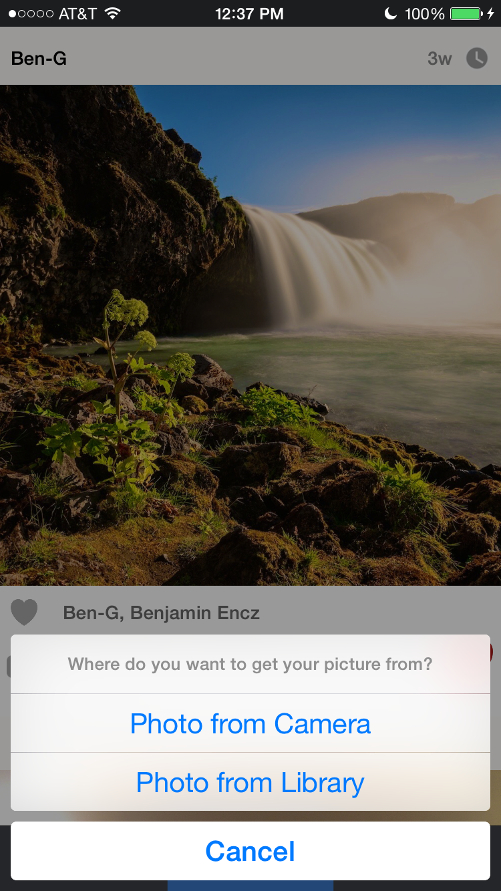
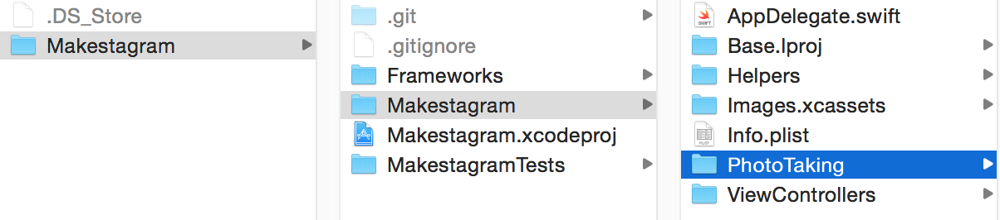

---
title: "Uploading photos"
slug: uploading-photos
---     

It's time to implement our very first feature: uploading Photos to Parse! In our App we want to allow the users to upload or take a photo as soon as they tap the camera button in the middle of the Tab Bar.

Typically at Tab Bar View Controller only allows a user to switch between different View Controllers. We don't want to switch to a View Controller when the button is tapped, instead we want to show an Action Dialog that lets the user take or select a picture:

Unfortunately, using a Tab Bar View Controller, we cannot **easily** perform an arbitrary method when one of the Tab Bar Items is selected. 

However,there's a **workaround**.

#Using a Tab Bar Item like a Button
Essentially we want to use the Photo Tab Bar Item like a button. When it is tapped we want to call a method to present dialog shown above.

One of the ways to accomplish this is to make use of the `UITabBarControllerDelegate` protocol.

That protocol contains a method that is interesting for us:

    optional func tabBarController(_ tabBarController: UITabBarController, shouldSelectViewController viewController: UIViewController) -> Bool

You can read the full documentation of the method [here](https://developer.apple.com/library/ios/documentation/UIKit/Reference/UITabBarControllerDelegate_Protocol/#//apple_ref/occ/intfm/UITabBarControllerDelegate/tabBarController:shouldSelectViewController:). 

Using this method, the Tab Bar View Controller asks its delegate whether or not it should present the View Controller that belongs to the Tab Bar Item that a user just tapped.

**Can you imagine how we could use this method to accomplish our goal?**

One of our classes can become the `delegate` of the `UITabBarViewController` and implement the method above. We can implement the method such that whenever the `PhotoViewController` should be presented, we show the photo capture dialog instead!

Let's implement this solution! 

The `TimelineViewController` will be the main View Controller of our app. When a user opens the App, the timeline will be displayed first.

That means we can use the `TimelineViewController` as the delegate for the `UITabBarViewController`.

Implementing our solution involves two steps:

1. Set the `TimelineViewController` as the delegate of `UITabBarViewController`
2. Implement the `tabBarController(_ , shouldSelectViewController:)` delegate method

Replace the entire source code in `TimelineViewController.swift` with the following one:

    import UIKit

    class TimelineViewController: UIViewController {

      override func viewDidLoad() {
        super.viewDidLoad()
        
        self.tabBarController?.delegate = self
      }

    }

    // MARK: Tab Bar Delegate

    extension TimelineViewController: UITabBarControllerDelegate {
      
      func tabBarController(tabBarController: UITabBarController, shouldSelectViewController viewController: UIViewController) -> Bool {
        if (viewController is PhotoViewController) {
          println("Take Photo")
          return false
        } else {
          return true
        }
      }
      
    }
    
What are we doing here? In `viewDidLoad` we are setting the `TimelineViewController` to be the `tabBarController`s delegate. Every `UIViewController` in iOS has the `tabBarController?` property; if the View Controller is presented from a `UITabBarViewController` (as it's the case in our app), this property will store a reference to it.

In the second part of this solution, after:

    // MARK: Tab Bar Delegate
    
we implement the relevant protocol method. The protocol method requires us to return a boolean value. If we return `true` the Tab Bar View Controller will behave as usual and present the View Controller that the user has selected. If we return `false` the View Controller will not be displayed and the Tab Bar Item will not be selected - exactly the behavior that we want for the Photo Tab Bar Item.

Within the method we check which View Controller is about to be selected.  If the View Controller is a `PhotoViewController` we return `false` and print "Take Photo" to the console. Later we'll replace this line with the actual photo taking code.

If the View Controller **isn't** a `PhotoViewController`, we return `true` and let the Tab Bar Controller behave as usual.

With this code in place, it's time to run the app. You should see the same behavior as in this video:

<video width="100%" controls>
  <source src="https://s3.amazonaws.com/mgwu-misc/SA2015/PhotoButton_small.mov" type="video/mp4">

When you tap the left or the right Tab Bar Item, they are selected. When you tap the middle button, you see our console output instead!

Now we can replace this console output with our actual photo taking code!

#Structuring the Photo Taking Code

Taking photos is one of the core features of our app! We allow users to take photos with the camera and to pick existing photos from their library. Additionally we will allow users to add filters to their photos.

As you'll see, implementing this takes quite a bit of code. Instead of putting all of that code into the `TimelineViewController` we should create a separate class that only takes care of photo related features.

Keep this in mind when working on your own app: *implementing all of your features directly in a View Controller is the first step towards an extremely messy project!*

Before we create that new photo taking class, let's create a new folder for it to keep our project structure tidy.

Open the folder that contains your Xcode project in Finder and create a new folder called *PhotoTaking*. It should be on the same level as the *ViewController* folder: 

Then add this new folder to your Xcode project:
<video width="100%" controls>
  <source src="https://s3.amazonaws.com/mgwu-misc/SA2015/AddPhotoFolder_small.mov" type="video/mp4">

You should always add new folders with this two-step process. If you create a new group directly in Xcode, that will not automatically create a new folder on your file system. That results in Xcode projects that have a structure that is different from the folder structure - another potential way of creating messy projects.

