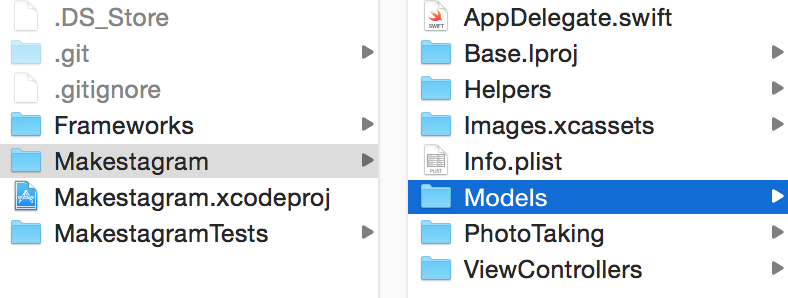
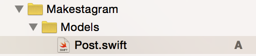
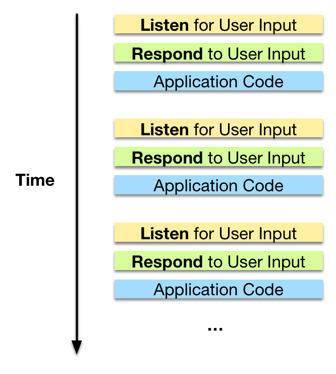
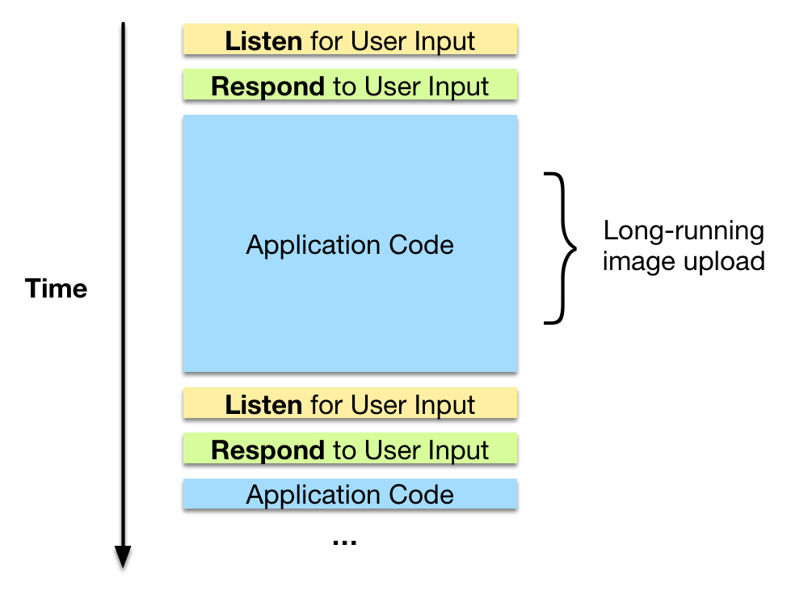
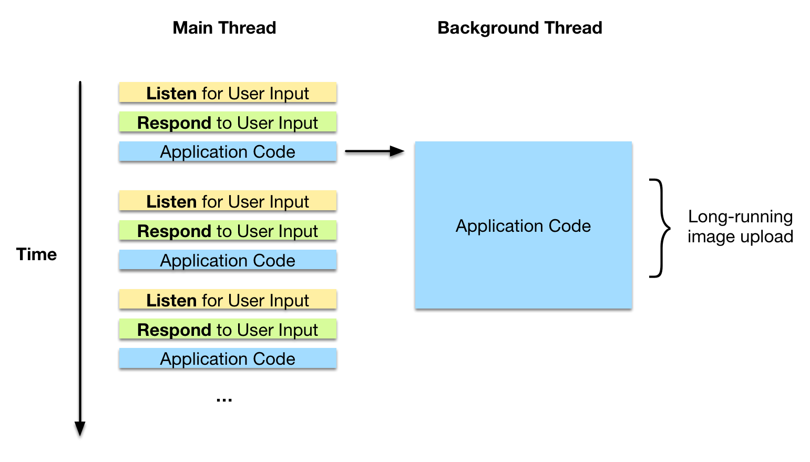
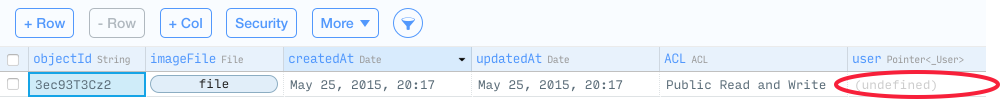
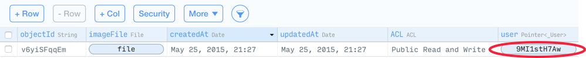

Now it's time to move from a working solution to a good one. In the last step we have identified two issues with our current uploading code:

1. We need to resolve the warnings in the console
2. We need to store more information along with the `Post` that we're creating. Right now we are only storing the image file, but we also need to store the `user` to which the post belongs

Actually, there's a third issue. All of our uploading code is currently contained in the `TimelineViewController` class. However, that code isn't related to the timeline feature of the app. If we place all of our code directly in the `TimelineViewController` we will end up with a huge mess.

Instead of having the code in the `TimelineViewController`, the photo upload should be handled by a separate `Post` class.

Let's start by creating this separate class - then we will tackle the two issues listed above!

#Creating a Custom Parse Class

As you have seen, we can store information in Parse without using custom classes:

    let imageData = UIImageJPEGRepresentation(image, 0.8)
    let imageFile = PFFile(data: imageData)
    imageFile.save()

    let post = PFObject(className: "Post")
    post["imageFile"] = imageFile
    post.save()

We can simply use the `PFObject` class and specify a `className`. This way however, we don't have a good place to store the image uploading code. And if we need to modify many more of the post's properties, the code will become difficult to read.

It would be better, if you could upload a post like this:

    let post = Post()
    post.image = image
    post.uploadImage()

This way we could hide a lot of code inside of `uploadImage`.

I would recommend this approach for your own apps as well. If any of your Parse classes needs to be stored or loaded with complex code upload / download code - consider using a custom class.

So how can we create a custom `Post` class?

##Creating the Skeleton for the `Post` Class

The Parse framework has some specific requirements for creating custom classes. You can find the [documentation here](https://www.parse.com/docs/ios/guide#objects-subclasses); however, we will discuss all of the required steps.

The first step will be creating a source code file for our new class. We'll also create a new folder and a new Xcode group for this class.

> [action]
Create a new _Models_ folder as child of the _Makestagram_ folder:

Then add the folder to Xcode and create a new _Swift_ file called _Post.swift_. The result in Xcode should look like this:

We're going to fill the `Post` class with some [_boilerplate_](http://en.wikipedia.org/wiki/Boilerplate_code#In_object-oriented_programming) code.

> [action]
Replace the content of _Post.swift_ with the following source code:
>
    import Foundation
    import Parse
>
    // 1
    class Post : PFObject, PFSubclassing {
>
      // 2
      @NSManaged var imageFile: PFFile?
      @NSManaged var user: PFUser?
>
>
      //MARK: PFSubclassing Protocol
>
      // 3
      static func parseClassName() -> String {
        return "Post"
      }
>
      // 4
      override init () {
        super.init()
      }
>
      override class func initialize() {
        var onceToken : dispatch_once_t = 0;
        dispatch_once(&onceToken) {
          // inform Parse about this subclass
          self.registerSubclass()
        }
      }
>
    }

1. To create a custom Parse class you need to inherit from `PFObject` and implement the `PFSubclassing` protocol
2. Next, define each property that you want to access on this Parse class. For our `Post` class that's the `user` and the `imageFile` of a post. That will allow you to change the code that accesses properties through strings:
       post["imageFile"] = imageFile
    Into code that uses Swift properties:
       post.imageFile = imageFile
3. By implementing the `parseClassName` you create a connection between the Parse class and your Swift class.
4. `init` and `initialize` are pure boilerplate code - copy these two into any custom Parse class that you're creating.

Now, we have set up the skeleton for our Parse class. Follow these steps whenever you want to create a custom Parse class in your own apps.

##Extending the Skeleton

We have laid the groundwork to improve our photo uploading code - now lets take the next step. It should be extremely easy to create a new `Post` and assign an image to it. Ideally this should be three lines of code:

    let post = Post()
    post.image = image
    post.uploadPost()

To accomplish this, we need to move the image upload into the `Post` class. This also includes the code for the conversion of a `UIImage` into `NSData`:

    let imageData = UIImageJPEGRepresentation(image, 0.8)

All of the code that prepares the `Post` to be uploaded should be part of the `uploadPost` method.

First, let's add an `image` property to our `Post` class:

Add the following property to the `Post` class:

    var image: UIImage?

Next, we'll move the uploading code into the `uploadPost` method.

> [action]
Add the following method to the `Post` class:
>
    func uploadPost() {
      // 1
      let imageData = UIImageJPEGRepresentation(image, 0.8)
      let imageFile = PFFile(data: imageData)
      imageFile.save()
      // 2
      self.imageFile = imageFile
      save()
    }

1. Whenever the `uploadPost` method is called, we grab the photo that shall be uploaded from the `image` property; turn it into a `PFFile` and upload it.
2. Once we have saved the `imageFile` we assign it to `self` (which is the `Post` that's being uploaded). Then we call `save()` to store the `Post`.

Now creating a `Post` and uploading it has become a lot simpler. We can change the code in the `TimelineViewController` accordingly.

> [action]
Update the `takePhoto` method in the `TimelineViewController` class to use the new `Post` class:
>
    func takePhoto() {
      // instantiate photo taking class, provide callback for when photo is selected
      photoTakingHelper =
        PhotoTakingHelper(viewController: self.tabBarController!) { (image: UIImage?) in
          let post = Post()
          post.image = image
          post.uploadPost()
      }
    }

If you like, you can test this new version of our solution. You should see that it's working! Now that we've set up a nice structure for uploading posts, we can tackle the two issues stated at the beginning of this step.

#Performing the Photo Upload in the Background

Let's first tackle the warning that we are currently seeing in the console when we are uploading a photo:

> Warning: A long-running operation is being executed on the main thread.

In case you haven't worked with _threads_ before, you will need a little bit of background knowledge before you'll be able to understand the issue.

##A Brief Introduction to Threading

A typical computer program is a sequence of instructions that get performed after each other. Only one instruction is running at any point in time. Most modern apps (mobile apps, web apps, etc.) however, perform multiple tasks in **parallel**.

Why is that necessary?

Simplified one could say that a typical iOS app repeats three steps over and over again, while an app is running:

1. The operating system listens for user input, e.g. touch events
2. The system components respond to that input, e.g. a list of items gets scrolled
3. Your application code runs and can respond to the user interaction, e.g. performing some code after a button has been tapped

This means the workflow of your typical app can be visualized like this:

This system works great, as long as your _Application Code_ runs very fast. However, some times we need to perform tasks that can take a longer amount of time - such as uploading an image. With bad connectivity, uploading an image can take multiple seconds.

If your application code takes longer to run, the workflow diagram will change to something like this:

Now you can see that your long running _Application Code_ is blocking the operating system's code from running. As long as you are uploading an image, the operating system will not be able to respond to user input - your app will freeze!

That is why we are seeing this warning message in the console:

> Warning: A long-running operation is being executed on the main thread.

How can we fix this issue?

We can perform the long-running task in the _background_, which means it will run in **parallel** to our other application code. The result will look like this:

You can see that our long-running task is now no longer blocking the operating system's code, because it is running in a different _Thread_. Now our photo upload can happen, while our app still responds smoothly to user input.

We'll dive a little deeper into threading throughout this tutorial. For now it's important to understand that we want to avoid blocking the _Main_ thread, by performing long-running tasks in a _Background_ thread. It's also worth mentioning that every app has exactly **one** main thread but can have many background threads.

Now that you understand the theory; let's fix the practical problem in our app.

##Saving Objects in the Background

Even though the theory might sound a little bit complicated; the implementation of threading with Parse is fairly simple. For now, we only need to replace the calls to the `save` method with calls to the `saveInBackgroundWithBlock` method.

> [action]
Change the `uploadPost` method to perform saving in the background:
>
    func uploadPost() {
      let imageData = UIImageJPEGRepresentation(image, 0.8)
      let imageFile = PFFile(data: imageData)
      imageFile.saveInBackgroundWithBlock(nil)
>
      self.imageFile = imageFile
      saveInBackgroundWithBlock(nil)
    }

By calling the `saveInBackgroundWithBlock` method, uploading the data happens on a background thread, and our app no longer freezes.

You can go ahead and test this new code - you should realize a significant difference. You will also see that the warning message doesn't show up anymore when a photo is uploaded.

You might wonder why we are passing a `nil` value to this method:

    saveInBackgroundWithBlock(nil)

The `saveInBackgroundWithBlock` method allows us to pass it a _callback_ in the form of a closure (the same concept that we've used for our `PhotoTakingHelper`). The code in that callback is executed once the task running on the background thread is completed, e.g. when the photo upload is completed.

This can be extremely useful. Right now however, we don't need be informed when the upload completes, so we pass `nil` to the method.

We have successfully resolved our first issue, let's move on to the next step: associating the post with a user.

#Adding the User to the Post
If you take a look at any of the posts that we've uploaded so far, you'll see that `user` column in the Parse data browser shows that the entry is _undefined_:

This means that we currently aren't storing information about which post has been created by which user.

This can be fixed very easily. Whenever a `Post` gets uploaded, we associate it with the user that is currently logged into the Makestagram app.

> [action]
Extend the `uploadPost` method, so that it sets the `user` property of the post:
>
    func uploadPost() {
      let imageData = UIImageJPEGRepresentation(image, 0.8)
      let imageFile = PFFile(data: imageData)
      imageFile.saveInBackgroundWithBlock(nil)
>
      // any uploaded post should be associated with the current user
      user = PFUser.currentUser()
      self.imageFile = imageFile
      saveInBackgroundWithBlock(nil)
    }

That was an easy fix! `PFUser.currentUser()` allows us to access the user that's logged in. We assign that user to the `user` property of the `Post`.

If you create another `Post` with this new code in place, you should see that the `user` property is stored in Parse and shows up in the data browser:

Great! We have created the first valid post!

There's another detail regarding the photo upload, that we need to take care of. **Apps on iOS get suspended very soon after a user closes the app**. If you have long-running tasks in your app, these will be cancelled as soon as the app gets suspended.

To avoid this issue, Apple provides an API that allows us to request some extra time to finish up tasks that started before the app got suspended. We're going to set up such a task for our photo upload. That way an ongoing photo upload will be continued in case a user closes our app.

#Requesting a Long Running Background Task

Let's request some extra time for our photo upload.

> [action]
Extend the `uploadPost` method to look as follows:
>
    func uploadPost() {
      let imageData = UIImageJPEGRepresentation(image, 0.8)
      let imageFile = PFFile(data: imageData)
>
      // 1
      photoUploadTask = UIApplication.sharedApplication().beginBackgroundTaskWithExpirationHandler { () -> Void in
        UIApplication.sharedApplication().endBackgroundTask(self.photoUploadTask!)
      }
>
      // 2
      imageFile.saveInBackgroundWithBlock { (success: Bool, error: NSError?) -> Void in
        // 3
        UIApplication.sharedApplication().endBackgroundTask(self.photoUploadTask!)
      }
>
      // any uploaded post should be associated with the current user
      user = PFUser.currentUser()
      self.imageFile = imageFile
      saveInBackgroundWithBlock(nil)
    }

1. As soon as a post gets uploaded, we create a background task. When a background task gets created, iOS generates a unique ID and returns it. We store that unique id in the `photoUploadTask` property. The API requires us to provide an _expirationHandler_ in the form of a closure. That closure runs when the extra time that iOS permitted us has expired. In case the additional background time wasn't sufficient, we are required to cancel our task! Within this block you should delete any temporary resources that you created - in the case of our photo upload we don't have any. Additionally you have to call `UIApplication.sharedApplication().endBackgroundTask`, otherwise your app will be terminated!
2. After we've created the background task, we save the `imageFile` by calling `saveInBackgroundWithBlock`. However, this time we aren't handing `nil` as a completion handler!
3. Within the completion handler of `saveInBackgroundWithBlock` we inform iOS that our background task is completed. This block gets called as soon as the image upload is finished. The API for background jobs makes us responsible for calling `UIApplication.sharedApplication().endBackgroundTask` as soon as our work is completed.

Next, we'll need to add the `photoUploadTask` property that we are referencing from the `uploadPhoto` method.

> [action]
Add the `photoUploadTask` property to the `Post` class:
>
    var photoUploadTask: UIBackgroundTaskIdentifier?

Most of this code is once again _boilerplate code_. Instead of memorizing all the details of it, rather remember that is the place to come back to when you want to create a background job next time around.

#Conclusion

We've improved the photo upload mechanism a lot! Here's what you have learned in this step:

- Why and how to create custom Parse class
- The basics of threading:
  - We differentiate between the _Main_ thread and background threads. We want to avoid blocking the main thread.
  - How to use Parse's `saveInBackgroundWithBlock` to perform long-running tasks on a background thread
- How to access the logged in user
- How to ask for some extra background time when you are being suspended

In the next step we will discuss some security features in the Parse API!
