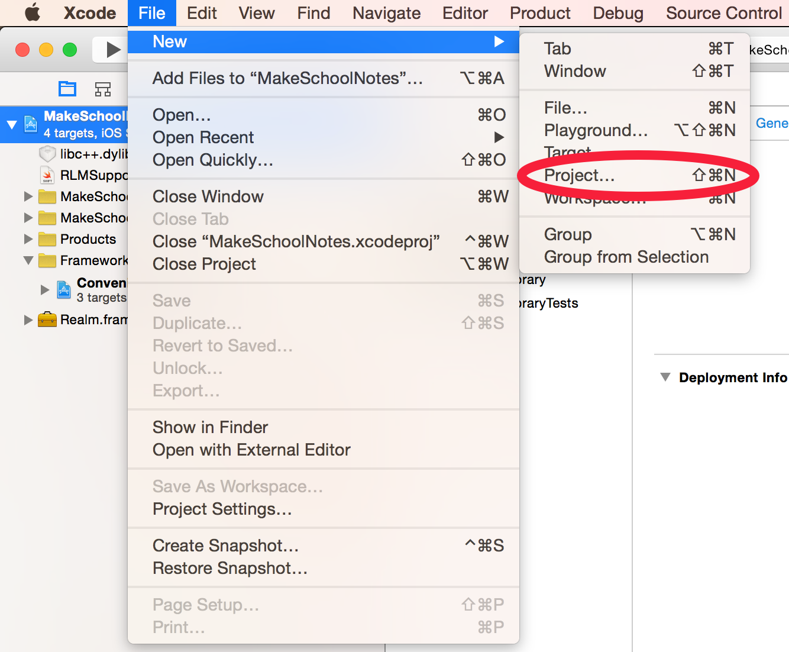
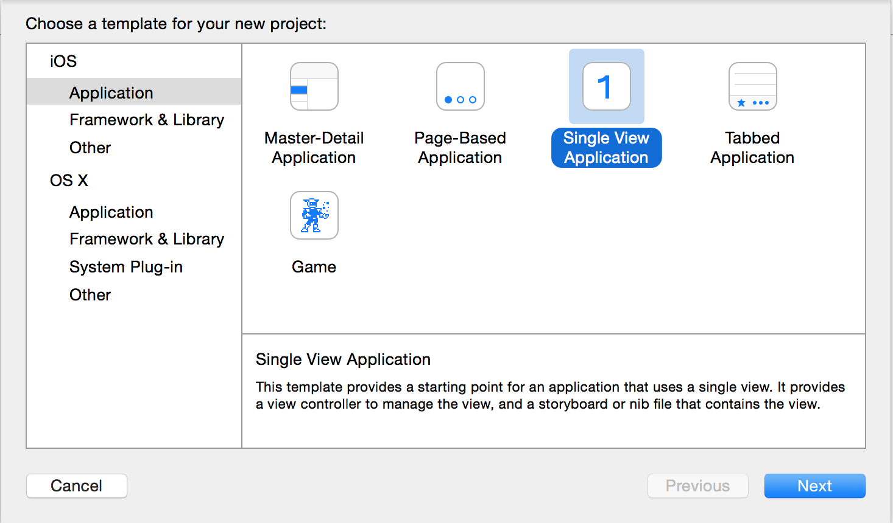
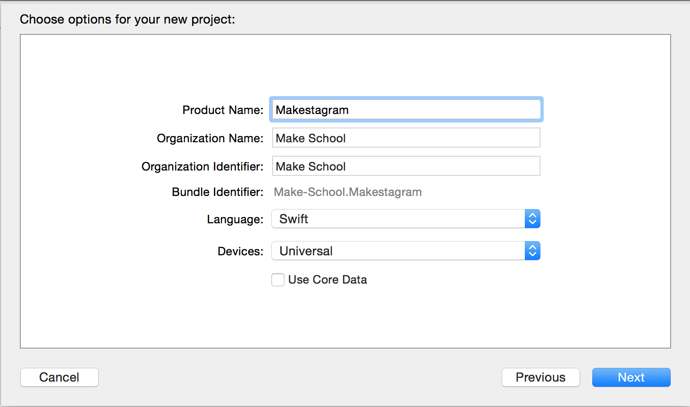
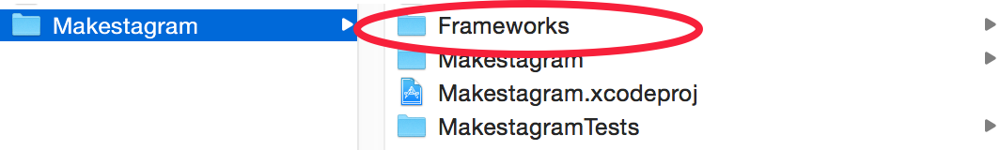
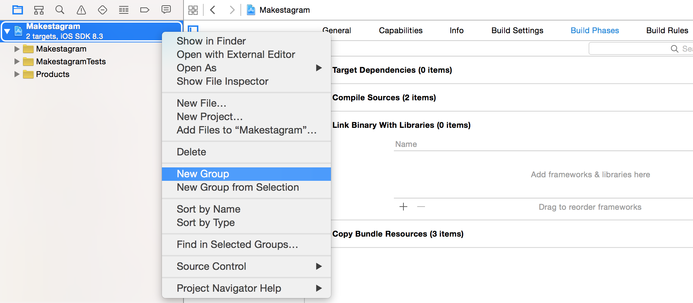
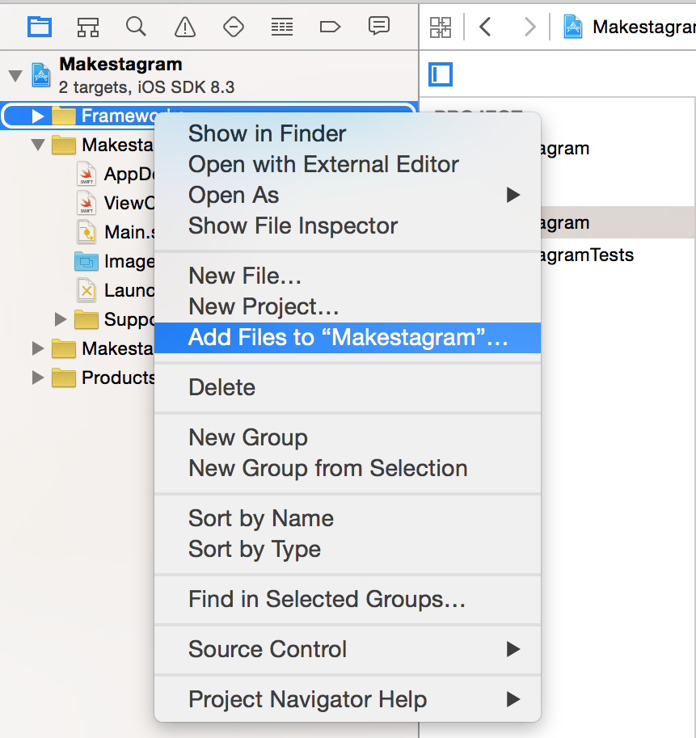
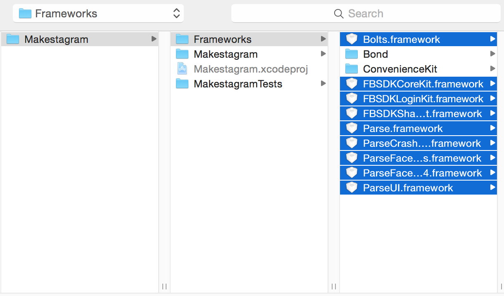

---
title: "Setting up the Xcode project"
slug: set-up-xcode-project
---     

Time for some coding! As a very first step we will set up our Xcode project.

Just as in the *Make School Notes* tutorial we will rely on frameworks written by other developers to build this App.

For this tutorial we will need to set up the following frameworks upfront:

- **Facebook SDK** for Facebook login
- **Parse SDK** to work with our Parse server
- **ConvenienceKit** to use some convenience features provided by Make School
- **Many iOS System libraries** because they are required by Facebook and Parse

This means that our very first step will be creating a new Xcode project and adding all the required libraries.

#Creating a new Xcode project

Open Xcode and start creating a new project:

On the upcoming page you need to choose an application template; choose *Single View Application* and hit *Next*:

Choose the *product name* to be *Makestagram* and hit *Next*:

Finally, choose a folder where you want to save the project and hit *Create*.

Now we have a clean slate to work with! Time to set up the frameworks we need.

#Adding frameworks to our project

Let's start with the Facebook and Parse SDKs. Typically you need to download them following the instructions on their respective websites ([Facebook](https://developers.facebook.com/docs/ios/getting-started) and [Parse](https://parse.com/apps/quickstart#parse_data/mobile/ios/swift/new)); however, we have bundled all the frameworks you need for this project to make the set up procedure a little bit easier.

Download the required frameworks from this [link](https://s3.amazonaws.com/mgwu-misc/SA2015/Frameworks.zip). When the download completes, unzip the folder. Then copy the entire *Frameworks* folder into the root directory of your project. This is what the folder structure should look like:

You probably remember that an Xcode project doesn't *"pull"* its files directly from the file system. Instead we need to explicitly add all the files to Xcode. Make sure you follow the next instructions exactly. Adding files to projects incorrectly is a common source of errors!

First we are going to create a new *Group* to our Xcode project. Within that group we will store all of the framework files. A group is to an Xcode project what a folder is to your file system. We can use groups to organize the files that we add to our projects.

Right-click onto the *Makestagram* project within Xcode. Then select *New Group*.

This will immediately add a group, called *New Group*, to your project and give you a chance to rename it. Rename it to *Frameworks* (you can rename any file/group in Xcode by selecting it and hitting the return key).

Now we can add our frameworks to this new group!

Right-click onto the *Makestagram* project. Then select *Add Files to "Makestagram"...*

In the following dialog, select all of the *.framework* files, but **none of the folders**. You can select multiple files in one dialog by holding down the ⌘ key. The hit the *Add* button:
